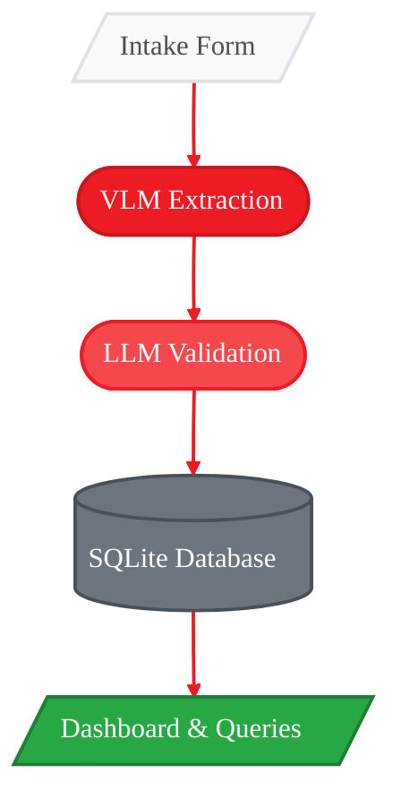
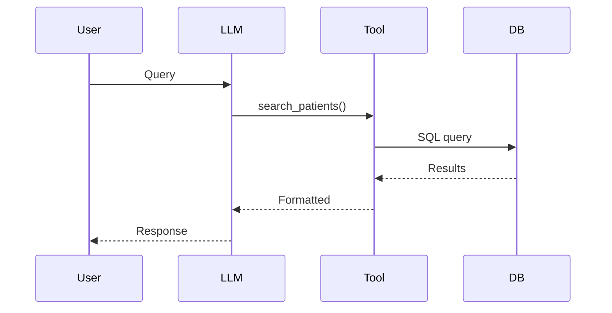

<Info>
  **Source Code:** [`src/gaia/agents/emr/`](https://github.com/amd/gaia/tree/main/src/gaia/agents/emr) · [`src/gaia/agents/emr/dashboard/`](https://github.com/amd/gaia/tree/main/src/gaia/agents/emr/dashboard)
</Info>

<Warning>
  **Demonstration Application:** This is a proof-of-concept demo showcasing AMD Ryzen AI capabilities. Not intended for production use with real patient data. Do not use with actual PHI (Protected Health Information).
</Warning>

The GAIA Medical Intake Agent demonstrates automated patient intake form processing using Vision Language Models (VLM). Drop a scanned intake form into the watch folder, and within seconds the agent extracts patient demographics, insurance information, medical history, and more—storing everything in a searchable SQLite database.

All processing happens **100% locally** on AMD Ryzen AI hardware. No cloud APIs, no data leaving your machine—critical for healthcare scenarios where patient privacy is paramount. The agent includes a real-time dashboard for monitoring processing status, viewing patient records, and querying the database using natural language.

<Tip>
  **Want to learn how it works?** See the [EMR Agent Playbook](/playbooks/emr-agent/part-1-getting-started) for a step-by-step guide to building this agent from scratch.
</Tip>

## How It Works

The EMR agent combines three AI models in a sophisticated pipeline that runs entirely on your local hardware:

<Frame>

</Frame>

1. **Vision Language Model (VLM)** - The Qwen3-VL-4B model "sees" the intake form image and extracts text using a carefully crafted prompt that guides it to identify specific fields (name, DOB, allergies, medications, etc.). Unlike traditional OCR, the VLM understands context—it knows that "DOB" means date of birth and can handle handwritten entries, checkboxes, and varied form layouts.

2. **LLM Validation & Querying** - The Qwen3-Coder-30B model (a Mixture-of-Experts architecture that activates only 3B parameters per inference) validates extracted data, handles natural language queries, and generates SQL to search the patient database. When you ask "Which patients have penicillin allergies?", the LLM translates this to proper SQL.

3. **Embedding Model** - The nomic-embed model creates vector embeddings for semantic similarity search, enabling fuzzy matching when looking up returning patients or finding related records.

<Info>
  **Why Local Matters:** Running on-device with AMD Ryzen AI means sub-second inference latency, no per-request API costs, and complete data sovereignty. A typical intake form processes in 10-15 seconds on AMD Ryzen AI MAX+ hardware.
</Info>

## Key Features

- **Automatic file watching** - Monitors a directory for new intake forms
- **Drag-and-drop upload** - Drop files directly into the Watch Folder panel
- **VLM-powered extraction** - Uses Qwen3-VL-4B-Instruct for OCR and data extraction
- **Local database storage** - SQLite with full patient record schema
- **New/returning detection** - Identifies returning patients and flags changes
- **Critical alerts** - Automatic alerts for allergies and missing fields
- **Web dashboard** - Real-time monitoring with SSE updates
- **Cumulative efficiency metrics** - Track total time saved across all processed forms

## Required Models

The EMR agent uses three models, downloaded automatically on first run via `gaia-emr init`:

| Model | Size | Purpose |
|-------|------|---------|
| Qwen3-Coder-30B-A3B-Instruct-GGUF | 18.6 GB | LLM for chat queries and patient search |
| Qwen3-VL-4B-Instruct-GGUF | 3.3 GB | Vision language model for form extraction |
| nomic-embed-text-v2-moe-GGUF | 522 MB | Embedding model for similarity search |

<Note>
  **Disk Space:** Ensure you have at least 25 GB of free disk space for model downloads.
</Note>

## Prerequisites

<Tabs>
  <Tab title="Windows">
    Installs [amd-gaia](https://pypi.org/project/amd-gaia/) from PyPI. **Recommended** for most users on **Windows**.

    ### Step 1: Create Project Directory

    Open **PowerShell** and run:
    ```powershell
    mkdir my-emr-project
    ```
    ```powershell
    cd my-emr-project
    ```

    ### Step 2: Create Virtual Environment

    ```powershell
    uv venv .venv --python 3.12
    ```

    <Note>uv will automatically download Python 3.12 if not already installed.</Note>

    ### Step 3: Activate the Environment

    ```powershell
    .\.venv\Scripts\Activate.ps1
    ```

    <Warning>
      If you see a script execution error, run this once:
      ```powershell
      Set-ExecutionPolicy -ExecutionPolicy RemoteSigned -Scope CurrentUser
      ```
      Then retry the activation command.
    </Warning>

    You should see `(.venv)` in your terminal prompt when activated.

    ### Step 4: Install GAIA with EMR Dependencies

    ```powershell
    uv pip install "amd-gaia[api,rag]"
    ```

    ### Step 5: Verify Installation

    ```powershell
    gaia-emr --help
    ```
  </Tab>

  <Tab title="Linux">
    Installs [amd-gaia](https://pypi.org/project/amd-gaia/) from PyPI. **Recommended** for most users on **Linux**.

    ### Step 1: Create Project Directory

    Open a **terminal** and run:
    ```bash
    mkdir my-emr-project
    ```
    ```bash
    cd my-emr-project
    ```

    ### Step 2: Create Virtual Environment

    ```bash
    uv venv .venv --python 3.12
    ```

    <Note>uv will automatically download Python 3.12 if not already installed.</Note>

    ### Step 3: Activate the Environment

    ```bash
    source .venv/bin/activate
    ```

    You should see `(.venv)` in your terminal prompt when activated.

    ### Step 4: Install GAIA with EMR Dependencies

    ```bash
    uv pip install "amd-gaia[api,rag]"
    ```

    ### Step 5: Verify Installation

    ```bash
    gaia-emr --help
    ```
  </Tab>

  <Tab title="Windows (Dev)">
    For contributors. Clones [amd/gaia](https://github.com/amd/gaia) from GitHub.

    <Note>
      **Requires:** [Git for Windows](https://git-scm.com/download/win) must be installed.
    </Note>

    ### Step 1: Clone the Repository

    Open **PowerShell** and run:
    ```powershell
    git clone https://github.com/amd/gaia.git
    ```
    ```powershell
    cd gaia
    ```

    ### Step 2: Create Virtual Environment

    ```powershell
    uv venv .venv --python 3.12
    ```

    ### Step 3: Activate the Environment

    ```powershell
    .\.venv\Scripts\Activate.ps1
    ```

    <Warning>
      If you see a script execution error, run this once:
      ```powershell
      Set-ExecutionPolicy -ExecutionPolicy RemoteSigned -Scope CurrentUser
      ```
      Then retry the activation command.
    </Warning>

    You should see `(.venv)` in your prompt when activated.

    ### Step 4: Install in Editable Mode

    ```powershell
    uv pip install -e ".[dev,api,rag]"
    ```

    ### Step 5: Verify Installation

    ```powershell
    gaia-emr --help
    ```

    <Note>
      Changes to GAIA source code will take effect immediately without reinstalling.
    </Note>
  </Tab>

  <Tab title="Linux (Dev)">
    For contributors. Clones [amd/gaia](https://github.com/amd/gaia) from GitHub.

    <Note>
      **Requires:** Git must be installed (`sudo apt install git`).
    </Note>

    ### Step 1: Clone the Repository

    Open a **terminal** and run:
    ```bash
    git clone https://github.com/amd/gaia.git
    ```
    ```bash
    cd gaia
    ```

    ### Step 2: Create Virtual Environment

    ```bash
    uv venv .venv --python 3.12
    ```

    ### Step 3: Activate the Environment

    ```bash
    source .venv/bin/activate
    ```

    You should see `(.venv)` in your prompt when activated.

    ### Step 4: Install in Editable Mode

    ```bash
    uv pip install -e ".[dev,api,rag]"
    ```

    ### Step 5: Verify Installation

    ```bash
    gaia-emr --help
    ```

    <Note>
      Changes to GAIA source code will take effect immediately without reinstalling.
    </Note>
  </Tab>
</Tabs>

<Note>
  The `api` extra provides FastAPI and uvicorn for the web dashboard. The `rag` extra provides PyMuPDF for PDF processing.
</Note>

<Tip>
  **Having issues?** Check the [Troubleshooting](/reference/troubleshooting) guide, [create an issue](https://github.com/amd/gaia/issues) on GitHub, or contact us at gaia@amd.com.
</Tip>

---

## Quick Start

<Info>
  **First time here?** Complete the [Setup](/setup) guide first to install Lemonade Server and uv.
</Info>

### Step 1: Initialize (First Time Only)

Download and load all required models before first use:

```bash
gaia-emr init
```

This command:
- Checks Lemonade server is running and context size is configured
- Downloads and loads all required models:
  - **VLM**: Qwen3-VL-4B-Instruct-GGUF (form extraction)
  - **LLM**: Qwen3-Coder-30B-A3B-Instruct-GGUF (chat/query processing)
  - **Embedding**: nomic-embed-text-v2-moe-GGUF (similarity search)
- Verifies all models are loaded and ready

<Tip>
  **Context Size:** For best results, set Lemonade context size to 32768. Right-click the Lemonade tray icon → Settings → Context Size → 32768.
</Tip>

<Note>
  **Partial Success:** If the LLM fails to download but VLM succeeds, form extraction will still work. Chat queries and natural language patient search require the LLM. Run `gaia-emr init` again to retry failed downloads.
</Note>

### Step 2: Launch

<Tabs>
  <Tab title="CLI App">
    ### Download sample forms

    [Download sample intake forms from GitHub](https://github.com/amd/gaia/tree/main/data/img/intake-forms) and save them to a local directory (e.g., `./intake-forms/`).

    <Note>
      **Dev Install:** Sample forms are already included in the repository at `data/img/intake-forms/`.
    </Note>

    ### Start watching for forms

    ```bash
    gaia-emr watch --watch-dir ./intake-forms
    ```

    The agent will process the sample forms and display extracted patient data.

    <Accordion title="Example Output">
    ```
    +-----------------------------------+
    | Medical Intake Agent              |
    | Automatic Patient Form Processing |
    +-----------------------------------+
      Watch folder: ./intake-forms
      Database:     ./data/patients.db

      File            Size      Hash          Status
      --------------  --------  ------------  ------
      IMG_2992.jpg    1.7 MB    eaabe23e...   new
      IMG_2993.jpg    887.6 KB  03f2391e...   new
      IMG_2995.jpg    2.3 MB    348071a9...   new
      IMG_2996.jpg    2.1 MB    7a73ea84...   new

    Processing Pipeline (7 steps)
      File: IMG_2992.jpg
      [5/7] Extracting patient data
      VLM extracting from image...
      Extracted 1844 chars in 14.12s
    Pipeline complete in 14.3s -> Alice Williams

    Extracted Fields
      Identity
        first_name           Alice
        last_name            Williams
        date_of_birth        1980-04-04
      Contact
        phone                (411) 413-1234
        email                alice.williams@hotmail.com
      Insurance
        insurance_provider   Medicaid Demo
      ...

    34 fields extracted
    ```
    </Accordion>

    ### Query patients

    Once processing completes, you can query the database using natural language. The agent uses tool calling to translate your questions into SQL queries and retrieve results from the SQLite database.

    ```
    Which patients have allergies?
    ```
    ```
    Show me all patients processed today
    ```
    ```
    Summarize today's intake forms
    ```

    Type `quit` or press `Ctrl+C` to stop.

    ### CLI Commands Reference

    <CodeGroup>
    ```bash init
    gaia-emr init
    ```

    ```bash watch
    gaia-emr watch --watch-dir ./forms
    ```

    ```bash dashboard
    gaia-emr dashboard
    ```

    ```bash query
    gaia-emr query "patients with allergies"
    ```

    ```bash reset
    gaia-emr reset
    ```

    ```bash help
    gaia-emr -h
    ```
    </CodeGroup>

    | Command | Description |
    |---------|-------------|
    | `init` | Download required models |
    | `watch` | Watch folder and process forms |
    | `dashboard` | Launch web dashboard |
    | `query` | One-shot database query |
    | `reset` | Delete database and start fresh |
    | `-h` | Full command reference |
  </Tab>

  <Tab title="Desktop App">
    The recommended way to use the EMR Dashboard is via the native Electron desktop app.

    ### Launch the desktop app

    ```bash
    gaia-emr dashboard
    ```

    The dashboard opens automatically in a native desktop window.

    <Note>
      First run will install Electron dependencies automatically. The default database is `./data/patients.db`.
    </Note>

    ### Add intake forms

    Drag and drop intake form images or PDFs directly onto the **Watch Folder** panel in the dashboard. The agent will process them automatically.

    <Tip>
      [Download sample intake forms from GitHub](https://github.com/amd/gaia/tree/main/data/img/intake-forms) to test the agent.
    </Tip>

    <Accordion title="Dev Install: Build the frontend (first time only)">
      If you installed from source (Windows/Linux Dev tabs), you need to build the frontend first:

      ```bash
      cd src/gaia/agents/emr/dashboard/frontend
      ```
      ```bash
      npm install
      ```
      ```bash
      npm run build
      ```

      Then return to the repository root:

      ```bash
      cd ../../../../../..
      ```
    </Accordion>

    ### Dashboard Features

    The dashboard includes four main views:

    - **Dashboard** - Real-time stats, cumulative efficiency metrics, and live processing feed
    - **Patient Database** - Searchable patient list with detailed records
    - **Chat** - Natural language queries about patients
    - **Settings** - Configure watch directory, upload files, and manage database

    **Watch Folder Panel:** The left column displays a Watch Folder panel with status indicators:
    - **Green dot** - Processed files
    - **Red flashing dot** - Currently processing
    - **Orange dot** - Queued for processing

    **Drag-and-Drop:** Drop intake form images or PDFs directly onto the Watch Folder panel to upload and process them instantly.

    ### Command Options

    <CodeGroup>
    ```bash default
    gaia-emr dashboard
    ```

    ```bash --watch-dir
    gaia-emr dashboard --watch-dir /path/to/forms
    ```

    ```bash --browser
    gaia-emr dashboard --browser
    ```

    ```bash --port
    gaia-emr dashboard --port 3000
    ```

    ```bash --no-open
    gaia-emr dashboard --no-open
    ```
    </CodeGroup>

    | Option | Default | Description |
    |--------|---------|-------------|
    | `--watch-dir` | `./intake_forms` | Directory to monitor for intake forms |
    | `--db` | `./data/patients.db` | SQLite database path |
    | `--port` | `8080` | Server port |
    | `--browser` | off | Open in browser instead of Electron |
    | `--no-open` | off | Don't auto-open, server only |

    <Tip>
      If Electron/Node.js is not available, the dashboard automatically falls back to opening in your default web browser.
    </Tip>
  </Tab>

</Tabs>

---

## Supported Intake Form Formats

The agent accepts scanned or photographed intake forms in these formats:

| Extension | Processing |
|-----------|------------|
| `.png`, `.jpg`, `.jpeg` | Direct image processing |
| `.pdf` | Converted to image via PyMuPDF |
| `.tiff`, `.bmp` | Direct image processing |

---

## Under the Hood

### Image Preprocessing Pipeline

Before reaching the VLM, intake forms go through an optimization pipeline:

1. **EXIF Orientation** - Auto-rotates images based on camera metadata (critical for phone photos)
2. **Resolution Scaling** - Resizes to max 1024px while preserving aspect ratio (balances quality vs. token count)
3. **JPEG Compression** - Reduces file size with quality=85 for faster transmission to the model
4. **Token Estimation** - Calculates expected image tokens to verify they fit within context window

### Returning Patient Detection

The agent uses a multi-signal approach to identify returning patients:

- **Exact Match** - Name + DOB combination lookup in SQLite
- **Fuzzy Match** - Levenshtein distance for misspellings ("Jon Smith" → "John Smith")
- **Embedding Similarity** - Vector search using nomic-embed for semantic matching

When a returning patient is detected, the agent highlights any changes from their previous record (new allergies, updated insurance, etc.).

### Real-Time Dashboard Architecture

The dashboard uses **Server-Sent Events (SSE)** for real-time updates without polling:

- FastAPI backend streams processing events as they occur
- React frontend subscribes to `/api/events` endpoint
- Sub-100ms latency from file detection to UI update
- No WebSocket complexity—SSE is simpler and works through proxies

### Tool Calling for Database Queries

When you ask a natural language question, the LLM uses **function calling** (tool use) to interact with the database:



This pattern ensures the LLM never directly writes SQL—it calls predefined, validated tools that safely construct queries.

---

## Troubleshooting

### PyMuPDF Required

```
ERROR: PyMuPDF required for PDF processing
```

**Solution**: `pip install "amd-gaia[rag]"`

### JSON Parse Failed

```
WARNING: Failed to parse extraction for: form.jpg
```

**Solution**: Check image quality and form layout clarity.

### Database Locked

```
ERROR: database is locked
```

**Solution**: Only one agent should access the database at a time.

### Slow First Run

First run downloads models (LLM, VLM, embeddings) which may take several minutes. Subsequent runs start immediately.

### Model Download Failed

```
Failed to download file: [model files]
Download succeeded but failed to rename file: The process cannot access the file
```

**Solution**: Run `gaia-emr init` again to resume the download. If the error persists:
1. Close any applications that may be using the model files
2. Delete partial downloads in Lemonade's model cache directory
3. Run `gaia-emr init` again

### Context Size Too Small

```
Context size too small! Image requires 4203 tokens but model context is only 4096.
```

**Solution**: Increase Lemonade context size:
1. Right-click Lemonade tray icon → Settings
2. Set Context Size to **32768**
3. Restart the model

### Corrupted Model / Init Fails

If `gaia-emr init` fails repeatedly or the agent won't start due to model errors:

**Solution**: Delete the corrupted model from Lemonade's cache and restart:
1. Close Lemonade Server (right-click tray icon → Exit)
2. Navigate to the model cache directory:
   - Windows: `%LOCALAPPDATA%\AMD\LemonadeModels\`
   - Linux: `~/.local/share/lemonade/models/`
3. Delete the corrupted model folder (e.g., `Qwen3-VL-4B-Instruct-GGUF/`)
4. Restart Lemonade Server
5. Run `gaia-emr init` again to re-download

---

## Learn More

<CardGroup cols={3}>
  <Card title="Part 1: Getting Started" icon="rocket" href="/playbooks/emr-agent/part-1-getting-started">
    Build this agent from scratch and understand the core components
  </Card>

  <Card title="Part 2: Dashboard & API" icon="chart-line" href="/playbooks/emr-agent/part-2-dashboard">
    Deep dive into the web dashboard and REST API endpoints
  </Card>

  <Card title="Part 3: Architecture" icon="sitemap" href="/playbooks/emr-agent/part-3-architecture">
    Database schema, processing pipeline, and system design
  </Card>
</CardGroup>

---

<small style="color: #666;">

**License**

Copyright(C) 2024-2025 Advanced Micro Devices, Inc. All rights reserved.

SPDX-License-Identifier: MIT

</small>
