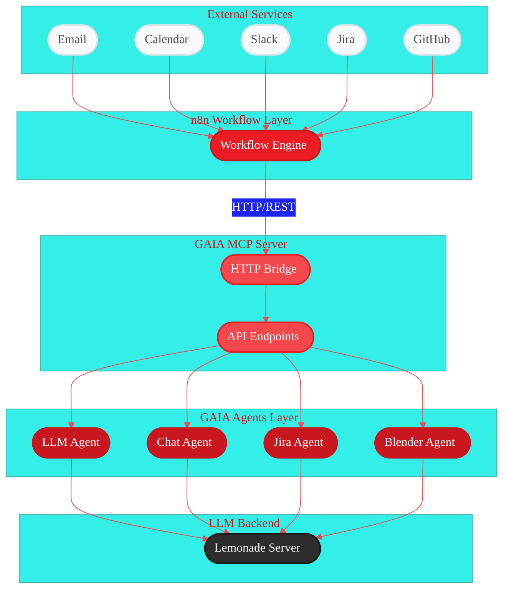

<Info>
  **Source Code:** [`src/gaia/mcp/`](https://github.com/amd/gaia/blob/main/src/gaia/mcp/) (n8n uses the MCP Server)
</Info>

# GAIA n8n Integration Guide

<Badge text="development" color="orange" />

This guide explains how to integrate GAIA's AI capabilities into n8n workflows using the GAIA MCP Server.

## Overview

n8n can leverage GAIA's AI agents (LLM, Chat, Jira, Blender) through HTTP requests to the MCP server. This enables powerful AI-driven workflow automation without writing code.

## Architecture

<Frame>

</Frame>

### How It Works

<Steps>
  <Step title="External Services">
    Email, Calendar, Slack, etc. trigger workflows or receive results
  </Step>

  <Step title="n8n Workflows">
    Orchestrates the flow between services and GAIA
  </Step>

  <Step title="GAIA MCP Server">
    HTTP bridge that exposes GAIA agents as REST endpoints
  </Step>

  <Step title="GAIA Agents">
    Specialized AI agents for different tasks (Jira, Chat, LLM, Blender)
  </Step>

  <Step title="LLM Backend">
    Lemonade server provides the AI model execution
  </Step>
</Steps>

<CardGroup cols={2}>
  <Card title="Natural Language Jira" icon="ticket">
    Natural language Jira operations
  </Card>
  <Card title="AI Text Processing" icon="brain">
    AI-powered text processing and summarization
  </Card>
  <Card title="Conversational Chat" icon="comments">
    Conversational chat with context
  </Card>
  <Card title="3D Content Generation" icon="cube">
    3D content generation via Blender
  </Card>
</CardGroup>

## Prerequisites

### 1. Set up GAIA MCP Server

Follow the [MCP Server Documentation](/integrations/mcp) to:
- Install GAIA with MCP support
- Start the Lemonade LLM server
- Start the MCP bridge server
- Verify it's running with `gaia mcp status`

### 2. Install and Run n8n Locally

<Tabs>
  <Tab title="Using npx (No Installation)">
    ```bash
    npx n8n
    ```
  </Tab>

  <Tab title="Global Installation">
    ```bash
    npm install -g n8n
    n8n start
    ```
  </Tab>
</Tabs>

n8n will open automatically at `http://localhost:5678`

<Warning>
Throughout this guide, use `http://localhost:8765` for MCP server connections.
</Warning>

## Getting Started: Step-by-Step

### Step 1: Verify MCP Server is Running

Before creating workflows, verify the MCP server is accessible:

```bash
# Check server status
gaia mcp status

# Test with curl
curl http://localhost:8765/health
```

### Step 2: Create Your First n8n Workflow

<Steps>
  <Step title="Open n8n">
    Navigate to `http://localhost:5678`
  </Step>

  <Step title="Create New Workflow">
    Click "New Workflow"
  </Step>

  <Step title="Follow Examples">
    Start with simple GET requests and progress to more complex use cases
  </Step>
</Steps>

## Available Endpoints

The MCP bridge provides the following HTTP endpoints:

### Health Check
- **GET** `/health` - Basic health check
- Returns: `{"status": "healthy", "service": "GAIA MCP Bridge (HTTP)", "agents": 4, "tools": 5}`

### Status (Detailed)
- **GET** `/status` - Comprehensive status with all agents, tools, and endpoints
- Returns: Detailed JSON with agents, tools, capabilities, and available endpoints

### Tool Listing
- **GET** `/tools` - List all available GAIA tools
- Returns: Array of tool definitions with names, descriptions, and input schemas

### Direct Agent Endpoints

<Tabs>
  <Tab title="Jira Operations">
    **POST** `/jira` - Natural language Jira operations

    ```json
    {
      "query": "show my open issues"
    }
    ```

    The Jira agent automatically determines the appropriate operation based on the query.
  </Tab>

  <Tab title="LLM Queries">
    **POST** `/llm` - Direct LLM queries (no conversation context)

    ```json
    {
      "query": "What is artificial intelligence?"
    }
    ```
  </Tab>

  <Tab title="Chat Interface">
    **POST** `/chat` - Interactive chat with conversation context

    ```json
    {
      "query": "Continue our discussion about AI"
    }
    ```
  </Tab>
</Tabs>

### JSON-RPC Endpoint

**POST** `/` - Standard JSON-RPC 2.0 interface for MCP protocol

Supports methods:
- `initialize` - Initialize MCP connection
- `tools/list` - List available tools
- `tools/call` - Execute a specific tool

## Integration Examples: From Simple to Complex

### Example 1: Simple Health Check (GET Request)

<Steps>
  <Step title="Add HTTP Request Node">
    Add an **HTTP Request** node to your workflow
  </Step>

  <Step title="Configure Node">
    - **Method**: `GET`
    - **URL**: `http://localhost:8765/health`
  </Step>

  <Step title="Execute">
    Click "Execute Node"
  </Step>
</Steps>

**Expected response:**
```json
{
  "status": "healthy",
  "service": "GAIA MCP Bridge (HTTP)",
  "agents": 4,
  "tools": 5
}
```

<Tip>Purpose: Verify n8n can connect to the MCP server</Tip>

### Example 2: Get Detailed Status (GET Request)

<Steps>
  <Step title="Add HTTP Request Node">
    Add an **HTTP Request** node
  </Step>

  <Step title="Configure">
    - **Method**: `GET`
    - **URL**: `http://localhost:8765/status`
  </Step>

  <Step title="Execute">
    Execute to see all available agents, tools, and endpoints
  </Step>
</Steps>

<Tip>Purpose: See all available agents and tools</Tip>

### Example 3: Simple Chat (POST Request)

<Steps>
  <Step title="Add HTTP Request Node">
    Add an **HTTP Request** node
  </Step>

  <Step title="Configure">
    - **Method**: `POST`
    - **URL**: `http://localhost:8765/chat`
    - **Body Content Type**: `JSON`
    - **JSON Body**:
    ```json
    {
      "query": "Hello GAIA! What can you help me with today?"
    }
    ```
  </Step>

  <Step title="Execute">
    Execute to get an AI response
  </Step>
</Steps>

<Tip>Purpose: Send a basic message to the AI</Tip>

### Example 4: LLM Analysis (POST Request)

<Steps>
  <Step title="Add HTTP Request Node">
    Add an **HTTP Request** node
  </Step>

  <Step title="Configure">
    - **Method**: `POST`
    - **URL**: `http://localhost:8765/llm`
    - **Body Content Type**: `JSON`
    - **JSON Body**:
    ```json
    {
      "query": "Summarize the following text: [your text here]"
    }
    ```
  </Step>
</Steps>

<Tip>Purpose: Analyze or process text with AI</Tip>

### Example 5: Jira Agent - Natural Language Queries

<Steps>
  <Step title="Add HTTP Request Node">
    Add an **HTTP Request** node
  </Step>

  <Step title="Configure">
    - **Method**: `POST`
    - **URL**: `http://localhost:8765/jira`
    - **Body Content Type**: `JSON`
    - **JSON Body**:
    ```json
    {
      "query": "Show my open issues from this week"
    }
    ```
  </Step>

  <Step title="Agent Processing">
    The Jira agent will:
    - Understand your natural language query
    - Convert it to JQL
    - Execute the search
    - Return formatted results
  </Step>
</Steps>

<Tip>Purpose: Query Jira using natural language</Tip>

## Building Complete Workflows

### Workflow 1: Daily Standup Assistant

**Components**: Manual Trigger → Jira Query → LLM Summarize → Output

<Steps>
  <Step title="Add Manual Trigger">
    Add **Manual Trigger** node (or Schedule Trigger for automation)
  </Step>

  <Step title="Add Jira HTTP Request">
    **HTTP Request** node for Jira:
    ```json
    {
      "query": "show issues I worked on yesterday"
    }
    ```
  </Step>

  <Step title="Add LLM HTTP Request">
    **HTTP Request** node for LLM:
    ```json
    {
      "query": "Format this as a standup update: {{$json.result}}"
    }
    ```
  </Step>

  <Step title="Add Output Node">
    **Send to Slack/Email** node with formatted output
  </Step>
</Steps>

### Workflow 2: Smart Issue Triage

**Components**: Webhook Trigger → LLM Analysis → Jira Update

<Steps>
  <Step title="Add Webhook Node">
    **Webhook** node to receive new issue notifications
  </Step>

  <Step title="Add LLM Analysis">
    **HTTP Request** to LLM for analysis:
    ```json
    {
      "query": "Analyze this issue and suggest priority and assignee: {{$json.description}}"
    }
    ```
  </Step>

  <Step title="Update Jira">
    **HTTP Request** to Jira to update the issue based on AI suggestions
  </Step>
</Steps>

### Import Pre-built Workflow

<Steps>
  <Step title="Navigate to Import">
    In n8n, go to **Workflows** → **Import from File**
  </Step>

  <Step title="Select File">
    Select `src/gaia/mcp/n8n.json`
  </Step>

  <Step title="Review Workflow">
    The workflow includes examples of all endpoints
  </Step>
</Steps>

## Tips for Building Workflows

### Using Variables in Requests

n8n allows you to reference data from previous nodes:

```json
{
  "query": "Summarize this: {{$node['Previous Node'].json.content}}"
}
```

### Error Handling

<Tip>
Always add an **IF** node after HTTP requests to handle errors:
- Check if `{{$json.success}}` is true
- Route errors to notification or retry logic
</Tip>

### Rate Limiting

<Tip>
For bulk operations, add a **Wait** node between requests:
- Wait 1-2 seconds between API calls
- Prevents overwhelming the MCP server
</Tip>

### Testing Workflows

<Steps>
  <Step title="Use Manual Trigger">
    Use **Manual Trigger** during development
  </Step>

  <Step title="Test Individually">
    Test each node individually with "Execute Node"
  </Step>

  <Step title="Pin Data">
    Use "Pin Data" to save test responses
  </Step>

  <Step title="Switch to Production">
    Switch to production triggers when ready
  </Step>
</Steps>

## Understanding Responses

### Successful Responses

Each endpoint returns different data structures:

<Tabs>
  <Tab title="GET Endpoints">
    **health, status, tools**:
    - Return status information directly
    - No `success` field needed
  </Tab>

  <Tab title="POST Endpoints">
    **chat, llm, jira**:
    - Always include `success: true/false`
    - Main content in `result` field
    - Additional info in `metadata` (optional)
  </Tab>
</Tabs>

### Handling Errors

```javascript
// In n8n expressions:
{{$json.success ? $json.result : 'Error: ' + $json.error}}
```

## Best Practices

<CardGroup cols={2}>
  <Card title="Start Simple" icon="1">
    Begin with GET requests, then move to POST
  </Card>
  <Card title="Use localhost" icon="2">
    Use `localhost` for local server connections
  </Card>
  <Card title="Test Incrementally" icon="3">
    Test each node before building complex workflows
  </Card>
  <Card title="Handle Errors" icon="4">
    Add IF nodes to check `success` field
  </Card>
  <Card title="Set Timeouts" icon="5">
    Use 30s timeout for Jira/LLM operations
  </Card>
  <Card title="Log Responses" icon="6">
    Use Set nodes to capture responses for debugging
  </Card>
</CardGroup>

## Troubleshooting

<AccordionGroup>
  <Accordion title='MCP Bridge Not Accessible / "Service refused the connection"'>
    If you get "The service refused the connection - perhaps it is offline" or `ECONNREFUSED ::1:8765` error:

    **QUICK FIX**: Ensure the MCP server is running with `gaia mcp start` and use `http://localhost:8765` for connections.

    For detailed MCP server troubleshooting (ports, processes, Docker/WSL), see the [MCP Server Documentation](./mcp.md#troubleshooting).
  </Accordion>

  <Accordion title="n8n-Specific Connection Issues">
    When MCP works locally but n8n doesn't:

    **Connection refused issue (Most Common)**:
    - Error: `connect ECONNREFUSED ::1:8765` means the MCP server may not be running
    - **FIX**: Ensure MCP server is running with `gaia mcp start` and use `http://localhost:8765`
    - If issues persist, check firewall settings or try `http://127.0.0.1:8765` as an alternative

    **If n8n is in browser (n8n.cloud or self-hosted web)**:
    <Warning>
    Browser security blocks ALL localhost connections from web apps. This is a browser security feature (CORS/Mixed Content) that cannot be bypassed.
    </Warning>

    **Solutions:**

    **a) Run n8n locally (BEST OPTION)**:
    ```bash
    # Install and run n8n on your machine
    npm install -g n8n
    n8n start
    # Opens at http://localhost:5678
    # Now it can access your local MCP bridge
    ```

    **b) Use ngrok tunnel (EASIEST for testing with n8n.cloud)**:
    ```bash
    # Install ngrok (or download from ngrok.com)
    npm install -g ngrok

    # In Terminal 1: Start your MCP bridge
    gaia mcp start

    # In Terminal 2: Create tunnel to expose MCP
    ngrok http 8765

    # You'll get a URL like: https://abc123.ngrok.io
    # Use this URL in n8n.cloud instead of localhost
    # Example: https://abc123.ngrok.io/health
    ```

    **c) Use localtunnel (Alternative to ngrok)**:
    ```bash
    # Install localtunnel
    npm install -g localtunnel

    # Expose your MCP bridge
    lt --port 8765
    # Gives URL like: https://xyz.loca.lt
    # Use this in n8n.cloud
    ```

    **d) Deploy MCP to cloud (for production)**:
    - Deploy GAIA MCP to AWS/Azure/Heroku
    - Use the public URL in n8n.cloud

    **To find your computer's IP** (for network access):
    ```bash
    # Windows
    ipconfig | findstr IPv4

    # Then use: http://[your-IP]:8765/health
    # Example: http://192.168.1.100:8765/health
    ```

    **Test the correct URL first**:
    ```bash
    # From where n8n is running, test:
    curl http://localhost:8765/health  # localhost
    curl http://192.168.1.100:8765/health  # Using your machine's IP
    ```
  </Accordion>

  <Accordion title="Jira Operations Failing">
    **Solutions**:
    - Verify Jira credentials are configured in GAIA
    - Test with simple query first: "show 1 issue"
    - Check Jira agent logs for detailed errors
  </Accordion>

  <Accordion title="LLM Queries Slow">
    **Solutions**:
    - Ensure Lemonade server is running
    - Check if model is loaded in memory
    - Consider using smaller models for faster responses
  </Accordion>

  <Accordion title="n8n Connection Issues">
    **Solutions**:
    - **First try**: Ensure MCP server is running and use `http://localhost:8765`
    - Verify n8n can reach the MCP bridge
    - Check CORS settings if using browser-based n8n
    - Test with curl first to isolate issues
  </Accordion>
</AccordionGroup>

## Advanced Configuration

For custom ports and other advanced MCP server configuration options, see the [MCP Server Documentation](./mcp.md#configuration-optional).

## Security Considerations

<Warning>
For production deployments, always implement these security measures:
</Warning>

<Steps>
  <Step title="Authentication">
    Add API key authentication
  </Step>

  <Step title="HTTPS">
    Use reverse proxy with SSL
  </Step>

  <Step title="Rate Limiting">
    Implement rate limiting
  </Step>

  <Step title="Input Validation">
    Validate all input parameters
  </Step>

  <Step title="Network Isolation">
    Run in isolated network segment
  </Step>
</Steps>

## Example Production Setup

Using nginx reverse proxy:

```nginx
server {
    listen 443 ssl;
    server_name gaia-mcp.example.com;

    ssl_certificate /path/to/cert.pem;
    ssl_certificate_key /path/to/key.pem;

    location / {
        proxy_pass http://localhost:8765;
        proxy_set_header Host $host;
        proxy_set_header X-Real-IP $remote_addr;

        # API Key validation
        if ($http_x_api_key != "your-secret-key") {
            return 403;
        }
    }
}
```

## Support

- **Documentation**: See other GAIA docs in `/docs`
- **Issues**: Report issues on GitHub
- **Examples**: Check `/examples` folder for more workflows

## Next Steps

<Steps>
  <Step title="Set up MCP Server">
    Follow the [MCP Documentation](/integrations/mcp)
  </Step>

  <Step title="Import Example Workflow">
    Import the example workflow from `src/gaia/mcp/n8n.json`
  </Step>

  <Step title="Build Custom Workflows">
    Build custom workflows using the endpoints documented above
  </Step>

  <Step title="Share Workflows">
    Share your workflows with the community
  </Step>
</Steps>

---

<small style="color: #666;">

**License**

Copyright(C) 2024-2025 Advanced Micro Devices, Inc. All rights reserved.

SPDX-License-Identifier: MIT

</small>
