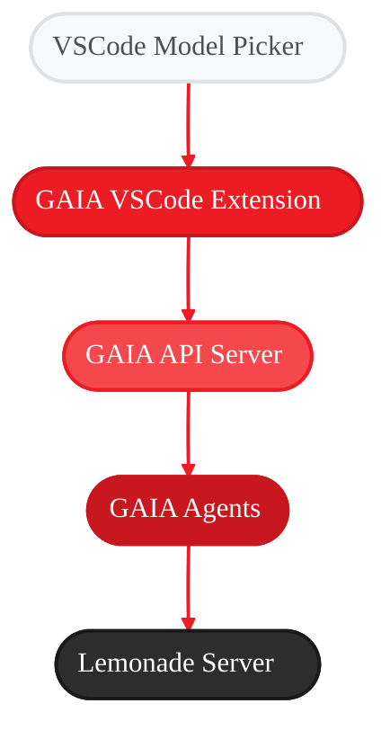
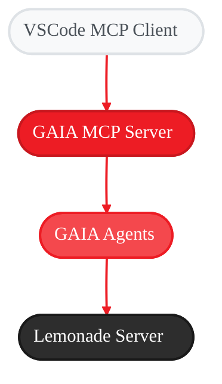

# GAIA VSCode Integration

<Badge text="development" color="orange" />

## Overview

GAIA can be integrated with Visual Studio Code in two powerful ways:

<CardGroup cols={2}>
  <Card title="VSCode Extension" icon="puzzle-piece" href="#vscode-extension-api-server">
    Use GAIA agents as selectable language models in VSCode's model picker
  </Card>
  <Card title="MCP Integration" icon="plug" href="#mcp-client-integration">
    Connect directly using the Model Context Protocol
  </Card>
</CardGroup>

---

## VSCode Extension (API Server)

### Overview

The GAIA VSCode extension integrates GAIA agents as selectable language models in Visual Studio Code, allowing you to use GAIA's autonomous agents alongside GitHub Copilot and other language model providers.

### Features

- **GAIA Code Agent**: Autonomous Python development with planning, code generation, linting, and testing
- **GAIA Jira Agent**: Natural language interface for Jira operations
- **Seamless Integration**: Works with VSCode's built-in model picker and Copilot Chat
- **Local Processing**: All inference runs locally on your AMD hardware via GAIA

### Prerequisites

<Steps>
  <Step title="Install GAIA Framework">
    Install GAIA with API support. See [API Server Prerequisites](/reference/api#prerequisites)
  </Step>

  <Step title="Start Lemonade Server">
    Ensure the LLM backend is running with extended context:
    ```bash
    lemonade-server serve --ctx-size 32768
    ```
  </Step>

  <Step title="Install Node.js v20.19.x">
    Required for building the VSCode extension

    <Tabs>
      <Tab title="Windows">
        Download and install from [nodejs.org](https://nodejs.org/en/download) (select Windows Installer for v20.x LTS)

        Verify installation:
        ```bash
        node --version
        ```
        Should show v20.x.x
      </Tab>

      <Tab title="Linux">
        Install using nvm (recommended):
        ```bash
        # Using nvm
        curl -o- https://raw.githubusercontent.com/nvm-sh/nvm/master/install.sh | bash
        source ~/.bashrc
        nvm install 20
        nvm use 20
        ```

        Or using NodeSource repository (Debian/Ubuntu):
        ```bash
        curl -fsSL https://deb.nodesource.com/setup_20.x | sudo -E bash -
        sudo apt-get install -y nodejs
        ```

        Verify installation:
        ```bash
        node --version
        ```
      </Tab>
    </Tabs>
  </Step>

  <Step title="Install GitHub Copilot Chat">
    Install from the [VSCode Marketplace](https://marketplace.visualstudio.com/items?itemName=GitHub.copilot-chat)

    <Info>This provides the chat UI that GAIA models integrate with via the Language Model Provider API</Info>
  </Step>
</Steps>

### Getting Started

<Warning>
GAIA Code requires **three services** running simultaneously:
1. Lemonade Server (LLM backend on port 8000)
2. GAIA API Server (REST API on port 8080)
3. VSCode Extension (installed in VSCode)
</Warning>

Follow these steps in order:

<Steps>
  <Step title="Start Lemonade Server (LLM Backend)">
    ```bash
    lemonade-server serve --ctx-size 32768
    ```

    <Info>Keep this terminal running and open a new terminal for the next step</Info>
  </Step>

  <Step title="Start the GAIA API Server">
    ```bash
    gaia api start
    ```

    The server will run on `http://localhost:8080` by default. Keep this terminal running.
  </Step>

  <Step title="Build and Install the Extension">
    <Tabs>
      <Tab title="Option A: Build and Install from VSIX">
        First, build the extension:

        ```bash
        cd src/vscode/gaia
        npm install
        npm run package
        ```

        This creates `gaia-vscode-0.1.0.vsix` in the extension directory.

        Then install it:

        ```bash
        code --install-extension gaia-vscode-0.1.0.vsix
        ```

        <AccordionGroup>
          <Accordion title="Next Steps">
            1. Open a new instance of VSCode
            2. Open a directory (e.g., `~/src/test`) that you wish to test GAIA Code against in the new VSCode instance
          </Accordion>
        </AccordionGroup>
      </Tab>

      <Tab title="Option B: Development Mode">
        1. Open the GAIA project root in VSCode
        2. Run > Start Debugging > Select **"GAIA VSCode Extension (API)"** from the dropdown
        3. This launches the Extension Development Host with the extension loaded
      </Tab>
    </Tabs>
  </Step>

  <Step title="Select a GAIA Model">
    1. Open the VSCode Command Palette (`Ctrl+Shift+P` / `Cmd+Shift+P`)
    2. Select "Chat: Manage Language Models..." or [follow this guide](https://code.visualstudio.com/docs/copilot/customization/language-models#_customize-the-model-picker)
    3. Click on the model picker
    4. Select a GAIA model using Github Copilot Chat from the Secondary Side Bar

    <Warning>GAIA API server must be running to see available models</Warning>
  </Step>

  <Step title="Use GAIA in Chat">
    Type your request in the GitHub Copilot chat and GAIA will process it using the selected agent.
  </Step>
</Steps>

### Configuration

Access settings via `File > Preferences > Settings` and search for "GAIA":

| Setting | Description | Default |
|---------|-------------|---------|
| `gaia.apiUrl` | GAIA API server URL | `http://localhost:8080` |
| `gaia.defaultModel` | Default GAIA model to use | `gaia-code` |

### Commands

The extension provides the following commands via the Command Palette:

- **GAIA: Manage API Server**: Shows information about GAIA, configuration, and links to documentation

### Architecture

<Frame>

</Frame>

The extension implements VSCode's `LanguageModelChatProvider` API to register GAIA as a language model provider.

### Usage Examples

<Tabs>
  <Tab title="Code Development">
    **Using GAIA Code Agent**

    1. Select **GAIA code** from the model picker
    2. In chat, type: "Create a function to calculate prime numbers"
    3. GAIA will:
       - Create the function
       - Generate tests
       - Run linting
       - Save files to your workspace
       - Report file paths in the response
  </Tab>

  <Tab title="Jira Operations">
    **Using GAIA Jira Agent**

    1. Select **GAIA jira** from the model picker
    2. In chat, type: "Show my open issues"
    3. GAIA will:
       - Query your Jira instance
       - Parse natural language
       - Return formatted results
  </Tab>
</Tabs>

### Troubleshooting

<AccordionGroup>
  <Accordion title='"Failed to connect to GAIA API server"'>
    **Symptoms**: Extension cannot reach the API server

    **Solutions**:
    - Ensure the API server is running: `gaia api start`
    - Check the server URL in settings matches where the server is running
    - Verify the server is healthy: `curl http://localhost:8080/health`
  </Accordion>

  <Accordion title='"No models available"'>
    **Symptoms**: Model picker doesn't show GAIA models

    **Solutions**:
    - Ensure Lemonade Server is running: `lemonade-server serve --ctx-size 32768`
    - The API server needs to be running before selecting models
    - Check the GAIA output channel for error messages (View > Output > GAIA)
    - Try restarting VSCode
  </Accordion>

  <Accordion title="Server Configuration Issues">
    **Symptoms**: Custom host/port not working

    **Solutions**:
    - Update the `gaia.apiUrl` setting to match your server configuration
    - Restart the API server on the configured address
    - Ensure firewall allows connections to the configured port
  </Accordion>

  <Accordion title="Agent-Specific Issues">
    **Code Agent not working**:
    - Ensure Lemonade context size is 32768 or higher
    - Check workspace has write permissions

    **Jira Agent not working**:
    - Ensure Jira is configured (see [Jira documentation](/guides/jira))
    - Verify Jira credentials are set up correctly
  </Accordion>
</AccordionGroup>

---

## MCP Client Integration

### Overview

VSCode can also integrate with GAIA through the Model Context Protocol (MCP) server. This is an alternative approach that uses MCP client capabilities rather than the Language Model Provider API.

<Note>This is not a VSCode extension, but rather a client integration using MCP protocol</Note>

### Prerequisites

<Steps>
  <Step title="Install GAIA Framework">
    Install GAIA
  </Step>

  <Step title="Start Lemonade Server">
    Running with appropriate context size
  </Step>

  <Step title="Start GAIA MCP Server">
    The MCP server must be running
  </Step>
</Steps>

### Getting Started

<Steps>
  <Step title="Start Lemonade Server">
    ```bash
    lemonade-server serve --ctx-size 32768
    ```
  </Step>

  <Step title="Start the GAIA MCP Server">
    ```bash
    gaia mcp start
    ```

    The server will run on `http://localhost:8765` by default.
  </Step>

  <Step title="Configure MCP Client">
    Configure your MCP client in VSCode to connect to `http://localhost:8765`.
  </Step>

  <Step title="Test Connection">
    Test the MCP integration:

    ```bash
    # List available tools
    curl http://localhost:8765/tools

    # Test a query
    curl -X POST http://localhost:8765/chat \
      -H "Content-Type: application/json" \
      -d '{"query":"Hello GAIA"}'
    ```
  </Step>
</Steps>

### Architecture

<Frame>

</Frame>

### Available Tools

The MCP server exposes GAIA agents as tools:

| Tool | Description |
|------|-------------|
| `gaia.chat` | Conversational chat with context |
| `gaia.query` | Direct LLM queries (no context) |
| `gaia.jira` | Natural language Jira operations |
| `gaia.blender.create` | 3D content creation |

### Configuration

- **MCP Server URL**: `http://localhost:8765` (default)
- **Protocol**: JSON-RPC 2.0 + REST endpoints

For detailed MCP server documentation, see [MCP Server Documentation](/integrations/mcp).

### Troubleshooting

<AccordionGroup>
  <Accordion title="Connection Issues">
    **Symptoms**: Cannot connect to MCP server

    **Solutions**:
    - Verify MCP server is running: `gaia mcp status`
    - Start server if needed: `gaia mcp start`
    - Check server health: `curl http://localhost:8765/health`
  </Accordion>

  <Accordion title="Tool Not Available">
    **Symptoms**: Specific GAIA tool not showing up

    **Solutions**:
    - List available tools: `curl http://localhost:8765/tools`
    - Check server logs for errors
    - Ensure required agent dependencies are installed
  </Accordion>
</AccordionGroup>

---

## Extension Development

This section covers developing and testing the GAIA VSCode extension (API Server approach).

### Project Structure

```
src/vscode/gaia/
├── src/
│   ├── extension.ts          # Extension activation and commands
│   └── provider.ts            # LanguageModelChatProvider implementation
├── package.json               # Extension manifest and dependencies
├── tsconfig.json              # TypeScript configuration
└── .vscodeignore              # Files to exclude from package
```

### Setup Development Environment

<Warning>Node.js v20.19.x is required. See [Prerequisites](#prerequisites) for installation instructions</Warning>

<Steps>
  <Step title="Install Dependencies">
    ```bash
    cd src/vscode/gaia
    npm install
    ```
  </Step>

  <Step title="Compile TypeScript">
    ```bash
    npm run compile
    ```

    Or watch for changes:
    ```bash
    npm run watch
    ```
  </Step>
</Steps>

### Testing the Extension

<Steps>
  <Step title="Start Backend Services">
    Before testing, ensure the GAIA backend is running:

    ```bash
    # Terminal 1: Start Lemonade Server
    lemonade-server serve --ctx-size 32768

    # Terminal 2: Start GAIA API Server
    gaia api start
    ```
  </Step>

  <Step title="Launch Extension Development Host">
    1. Open the GAIA project root in VSCode
    2. Go to Run > Start Debugging (F5)
    3. Select **"GAIA VSCode Extension (API)"** from the launch configuration dropdown
    4. This opens a new VSCode window (Extension Development Host) with the extension loaded

    <Info>
    The launch configuration is defined in `.vscode/launch.json` and automatically compiles TypeScript before launching. There are two configurations:
    - **GAIA VSCode Extension (API)** - For testing with the GAIA API server (port 8080)
    - **GAIA VSCode Extension (MCP)** - For testing with the GAIA MCP server (port 8765)
    </Info>
  </Step>

  <Step title="Test the Provider">
    In the Extension Development Host window:

    1. Open Command Palette (`Ctrl+Shift+P`)
    2. Run "GAIA: Manage API Server" to see the About dialog
    3. Open any chat feature (e.g., Copilot Chat if available)
    4. Click the model picker
    5. Select a GAIA model (gaia-code or gaia-jira)
    6. Send a test message
  </Step>
</Steps>

### Key Components

<Tabs>
  <Tab title="Extension Activation">
    **extension.ts**

    - Registers the GAIA LanguageModelChatProvider
    - Implements management command for About dialog
    - Creates output channel for logging
  </Tab>

  <Tab title="Provider Implementation">
    **provider.ts**

    Implements VSCode's `LanguageModelChatProvider` interface:

    - **provideLanguageModelChatInformation**: Fetches available models from API server
    - **provideLanguageModelChatResponse**: Handles chat requests with SSE streaming
    - **provideTokenCount**: Estimates token count for input
  </Tab>

  <Tab title="Package Configuration">
    **package.json**

    - Declares `languageModelChatProviders` contribution
    - Registers commands and settings
    - Specifies activation events
  </Tab>
</Tabs>

### API Integration

The extension communicates with the GAIA API server (see [API documentation](/reference/api)):

#### GET /v1/models
Returns list of available GAIA models with metadata.

#### POST /v1/chat/completions
Sends chat requests. Supports streaming via Server-Sent Events (SSE).

### Building for Distribution

<Steps>
  <Step title="Install VSCE">
    ```bash
    npm install -g @vscode/vsce
    ```
  </Step>

  <Step title="Package Extension">
    ```bash
    cd src/vscode/gaia
    vsce package
    ```

    This creates `gaia-vscode-0.1.0.vsix`.
  </Step>

  <Step title="Install Locally">
    ```bash
    code --install-extension gaia-vscode-0.1.0.vsix
    ```
  </Step>
</Steps>

### Debugging

<Tip>
The extension logs to the "GAIA" output channel. View it via:
View > Output > Select "GAIA" from dropdown
</Tip>

<AccordionGroup>
  <Accordion title="Common Development Issues">
    1. **"Failed to connect to GAIA API server" during development**
       - Check API server is running: `curl http://localhost:8080/health`
       - Check `gaia.apiUrl` setting in Extension Development Host

    2. **Models not appearing in picker**
       - Ensure API server returns models: `curl http://localhost:8080/v1/models`
       - Check VSCode output channel for errors
       - Restart Extension Development Host

    3. **Streaming not working**
       - Verify API server supports SSE streaming
       - Check network tab in browser developer tools (if testing web)

    4. **TypeScript compilation errors**
       - Run `npm install` to ensure dependencies are installed
       - Check `tsconfig.json` configuration
       - Verify VSCode TypeScript version matches project

    5. **Extension not loading in debugger**
       - Ensure you selected the correct launch configuration: **"GAIA VSCode Extension (API)"**
       - Check that pre-launch task compiled successfully
       - Look for errors in Debug Console
  </Accordion>
</AccordionGroup>

### Architecture Details

<Tabs>
  <Tab title="Message Flow">
    <Frame>
    ```mermaid
    %%{init: {'theme':'base', 'themeVariables': { 'primaryColor':'#ED1C24', 'actorBkg':'#ED1C24', 'actorTextColor':'#fff', 'actorBorder':'#C8171E', 'signalColor':'#F4484D', 'signalTextColor':'#333', 'fontFamily': 'system-ui, -apple-system, sans-serif'}}}%%
    sequenceDiagram
        participant User
        participant VSCode
        participant Provider
        participant API

        User->>VSCode: Types in Chat
        VSCode->>Provider: provideLanguageModelChatResponse()
        Provider->>Provider: Convert messages
        Provider->>API: POST /v1/chat/completions
        API->>Provider: SSE stream
        Provider->>VSCode: Report chunks
        VSCode->>User: Display response
    ```
    </Frame>
  </Tab>

  <Tab title="Model Discovery">
    <Frame>
    ```mermaid
    %%{init: {'theme':'base', 'themeVariables': { 'primaryColor':'#ED1C24', 'actorBkg':'#ED1C24', 'actorTextColor':'#fff', 'actorBorder':'#C8171E', 'signalColor':'#F4484D', 'signalTextColor':'#333', 'fontFamily': 'system-ui, -apple-system, sans-serif'}}}%%
    sequenceDiagram
        participant VSCode
        participant Provider
        participant API

        VSCode->>Provider: Request models
        Provider->>API: GET /v1/models
        API->>Provider: Model list
        Provider->>Provider: Convert format
        Provider->>VSCode: Return models
        VSCode->>VSCode: Show in picker
    ```
    </Frame>
  </Tab>
</Tabs>

### Testing Checklist

Before submitting changes:

- [ ] TypeScript compiles without errors: `npm run compile`
- [ ] Extension activates without errors
- [ ] Models appear in model picker
- [ ] Chat completions work (non-streaming)
- [ ] Streaming responses work
- [ ] About dialog displays correctly
- [ ] Settings are respected
- [ ] Error messages are clear and helpful
- [ ] Output channel shows useful logs

### Contributing

When making changes to the extension:

1. Update TypeScript code in `src/`
2. Run `npm run compile` to build
3. Test using the **"GAIA VSCode Extension (API)"** launch configuration
4. Update this documentation if adding features
5. Follow existing code style and patterns
6. Ensure copyright headers are present

---

## Comparison: Extension vs MCP Integration

| Feature | VSCode Extension (API) | MCP Integration |
|---------|----------------------|-----------------|
| **Integration Type** | VSCode Extension | MCP Client |
| **Protocol** | OpenAI-compatible REST + SSE | JSON-RPC + REST |
| **Port** | 8080 | 8765 |
| **Exposes** | Agents as "models" | Agents as "tools" |
| **Model Picker** | ✅ Yes | ❌ No |
| **Setup Complexity** | Install extension | Configure MCP client |
| **Launch Config** | "GAIA VSCode Extension (API)" | "GAIA VSCode Extension (MCP)" |
| **Best For** | Language model provider workflow | MCP client workflow |

---

## See Also

<CardGroup cols={2}>
  <Card title="GAIA API Server" icon="server" href="./api.md">
    OpenAI-compatible API server
  </Card>
  <Card title="GAIA MCP Server" icon="network-wired" href="./mcp.md">
    Model Context Protocol server
  </Card>
  <Card title="Code Agent" icon="code" href="./code.md">
    Code agent capabilities
  </Card>
  <Card title="Jira Agent" icon="ticket" href="./jira.md">
    Jira agent capabilities
  </Card>
</CardGroup>

- [Development Guide](/reference/dev) - GAIA framework setup
- [VSCode Language Model API](https://code.visualstudio.com/api/extension-guides/ai/language-model-chat-provider) - Official VSCode docs

---

<small style="color: #666;">

**License**

Copyright(C) 2024-2025 Advanced Micro Devices, Inc. All rights reserved.

SPDX-License-Identifier: MIT

</small>
