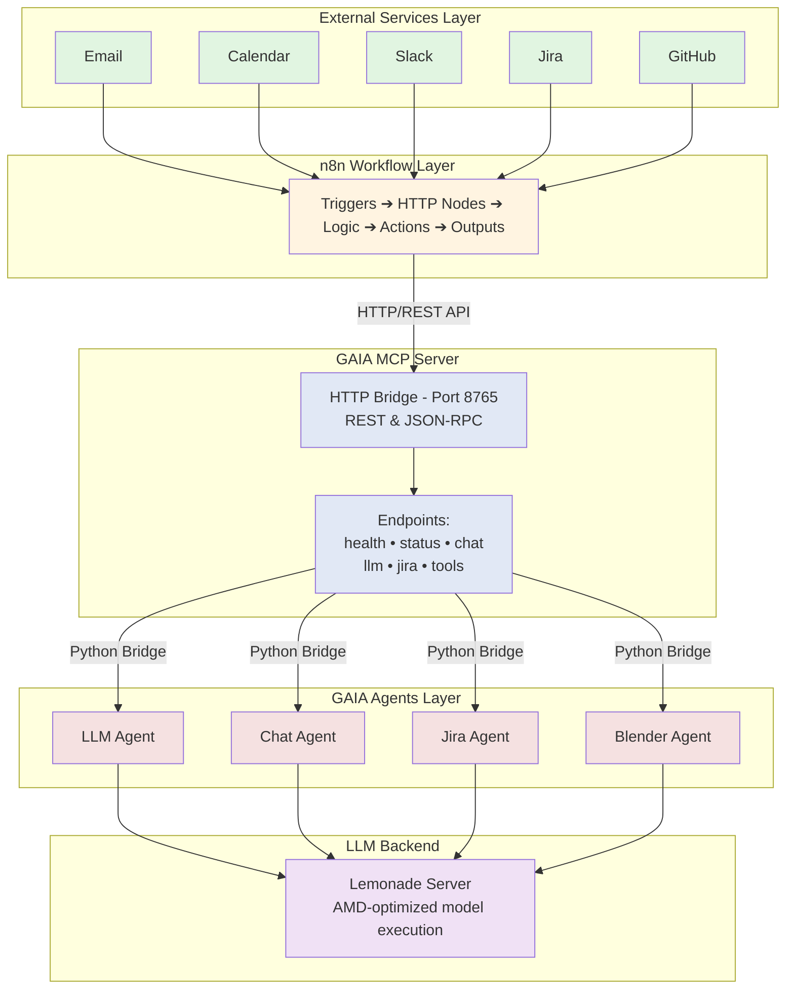

# GAIA n8n Integration Guide

This guide explains how to integrate GAIA's AI capabilities into n8n workflows using the GAIA MCP Server.

## Overview

n8n can leverage GAIA's AI agents (LLM, Chat, Jira, Blender) through HTTP requests to the MCP server. This enables powerful AI-driven workflow automation without writing code.

## Architecture



### How It Works

1. **External Services** (top) - Email, Calendar, Slack, etc. trigger workflows or receive results
2. **n8n Workflows** - Orchestrates the flow between services and GAIA
3. **GAIA MCP Server** - HTTP bridge that exposes GAIA agents as REST endpoints
4. **GAIA Agents** - Specialized AI agents for different tasks (Jira, Chat, LLM, Blender)
5. **LLM Backend** - Lemonade server provides the AI model execution

**Key Benefits:**
- Natural language Jira operations
- AI-powered text processing and summarization
- Conversational chat with context
- 3D content generation via Blender
- All accessible through simple HTTP nodes in n8n

## Prerequisites

### 1. Set up GAIA MCP Server
Follow the [MCP Server Documentation](./mcp.md) to:
- Install GAIA with MCP support
- Start the Lemonade LLM server
- Start the MCP bridge server
- Verify it's running with `gaia mcp status`

### 2. Install and Run n8n Locally

```bash
# Install and run n8n using npx (no installation required)
npx n8n

# Or install globally with npm
npm install -g n8n
n8n start
```

n8n will open automatically at `http://localhost:5678`

⚠️ **IMPORTANT**: Throughout this guide, use `http://localhost:8765` for MCP server connections.

## Getting Started: Step-by-Step

### Step 1: Verify MCP Server is Running

Before creating workflows, verify the MCP server is accessible:

```bash
# Check server status
gaia mcp status

# Test with curl
curl http://localhost:8765/health
```

### Step 2: Create Your First n8n Workflow

1. Open n8n at `http://localhost:5678`
2. Click "New Workflow"
3. Follow the examples below, starting with simple GET requests and progressing to more complex use cases

## Available Endpoints

The MCP bridge provides the following HTTP endpoints:

### Health Check
- **GET** `/health` - Basic health check
- Returns: `{"status": "healthy", "service": "GAIA MCP Bridge (HTTP)", "agents": 4, "tools": 5}`

### Status (Detailed)
- **GET** `/status` - Comprehensive status with all agents, tools, and endpoints
- Returns: Detailed JSON with agents, tools, capabilities, and available endpoints

### Tool Listing
- **GET** `/tools` - List all available GAIA tools
- Returns: Array of tool definitions with names, descriptions, and input schemas

### Direct Agent Endpoints

#### Jira Operations
- **POST** `/jira` - Natural language Jira operations
- Body:
  ```json
  {
    "query": "show my open issues"
  }
  ```
- The Jira agent automatically determines the appropriate operation based on the query

#### LLM Queries
- **POST** `/llm` - Direct LLM queries (no conversation context)
- Body:
  ```json
  {
    "query": "What is artificial intelligence?"
  }
  ```

#### Chat Interface
- **POST** `/chat` - Interactive chat with conversation context
- Body:
  ```json
  {
    "query": "Continue our discussion about AI"
  }
  ```

### JSON-RPC Endpoint
- **POST** `/` - Standard JSON-RPC 2.0 interface for MCP protocol
- Supports methods:
  - `initialize` - Initialize MCP connection
  - `tools/list` - List available tools
  - `tools/call` - Execute a specific tool

## Integration Examples: From Simple to Complex

### Example 1: Simple Health Check (GET Request)

**Purpose**: Verify n8n can connect to the MCP server

1. Add an **HTTP Request** node
2. Configure:
   - **Method**: `GET`
   - **URL**: `http://localhost:8765/health`
3. Click "Execute Node"
4. Expected response:
   ```json
   {
     "status": "healthy",
     "service": "GAIA MCP Bridge (HTTP)",
     "agents": 4,
     "tools": 5
   }
   ```

### Example 2: Get Detailed Status (GET Request)

**Purpose**: See all available agents and tools

1. Add an **HTTP Request** node
2. Configure:
   - **Method**: `GET`
   - **URL**: `http://localhost:8765/status`
3. Execute to see all available agents, tools, and endpoints

### Example 3: Simple Chat (POST Request)

**Purpose**: Send a basic message to the AI

1. Add an **HTTP Request** node
2. Configure:
   - **Method**: `POST`
   - **URL**: `http://localhost:8765/chat`
   - **Body Content Type**: `JSON`
   - **JSON Body**:
     ```json
     {
       "query": "Hello GAIA! What can you help me with today?"
     }
     ```
3. Execute to get an AI response

### Example 4: LLM Analysis (POST Request)

**Purpose**: Analyze or process text with AI

1. Add an **HTTP Request** node
2. Configure:
   - **Method**: `POST`
   - **URL**: `http://localhost:8765/llm`
   - **Body Content Type**: `JSON`
   - **JSON Body**:
     ```json
     {
       "query": "Summarize the following text: [your text here]"
     }
     ```

### Example 5: Jira Agent - Natural Language Queries

**Purpose**: Query Jira using natural language

1. Add an **HTTP Request** node
2. Configure:
   - **Method**: `POST`
   - **URL**: `http://localhost:8765/jira`
   - **Body Content Type**: `JSON`
   - **JSON Body**:
     ```json
     {
       "query": "Show my open issues from this week"
     }
     ```
3. The Jira agent will:
   - Understand your natural language query
   - Convert it to JQL
   - Execute the search
   - Return formatted results

## Building Complete Workflows

### Workflow 1: Daily Standup Assistant

**Components**: Manual Trigger → Jira Query → LLM Summarize → Output

1. **Manual Trigger** node (or Schedule Trigger for automation)
2. **HTTP Request** node for Jira:
   ```json
   {
     "query": "show issues I worked on yesterday"
   }
   ```
3. **HTTP Request** node for LLM:
   ```json
   {
     "query": "Format this as a standup update: {{$json.result}}"
   }
   ```
4. **Send to Slack/Email** node with formatted output

### Workflow 2: Smart Issue Triage

**Components**: Webhook Trigger → LLM Analysis → Jira Update

1. **Webhook** node to receive new issue notifications
2. **HTTP Request** to LLM for analysis:
   ```json
   {
     "query": "Analyze this issue and suggest priority and assignee: {{$json.description}}"
   }
   ```
3. **HTTP Request** to Jira to update the issue based on AI suggestions

### Import Pre-built Workflow

A complete example workflow is available:

1. In n8n, go to **Workflows** → **Import from File**
2. Select `src/gaia/mcp/n8n.json`
3. The workflow includes examples of all endpoints

## Getting Started: Step-by-Step Integration

### Step 1: Verify MCP Server is Running

Before configuring n8n, verify the MCP server is accessible:

```bash
# Check server status
gaia mcp status

# Test with curl
curl http://localhost:8765/health
```

### Step 2: Create Your First n8n Workflow

1. Open n8n at `http://localhost:5678`
2. Click "New Workflow"
3. Add nodes following the examples below, starting simple and progressing to more complex use cases

## Tips for Building Workflows

### Using Variables in Requests

n8n allows you to reference data from previous nodes:

```json
{
  "query": "Summarize this: {{$node['Previous Node'].json.content}}"
}
```

### Error Handling

Always add an **IF** node after HTTP requests to handle errors:
- Check if `{{$json.success}}` is true
- Route errors to notification or retry logic

### Rate Limiting

For bulk operations, add a **Wait** node between requests:
- Wait 1-2 seconds between API calls
- Prevents overwhelming the MCP server

### Testing Workflows

1. Use **Manual Trigger** during development
2. Test each node individually with "Execute Node"
3. Use "Pin Data" to save test responses
4. Switch to production triggers when ready

## Understanding Responses

### Successful Responses

Each endpoint returns different data structures:

**GET endpoints** (health, status, tools):
- Return status information directly
- No `success` field needed

**POST endpoints** (chat, llm, jira):
- Always include `success: true/false`
- Main content in `result` field
- Additional info in `metadata` (optional)

### Handling Errors

```javascript
// In n8n expressions:
{{$json.success ? $json.result : 'Error: ' + $json.error}}
```

## Best Practices

1. **Start Simple**: Begin with GET requests, then move to POST
2. **Use localhost**: Use `localhost` for local server connections
3. **Test Incrementally**: Test each node before building complex workflows
4. **Handle Errors**: Add IF nodes to check `success` field
5. **Set Timeouts**: Use 30s timeout for Jira/LLM operations
6. **Log Responses**: Use Set nodes to capture responses for debugging

## Troubleshooting

### MCP Bridge Not Accessible / "Service refused the connection"

If you get "The service refused the connection - perhaps it is offline" or `ECONNREFUSED ::1:8765` error:

**QUICK FIX**: Ensure the MCP server is running with `gaia mcp start` and use `http://localhost:8765` for connections.

For detailed MCP server troubleshooting (ports, processes, Docker/WSL), see the [MCP Server Documentation](./mcp.md#troubleshooting).

7. **n8n-specific connection issues** (when MCP works locally but n8n doesn't):

   **✅ SOLUTION: Connection refused issue (Most Common)**
   - Error: `connect ECONNREFUSED ::1:8765` means the MCP server may not be running
   - **FIX**: Ensure MCP server is running with `gaia mcp start` and use `http://localhost:8765`
   - If issues persist, check firewall settings or try `http://127.0.0.1:8765` as an alternative

   **If n8n is in browser (n8n.cloud or self-hosted web)**:
   - ⚠️ **Browser security blocks ALL localhost connections from web apps**
   - This is a browser security feature (CORS/Mixed Content) that cannot be bypassed
   
   **Solutions:**
   
   a) **Run n8n locally** (BEST OPTION):
   ```bash
   # Install and run n8n on your machine
   npm install -g n8n
   n8n start
   # Opens at http://localhost:5678
   # Now it can access your local MCP bridge
   ```
   
   b) **Use ngrok tunnel** (EASIEST for testing with n8n.cloud):
   ```bash
   # Install ngrok (or download from ngrok.com)
   npm install -g ngrok
   
   # In Terminal 1: Start your MCP bridge
   gaia mcp start
   
   # In Terminal 2: Create tunnel to expose MCP
   ngrok http 8765
   
   # You'll get a URL like: https://abc123.ngrok.io
   # Use this URL in n8n.cloud instead of localhost
   # Example: https://abc123.ngrok.io/health
   ```
   
   c) **Use localtunnel** (Alternative to ngrok):
   ```bash
   # Install localtunnel
   npm install -g localtunnel
   
   # Expose your MCP bridge
   lt --port 8765
   # Gives URL like: https://xyz.loca.lt
   # Use this in n8n.cloud
   ```
   
   d) **Deploy MCP to cloud** (for production):
   - Deploy GAIA MCP to AWS/Azure/Heroku
   - Use the public URL in n8n.cloud
   
   **To find your computer's IP** (for network access):
   ```bash
   # Windows
   ipconfig | findstr IPv4
   
   # Then use: http://[your-IP]:8765/health
   # Example: http://192.168.1.100:8765/health
   ```
   
   **Test the correct URL first**:
   ```bash
   # From where n8n is running, test:
   curl http://localhost:8765/health  # localhost
   curl http://192.168.1.100:8765/health  # Using your machine's IP
   ```

### Jira Operations Failing
- Verify Jira credentials are configured in GAIA
- Test with simple query first: "show 1 issue"
- Check Jira agent logs for detailed errors

### LLM Queries Slow
- Ensure Lemonade server is running
- Check if model is loaded in memory
- Consider using smaller models for faster responses

### n8n Connection Issues
- **First try**: Ensure MCP server is running and use `http://localhost:8765`
- Verify n8n can reach the MCP bridge
- Check CORS settings if using browser-based n8n
- Test with curl first to isolate issues

## Advanced Configuration

For custom ports and other advanced MCP server configuration options, see the [MCP Server Documentation](./mcp.md#configuration-optional).

## Security Considerations

For production deployments:

1. **Authentication**: Add API key authentication
2. **HTTPS**: Use reverse proxy with SSL
3. **Rate Limiting**: Implement rate limiting
4. **Input Validation**: Validate all input parameters
5. **Network Isolation**: Run in isolated network segment

## Example Production Setup

Using nginx reverse proxy:

```nginx
server {
    listen 443 ssl;
    server_name gaia-mcp.example.com;
    
    ssl_certificate /path/to/cert.pem;
    ssl_certificate_key /path/to/key.pem;
    
    location / {
        proxy_pass http://localhost:8765;
        proxy_set_header Host $host;
        proxy_set_header X-Real-IP $remote_addr;
        
        # API Key validation
        if ($http_x_api_key != "your-secret-key") {
            return 403;
        }
    }
}
```

## Support

- **Documentation**: See other GAIA docs in `/docs`
- **Issues**: Report issues on GitHub
- **Examples**: Check `/examples` folder for more workflows

## Next Steps

1. Set up the MCP server following the [MCP Documentation](./mcp.md)
2. Import the example workflow from `src/gaia/mcp/n8n.json`
3. Build custom workflows using the endpoints documented above
4. Share your workflows with the community