# SD Agent

<Info>
**Status:** Planning
**Priority:** Medium
[Vote with 👍 on GitHub Issue #272](https://github.com/amd/gaia/issues/272)
</Info>

## Overview

An AI agent that helps users generate better Stable Diffusion images through intelligent optimization of both **prompts** and **generation parameters**. The agent analyzes user intent, enhances text descriptions, and recommends optimal settings (model, size, steps, cfg_scale) for high-quality results.

**Triple Optimization Approach:**
1. **Prompt Enhancement:** Transform simple text ("a cat") into detailed, effective SD prompts
2. **Parameter Optimization:** Recommend model selection, dimensions, inference steps, and guidance scale
3. **VLM-Powered Iteration:** Analyze generated images with Vision LLM, score quality across categories, and automatically iterate until quality threshold is met

**Key Features:**
- LLM-powered prompt analysis and enhancement (AMD NPU-accelerated)
- Intelligent parameter recommendation (model, size, steps, cfg_scale)
- **VLM-powered image evaluation** (composition, lighting, prompt adherence, style, technical quality)
- **Autonomous iteration loop** - generate → evaluate → refine → regenerate until quality threshold met
- Template library with proven patterns
- A/B testing and strategy comparison
- Terminal image display for immediate visual feedback
- SQLite database for generation history
- Agent-powered search and filtering (natural language queries)
- Web gallery UI with **task-based interface** for browsing, annotating, and rating
- Version control and reproducibility

**Goal:** Make professional-quality Stable Diffusion image generation accessible through intelligent optimization of all generation parameters, with a searchable database and gallery for managing your creations. The agent learns from your ratings to personalize future recommendations based on your unique aesthetic preferences.

---

## System Architecture

### High-Level Overview

```mermaid
graph TB
    subgraph "User Input Layer"
        User["👤 User"]
        UserInput["Text Prompt<br/>+ Preferences"]
        UserFeedback["Rating<br/>Tags<br/>Notes<br/>Favorites"]
    end

    subgraph "User Interfaces"
        CLI["🖥️ CLI<br/>(gaia sd ...)"]
        GalleryUI["🌐 Gallery UI<br/>(Web/Electron)"]
        TaskInterface["📋 Task Interface<br/>(Submit → Process → Result)"]
        TermDisplay["🖼️ Terminal Display<br/>(Sixel/iTerm2/Kitty)"]
    end

    subgraph "SD Optimization Agent"
        Agent["🤖 SDAgent<br/>(Agent + DatabaseMixin)"]

        subgraph "Core Components"
            PromptEnh["✨ Prompt Enhancer<br/>(LLM-powered)"]
            ParamOpt["⚙️ Parameter Optimizer<br/>(Model, Size, Steps, CFG)"]
            Analyzer["📊 Prompt Analyzer<br/>(Quality Scoring)"]
            ImgEval["👁️ Image Evaluator<br/>(VLM-powered)"]
        end

        subgraph "Intelligence Layer"
            Search["🔍 NL Search<br/>(LLM → SQL)"]
            Learn["🧠 Preference Learner<br/>(Rating Analysis)"]
            Templates["📚 Template Library<br/>(DB-backed)"]
        end

        subgraph "Utilities"
            Export["📤 Export<br/>(JSON/CSV/ZIP)"]
            Cache["🗄️ Cache Manager"]
        end
    end

    subgraph "Storage Layer"
        DB[(💾 SQLite Database<br/>• generations<br/>• templates<br/>• prompt_versions<br/>• user preferences)]
        Files[("📁 Image Files<br/>.gaia/cache/sd/images/<br/>+ thumbnails")]
    end

    subgraph "AMD NPU-Accelerated Backend"
        LLM["🚀 LLM<br/>(Qwen3-4B-Instruct-2507-FLM)<br/>Lemonade Server / AMD NPU"]
        VLM["👁️ VLM<br/>(Qwen3-VL-4B)<br/>Lemonade Server / AMD NPU"]
        SD["🎨 Stable Diffusion<br/>(SD-Turbo / SDXL-Turbo)<br/>Lemonade Server"]
    end

    subgraph "Communication Layer"
        REST["REST API"]
        WS["WebSocket<br/>(Real-time Updates)"]
    end

    %% User Input Flow
    User -->|Enter| UserInput
    User -->|Provide| UserFeedback
    UserInput -->|CLI Commands| CLI
    UserInput -->|Submit Task| TaskInterface
    UserFeedback -->|via UI| GalleryUI

    %% Interface to Agent
    CLI -->|Direct Call| Agent
    TaskInterface -->|REST API| REST
    GalleryUI -->|REST API| REST
    REST -->|Forward| Agent

    %% Agent Processing Flow
    Agent -->|Analyze| Analyzer
    Agent -->|Enhance| PromptEnh
    Agent -->|Optimize| ParamOpt
    Agent -->|Generate| SD
    Agent -->|Search/Filter| Search
    Agent -->|Apply Template| Templates
    Agent -->|Export Data| Export
    Agent -->|Manage Cache| Cache

    %% LLM Integration
    PromptEnh -->|Prompt Enhancement| LLM
    ParamOpt -->|Parameter Recommendation| LLM
    Search -->|Query Translation| LLM
    Analyzer -->|Quality Scoring| LLM

    %% VLM Integration (Image Evaluation)
    Agent -->|Evaluate| ImgEval
    ImgEval -->|Analyze Image| VLM
    VLM -->|Quality Scores| ImgEval
    ImgEval -->|Feedback| PromptEnh
    ImgEval -->|Param Adjustments| ParamOpt

    %% Personalization & Learning
    Learn -->|Analyze Patterns| DB
    Learn -->|User Preferences| PromptEnh
    Learn -->|Best Params| ParamOpt

    %% Storage Operations
    Agent -->|Save Metadata| DB
    Agent -->|Save Images| Files
    Agent -->|Load History| DB
    Agent -->|Load Images| Files
    Templates -->|CRUD| DB

    %% User Feedback Loop
    UserFeedback -->|Store| DB
    DB -->|Feed to| Learn

    %% Gallery Features
    GalleryUI -->|Browse/Search| REST
    REST -->|Query| DB
    DB -->|Results| REST
    REST -->|Image Paths| GalleryUI
    GalleryUI -->|Display| Files

    %% Image Display
    Agent -->|Display| TermDisplay
    TermDisplay -->|Render| CLI
    Agent -->|Stream Progress| WS
    WS -->|Update| GalleryUI

    %% Image Generation Flow
    SD -->|Base64 PNG| Agent
    Agent -->|Decode + Save| Files
    Agent -->|Save Metadata| DB

    style Agent fill:#ED1C24,stroke:#C8171E,color:#fff,stroke-width:3px
    style LLM fill:#F4484D,stroke:#ED1C24,color:#fff
    style VLM fill:#F4484D,stroke:#ED1C24,color:#fff
    style SD fill:#F4484D,stroke:#ED1C24,color:#fff
    style ImgEval fill:#9B59B6,stroke:#8E44AD,color:#fff
    style DB fill:#2d2d2d,stroke:#1a1a1a,color:#fff
    style User fill:#4A90E2,stroke:#357ABD,color:#fff
    style Learn fill:#FFA500,stroke:#FF8C00,color:#fff
```



### Data Flow

**Generation Workflow (with VLM Iteration Loop):**

1. **User Request** → CLI/Task Interface submits generation task
2. **Prompt Enhancement** → Agent sends original prompt to LLM
3. **Parameter Optimization** → Agent recommends SD parameters based on prompt + user preferences
4. **Image Generation** → Agent calls Lemonade SD endpoint
5. **VLM Evaluation** → Image Evaluator analyzes output using Qwen3-VL-4B
   - Scores across categories: composition, lighting, prompt adherence, style consistency, technical quality
   - Returns overall score (1-10) + category breakdown + improvement suggestions
6. **Iteration Decision** → If score < threshold (default 7/10) AND iterations < max:
   - VLM feedback refines prompt and/or parameters
   - Return to step 4 (regenerate with improvements)
7. **Storage** → Agent saves final image + all iterations to SQLite + file system
8. **Display** → Final image shown in terminal or Gallery UI with quality report
9. **Learning** → Successful patterns stored for future preference learning

**Search Workflow:**

1. **User Query** (natural language) → "show me all cyberpunk cities"
2. **LLM Translation** → Agent converts to SQL query
3. **Database Query** → Execute against SQLite
4. **Results** → Return matching generations with images

**VLM Evaluation Workflow:**

1. **Image Input** → Generated image passed to VLM (Qwen3-VL-4B)
2. **Multi-Category Scoring** → VLM evaluates:
   - **Composition** (1-10): Rule of thirds, balance, focal point
   - **Lighting** (1-10): Consistency, mood, shadows/highlights
   - **Prompt Adherence** (1-10): How well image matches the prompt
   - **Style Consistency** (1-10): Coherent artistic style throughout
   - **Technical Quality** (1-10): Sharpness, artifacts, resolution
3. **Overall Score** → Weighted average of categories
4. **Improvement Suggestions** → VLM provides specific feedback for refinement
5. **Iteration Trigger** → If below threshold, suggestions feed back into enhancement loop

**Personalization Workflow:**

1. **User Rates Images** → 1-5 stars stored in database
2. **Pattern Analysis** → Agent analyzes high-rated generations
3. **Preference Learning** → Identify preferred styles, models, parameters
4. **Future Enhancements** → Bias recommendations toward learned preferences

---

## Technical Decisions

| Decision | Choice | Rationale |
|----------|--------|-----------|
| **Optimization Engine** | Qwen3-4B-Instruct-2507-FLM (AMD NPU) | Fast, efficient prompt enhancement optimized for NPU |
| **Image Evaluator** | Qwen3-VL-4B (AMD NPU) | VLM-powered quality scoring and iteration feedback |
| **Evaluation Categories** | Composition, lighting, prompt adherence, style, technical | Comprehensive quality assessment across key dimensions |
| **Iteration Strategy** | Auto-iterate until score ≥ 7/10 or max 3 iterations | Balance quality improvement with generation time |
| **Focus Domain** | Stable Diffusion only (via Lemonade Server) | Deep specialization, measurable quality improvement |
| **Optimization Scope** | Prompts + parameters + VLM feedback loop | Holistic optimization with automated quality assurance |
| **SD Backend** | Lemonade Server `/api/v1/images/generations` | AMD NPU/GPU optimized, local inference, privacy |
| **Supported Models** | SD-Turbo, SDXL-Turbo | Fast inference on AMD hardware |
| **Parameters Optimized** | model, size, steps, cfg_scale, seed | All tunable SD generation parameters |
| **Template Library** | SD-specific patterns (photorealistic, anime, etc.) | Codify proven prompt+parameter combinations |
| **Storage** | SQLite database + file system | DatabaseMixin, queryable history, fast retrieval |
| **Database Schema** | generations, templates, prompt_versions, evaluations | Structured storage for all generation + evaluation data |
| **Image Files** | `.gaia/cache/sd/images/` | File system for actual image binaries |
| **Gallery UI** | Task-based web interface (Electron or browser) | Submit tasks → view results, browse, annotate, rate |
| **Terminal Display** | `rich` + `term-image` | CLI image preview |
| **Metadata Format** | Database rows + JSON export | Queryable + portable |

---

## Architecture

### Component Structure

```
src/gaia/agents/sd/
├── __init__.py
├── agent.py                    # SDAgent class (Agent + DatabaseMixin)
├── core/
│   ├── __init__.py
│   ├── prompt_enhancer.py      # LLM-based prompt enhancement
│   ├── prompt_analyzer.py      # Prompt quality scoring
│   ├── param_optimizer.py      # SD parameter recommendation
│   ├── image_evaluator.py      # VLM-based image quality evaluation
│   ├── iteration_controller.py # Manages generate→evaluate→refine loop
│   ├── task_queue.py           # Async task queue with priority + persistence
│   ├── template_library.py     # Template management (DB-backed)
│   └── validators.py           # Validation (token limits, param ranges)
├── database/
│   ├── __init__.py
│   ├── schema.py               # Database schema definitions
│   ├── models.py               # Generation, Template, PromptVersion models
│   └── queries.py              # Common query patterns
├── gallery/
│   ├── __init__.py
│   ├── app.py                  # Web gallery server (Flask/FastAPI)
│   ├── static/                 # CSS, JS for gallery UI
│   ├── templates/              # HTML templates
│   └── api.py                  # REST API for gallery
├── integrations/
│   ├── __init__.py
│   ├── image_generator.py      # Lemonade Server SD API wrapper
│   ├── image_utils.py          # Image processing, format conversion
│   └── terminal_display.py     # Terminal image rendering
└── templates/
    └── default_templates.json  # Starter template set (inserted into DB)
```

### Database Schema

```sql
-- Core generation history table
CREATE TABLE generations (
    id INTEGER PRIMARY KEY AUTOINCREMENT,
    created_at TIMESTAMP DEFAULT CURRENT_TIMESTAMP,

    -- Prompt data
    prompt_original TEXT NOT NULL,
    prompt_enhanced TEXT NOT NULL,
    prompt_score_before INTEGER,
    prompt_score_after INTEGER,

    -- SD Parameters
    model TEXT NOT NULL,           -- "SD-Turbo", "SDXL-Turbo"
    size TEXT NOT NULL,            -- "512x512", "1024x1024", etc.
    steps INTEGER NOT NULL,
    cfg_scale REAL NOT NULL,
    seed INTEGER NOT NULL,

    -- Generation metadata
    generation_time_ms INTEGER,

    -- Image data
    image_path TEXT NOT NULL,      -- Relative path to .gaia/cache/sd/images/
    image_hash TEXT,               -- SHA256 hash for deduplication

    -- User annotations (for gallery)
    user_rating INTEGER,           -- 1-5 stars
    user_notes TEXT,
    tags TEXT,                     -- Comma-separated tags
    is_favorite BOOLEAN DEFAULT 0
);

-- Template library
CREATE TABLE templates (
    id INTEGER PRIMARY KEY AUTOINCREMENT,
    name TEXT UNIQUE NOT NULL,
    description TEXT,
    category TEXT,                 -- "photorealistic", "anime", "abstract", etc.

    -- Template data
    prompt_template TEXT NOT NULL,
    default_model TEXT,
    default_size TEXT,
    default_steps INTEGER,
    default_cfg_scale REAL,

    -- Usage statistics
    usage_count INTEGER DEFAULT 0,
    avg_user_rating REAL,
    created_at TIMESTAMP DEFAULT CURRENT_TIMESTAMP
);

-- Prompt version history (for iterative refinement)
CREATE TABLE prompt_versions (
    id INTEGER PRIMARY KEY AUTOINCREMENT,
    generation_id INTEGER NOT NULL,
    version INTEGER NOT NULL,
    prompt TEXT NOT NULL,
    score INTEGER,
    refinement_notes TEXT,
    created_at TIMESTAMP DEFAULT CURRENT_TIMESTAMP,
    FOREIGN KEY (generation_id) REFERENCES generations(id) ON DELETE CASCADE
);

-- VLM evaluation results (for quality iteration)
CREATE TABLE evaluations (
    id INTEGER PRIMARY KEY AUTOINCREMENT,
    generation_id INTEGER NOT NULL,
    iteration INTEGER NOT NULL,          -- Which iteration (1, 2, 3...)

    -- Category scores (1-10)
    score_composition INTEGER,
    score_lighting INTEGER,
    score_prompt_adherence INTEGER,
    score_style_consistency INTEGER,
    score_technical_quality INTEGER,
    score_overall REAL,                  -- Weighted average

    -- VLM feedback
    feedback TEXT,                       -- Improvement suggestions from VLM
    should_iterate BOOLEAN,              -- Whether another iteration is recommended

    created_at TIMESTAMP DEFAULT CURRENT_TIMESTAMP,
    FOREIGN KEY (generation_id) REFERENCES generations(id) ON DELETE CASCADE
);

-- Task queue for async processing
CREATE TABLE task_queue (
    id INTEGER PRIMARY KEY AUTOINCREMENT,
    status TEXT NOT NULL DEFAULT 'pending',  -- pending, in_progress, completed, failed, cancelled
    priority INTEGER DEFAULT 0,              -- Higher = more urgent

    -- Task input (natural language + optional overrides)
    prompt TEXT NOT NULL,                    -- Natural language request (e.g., "a cyberpunk city at night")
    locked_model TEXT,                       -- If set, forces specific model (bypasses agent recommendation)
    locked_size TEXT,                        -- If set, forces specific size
    locked_steps INTEGER,                    -- If set, forces specific steps
    locked_cfg_scale REAL,                   -- If set, forces specific cfg_scale
    locked_seed INTEGER,                     -- If set, forces specific seed
    quality_threshold REAL DEFAULT 7.0,      -- Min score to accept (1-10)
    max_iterations INTEGER DEFAULT 3,

    -- Task output
    generation_id INTEGER,                   -- Links to final generation when complete
    error_message TEXT,                      -- If failed

    -- Timestamps
    created_at TIMESTAMP DEFAULT CURRENT_TIMESTAMP,
    started_at TIMESTAMP,
    completed_at TIMESTAMP,

    FOREIGN KEY (generation_id) REFERENCES generations(id) ON DELETE SET NULL
);

-- Indexes for fast queries
CREATE INDEX idx_generations_created ON generations(created_at DESC);
CREATE INDEX idx_generations_model ON generations(model);
CREATE INDEX idx_generations_favorite ON generations(is_favorite);
CREATE INDEX idx_generations_rating ON generations(user_rating);
CREATE INDEX idx_generations_tags ON generations(tags);
```

### Class Hierarchy

```python
Agent (base)
DatabaseMixin
  └── SDAgent (Agent + DatabaseMixin)
      ├── Optimization Tools:
      │   ├── enhance_prompt              # LLM-powered prompt enhancement
      │   ├── analyze_prompt              # Quality scoring (1-10)
      │   ├── optimize_parameters         # Recommend model, size, steps, cfg_scale
      │   ├── generate_image              # Full generation with optimization
      │   ├── refine_generation           # Iterative improvement
      │   └── compare_strategies          # A/B test different approaches
      │
      ├── VLM Evaluation Tools:
      │   ├── evaluate_image              # VLM-powered quality scoring
      │   ├── iterate_until_quality       # Auto-loop until score threshold met
      │   ├── get_evaluation_feedback     # Retrieve VLM suggestions
      │   └── compare_iterations          # Compare quality across iterations
      │
      ├── Gallery/Search Tools:
      │   ├── search_generations          # Natural language search
      │   ├── filter_by_params            # Filter by model, size, rating, etc.
      │   ├── get_favorites               # Retrieve favorited images
      │   ├── get_top_rated               # Get highest rated generations
      │   ├── tag_generation              # Add tags for organization
      │   ├── rate_generation             # Set user rating (1-5 stars)
      │   └── add_notes                   # Annotate with notes
      │
      ├── Template Tools:
      │   ├── list_templates              # Browse available templates
      │   ├── use_template                # Apply template to new generation
      │   ├── save_as_template            # Create template from generation
      │   └── delete_template             # Remove template
      │
      ├── Task Queue Tools:
      │   ├── submit_task                 # Add task to queue (NL prompt + optional locks)
      │   ├── get_queue_status            # View pending/in-progress/completed tasks
      │   ├── cancel_task                 # Cancel pending or in-progress task
      │   ├── prioritize_task             # Bump task priority in queue
      │   └── batch_submit                # Submit multiple tasks at once
      │
      ├── Components:
      │   ├── PromptEnhancer              # LLM-based enhancement
      │   ├── PromptAnalyzer              # Quality scoring
      │   ├── ParamOptimizer              # SD parameter recommendation
      │   ├── ImageEvaluator (VLM)        # VLM-based image quality assessment
      │   ├── IterationController         # Manages generate→evaluate→refine loop
      │   ├── TaskQueue                   # Async task queue with priority ordering
      │   ├── TemplateLibrary (DB)        # Template CRUD
      │   ├── ImageGenerator              # Lemonade Server integration
      │   └── TerminalDisplay             # CLI image preview
      │
      └── Gallery:
          ├── GalleryServer               # Task-based web UI server
          ├── GalleryAPI                  # REST API for task submission
          └── Database (SQLite)           # Persistent storage
```

---

## User Experience

### Mode 1: Prompt Enhancement Only

**Use Case:** Get better prompts without generating images yet

```bash
# Enhance a Stable Diffusion prompt
gaia prompt enhance "a mountain" --for sd

# Analyze prompt quality
gaia prompt analyze "a serene mountain landscape at sunset"

# Refine iteratively
gaia prompt refine "cyberpunk city" --iterations 3
```

**Terminal Output:**
```
🧠 Analyzing your prompt...

Original: "a mountain"
Domain: Stable Diffusion

📊 Quality Score: 3/10
   ❌ Missing: style descriptors, lighting, quality keywords
   ❌ Too brief: may produce generic results
   ✅ Clear subject

✨ Enhanced Version:
   "a serene mountain landscape at sunset, golden hour lighting,
    detailed snow-capped peaks, atmospheric perspective, misty valleys,
    high quality, photorealistic, 4k"

📈 Quality Score: 9/10
   ✅ Style: photorealistic landscape
   ✅ Lighting: golden hour, atmospheric
   ✅ Quality: high quality, 4k
   ✅ Details: snow-capped peaks, misty valleys
   ✅ Token count: 23/77 (optimal)

💾 Saved to: .gaia/cache/prompts/mountain_v1.json

Would you like to:
  [g] Generate image with this prompt
  [r] Refine further
  [c] Compare with variations
  [s] Save to template library
```

### Mode 2: Enhance + Generate (Integrated)

**Use Case:** One command to enhance and visualize

```bash
# Enhance prompt and generate image immediately
gaia prompt generate "a mountain"

# Or use shorthand
gaia pg "a mountain"
```

**Terminal Output:**
```
🎨 PromptAgent: Enhance + Generate Workflow

Step 1: Enhancing prompt...
✨ Enhanced: "a serene mountain landscape at sunset, golden hour..."

Step 2: Generating image with SD-Turbo...
⚡ AMD Ryzen AI NPU acceleration enabled

🖼️  [Image displayed inline in terminal]

✅ Results saved:
   Prompt: .gaia/cache/prompts/mountain_v1.json
   Image:  .gaia/cache/prompts/images/mountain_v1.png

Quality comparison:
  Original prompt score: 3/10
  Enhanced prompt score: 9/10
  Visual quality: Excellent (manual review)

Next steps:
  - Try variations: gaia pg "a mountain" --variations 4
  - Refine style: gaia prompt refine <prompt-id> --style anime
  - Save as template: gaia prompt save <prompt-id> --name "scenic-landscape"
```

### Mode 3: Interactive Refinement

**Use Case:** Collaborative prompt engineering session

```bash
gaia prompt
```

**Interactive Session:**
```
🧠 PromptAgent - Interactive Mode

> What would you like to create?
User: A futuristic city

> Domain: [sd] Stable Diffusion, [llm] Text Generation, [code] Code
User: sd

> I'll analyze and enhance your prompt...

Original: "A futuristic city"
Score: 4/10

Enhanced Options:

[1] Photorealistic Style (Score: 9/10)
    "A futuristic city at night, neon lights, flying cars, towering
     skyscrapers, holographic advertisements, rainy streets with
     reflections, photorealistic, detailed architecture, 4k"

[2] Cyberpunk Aesthetic (Score: 9/10)
    "A cyberpunk futuristic city, dark atmosphere, purple and blue neon
     signs, dense urban environment, steam rising from streets, night scene,
     cinematic lighting, blade runner inspired"

[3] Clean Utopian (Score: 8/10)
    "A bright futuristic city, clean white buildings, green parks, solar
     panels, clear blue sky, optimistic atmosphere, sustainable architecture,
     people walking, daytime, high quality"

> Select option or type custom changes:
User: 2

> Generate image now? [Y/n]
User: y

> [Generates and displays image]

> How's the result?
  [g] Good - save this prompt as template
  [r] Refine - adjust the prompt
  [v] Variations - try different seeds
  [n] New - start over
User: g

> Template name:
User: cyberpunk-city

✅ Saved template: cyberpunk-city
   Reuse with: gaia prompt use cyberpunk-city "metropolis"
```

### Mode 4: A/B Testing

**Use Case:** Compare different prompt approaches

```bash
# Compare multiple enhancement strategies
gaia prompt compare "a dragon" --strategies photorealistic,anime,oil-painting
```

**Terminal Output:**
```
🔬 A/B Testing: 3 prompt strategies

Strategy 1: Photorealistic (Score: 9/10)
  Enhanced: "A majestic dragon, realistic scales, detailed anatomy..."
  [Generated image displayed]

Strategy 2: Anime (Score: 8/10)
  Enhanced: "A dragon, anime style, vibrant colors, cel shaded..."
  [Generated image displayed]

Strategy 3: Oil Painting (Score: 9/10)
  Enhanced: "A dragon, oil painting style, classical brushstrokes..."
  [Generated image displayed]

📊 Results saved to: .gaia/cache/prompts/dragon_comparison/
   - Contains 3 prompts + images + metadata

> Which strategy worked best?
User: 1

✅ Photorealistic strategy saved as preferred for "dragon" subject
```

---

## Core Features

### 1. LLM-Powered Prompt Enhancement Engine

**Problem:** Users struggle to write effective prompts that produce desired results from AI systems (SD, LLMs, etc.). Prompt engineering is a specialized skill.

**Solution:** Use GAIA's AMD NPU-accelerated LLM to analyze user intent and generate optimized prompts using domain-specific best practices.

**Core Capabilities:**

#### A) Intent Analysis
```python
@tool
def analyze_intent(user_input: str, domain: str = "sd") -> Dict:
    """
    Analyze what the user wants to create and identify missing elements.

    Returns:
        {
            "subject": "mountain landscape",
            "style": None,  # Missing!
            "mood": "serene",
            "missing": ["lighting", "quality", "details"],
            "suggestions": [...]
        }
    """
```

#### B) Domain-Specific Enhancement
```python
@tool
def enhance_prompt(
    original_prompt: str,
    domain: str = "sd",
    style: Optional[str] = None,
    target_score: int = 9
) -> Dict:
    """
    Enhance prompt using domain-specific best practices.

    Args:
        original_prompt: User's input (e.g., "a mountain")
        domain: Target system ("sd", "llm", "code")
        style: Optional style override ("photorealistic", "anime", etc.)
        target_score: Desired quality score (1-10)

    Returns:
        {
            "original": "a mountain",
            "enhanced": "a serene mountain landscape at sunset...",
            "score_before": 3,
            "score_after": 9,
            "changes": {
                "added_style": "photorealistic",
                "added_lighting": "golden hour",
                "added_quality": "high quality, 4k",
                "added_details": "snow-capped peaks, misty valleys"
            },
            "token_count": 23,
            "validation": "PASS"
        }
    """
```

**Domain-Specific Strategies:**

| Domain | Enhancement Focus | Example |
|--------|------------------|---------|
| **Stable Diffusion** | Style, lighting, composition, quality keywords | "mountain" → "serene mountain landscape, golden hour..." |
| **LLM Prompts** | Clarity, context, examples, constraints | "write code" → "Write Python code that... Use type hints..." |
| **Code Generation** | Specificity, patterns, requirements, constraints | "make API" → "Create FastAPI endpoint with Pydantic models..." |

**Enhancement Techniques:**

```python
# SD Enhancement Strategy
class SDPromptEnhancer:
    """Stable Diffusion-specific prompt engineering."""

    def enhance(self, prompt: str) -> str:
        # 1. Identify subject and action
        # 2. Add artistic style (photorealistic, anime, oil painting, etc.)
        # 3. Add lighting (golden hour, dramatic, soft, etc.)
        # 4. Add composition details (rule of thirds, depth of field, etc.)
        # 5. Add quality keywords (high quality, detailed, 4k, masterpiece)
        # 6. Validate token count (< 77 for SD CLIP limit)
        # 7. Return enhanced prompt
```

**User Control:**
- `--auto` (default): Fully automated enhancement
- `--suggest`: Show suggestions, let user pick
- `--interactive`: Collaborative refinement
- `--no-enhance`: Use prompt as-is
- `--style <style>`: Force specific artistic style

### 2. Prompt Quality Scoring & Analysis

**Goal:** Provide objective feedback on prompt quality before generation.

**Scoring Criteria (for Stable Diffusion):**

| Criterion | Weight | Checks |
|-----------|--------|--------|
| **Clarity** | 20% | Clear subject, unambiguous intent |
| **Style** | 20% | Artistic style specified (photorealistic, anime, etc.) |
| **Details** | 20% | Specific details (colors, textures, objects) |
| **Technical** | 15% | Lighting, composition, camera angle |
| **Quality** | 15% | Quality keywords (4k, detailed, high quality) |
| **Length** | 10% | Optimal token count (10-50 tokens) |

**Scoring Implementation:**

```python
@tool
def analyze_prompt_quality(prompt: str, domain: str = "sd") -> Dict:
    """
    Score prompt quality and provide improvement suggestions.

    Returns:
        {
            "overall_score": 7,  # Out of 10
            "breakdown": {
                "clarity": 9,
                "style": 5,  # Missing!
                "details": 8,
                "technical": 6,
                "quality": 5,
                "length": 8
            },
            "strengths": ["Clear subject", "Good detail level"],
            "weaknesses": ["No artistic style", "Missing quality keywords"],
            "suggestions": [
                "Add style: photorealistic, anime, or oil painting",
                "Include quality keywords: high quality, detailed, 4k"
            ],
            "token_count": 12,
            "optimal_range": "10-50"
        }
    """
```

**Visual Scoring Display:**

```
📊 Prompt Quality Analysis

Original: "a mountain landscape"

Overall Score: 6/10 ⚠️

Breakdown:
  ✅ Clarity       █████████░ 9/10  Clear subject
  ❌ Style         █████░░░░░ 5/10  No artistic style specified
  ✅ Details       ████████░░ 8/10  Landscape is specific
  ⚠️  Technical    ██████░░░░ 6/10  Missing lighting, composition
  ❌ Quality       █████░░░░░ 5/10  No quality keywords
  ✅ Length        ████████░░ 8/10  12 tokens (optimal: 10-50)

💡 Suggestions:
  1. Add artistic style (e.g., "photorealistic", "oil painting")
  2. Specify lighting (e.g., "golden hour", "dramatic lighting")
  3. Include quality keywords (e.g., "high quality, 4k")

🔧 Quick fixes:
  [1] Add photorealistic style
  [2] Add dramatic lighting
  [3] Add all suggestions
  [c] Custom edit
```

### 3. Terminal Image Display & Verification

**Goal:** Provide immediate visual feedback on prompt quality by generating test images in-terminal.

**Use Case:** After enhancing a prompt, quickly verify it produces desired results without leaving the CLI.

**Terminal Support:**

| Terminal | Protocol | Library | Windows | Linux | macOS |
|----------|----------|---------|---------|-------|-------|
| Windows Terminal | Sixel | `term-image` | ✅ | - | - |
| iTerm2 | Inline Images | `imgcat` | - | - | ✅ |
| Kitty | Graphics Protocol | `term-image` | ✅ | ✅ | ✅ |
| Standard terminals | ASCII art | `term-image` | ✅ | ✅ | ✅ |

**Implementation:**

```python
# core/terminal_display.py
class TerminalDisplay:
    """Handle cross-platform terminal image rendering."""

    def __init__(self):
        self.console = Console()  # Rich console
        self.display_method = self._detect_terminal_capabilities()

    def show_image(self, image_path: Path, max_width: int = 80):
        """Display image in terminal using best available method."""
        if self.display_method == "sixel":
            self._show_sixel(image_path, max_width)
        elif self.display_method == "iterm2":
            self._show_iterm2(image_path)
        elif self.display_method == "kitty":
            self._show_kitty(image_path)
        else:
            # Fallback: ASCII art or open in default viewer
            self._show_ascii(image_path, max_width)

    def _detect_terminal_capabilities(self) -> str:
        """Detect which image protocol terminal supports."""
        # Check environment variables, terminal type
        # Return best available protocol
```

**Fallback Strategy:**
1. Try native terminal image protocol
2. Fall back to Unicode block art (better than ASCII)
3. Finally, open image in default viewer

**Rich Integration:**
```python
# Use Rich for beautiful formatting around image
panel = Panel(
    f"[bold cyan]Generated Image[/bold cyan]\n"
    f"Prompt: {prompt}\n"
    f"Model: {model} | Size: {size} | Seed: {seed}",
    title="🎨 Image Generation",
    border_style="cyan"
)
console.print(panel)
# Display image here
```

### 4. Prompt Template Library

**Goal:** Codify and reuse successful prompt patterns.

**Template Structure:**

```json
{
  "name": "scenic-landscape",
  "domain": "sd",
  "description": "Photorealistic landscape photography style",
  "template": "{subject} at {time_of_day}, {lighting} lighting, detailed {features}, atmospheric perspective, {quality_keywords}",
  "defaults": {
    "time_of_day": "sunset",
    "lighting": "golden hour",
    "features": "natural elements",
    "quality_keywords": "high quality, 4k, photorealistic"
  },
  "examples": [
    {
      "input": "mountain",
      "output": "mountain landscape at sunset, golden hour lighting, detailed snow-capped peaks, atmospheric perspective, high quality, 4k, photorealistic"
    }
  ],
  "metadata": {
    "created": "2026-01-26",
    "author": "PromptAgent",
    "usage_count": 42,
    "avg_score": 9.2
  }
}
```

**Template Commands:**

```bash
# List available templates
gaia prompt templates

# Use template
gaia prompt use scenic-landscape "mountain"

# Create template from successful prompt
gaia prompt save <prompt-id> --name my-template

# Edit template
gaia prompt template edit scenic-landscape

# Share template
gaia prompt template export scenic-landscape > template.json
```

**Built-in Template Categories:**

| Category | Templates | Use Cases |
|----------|-----------|-----------|
| **Photography** | portrait, landscape, macro, street, architectural | Photorealistic scene composition |
| **Artistic** | oil-painting, watercolor, anime, comic-book, sketch | Artistic style applications |
| **Mood** | dramatic, serene, energetic, mysterious, playful | Emotional atmosphere |
| **Genre** | cyberpunk, fantasy, sci-fi, horror, vintage | Genre-specific aesthetics |
| **Technical** | product-shot, technical-diagram, infographic | Professional/commercial use |

### 5. Iterative Refinement Workflow

**Goal:** Progressively improve prompts through multiple enhancement cycles.

**Workflow:**

```python
@tool
def refine_prompt(
    prompt_or_id: str,
    feedback: Optional[str] = None,
    iterations: int = 1
) -> List[Dict]:
    """
    Iteratively refine prompt based on feedback or automated analysis.

    Args:
        prompt_or_id: Prompt text or saved prompt ID
        feedback: User feedback on current version
        iterations: Number of refinement cycles

    Returns:
        List of progressively refined versions with scores
    """
```

**Example Refinement Session:**

```
🔄 Iterative Refinement: 3 cycles

Iteration 1: Initial Enhancement
  Input:  "a dragon"
  Output: "a majestic dragon, detailed scales, powerful wings,
           breathing fire, fantasy art style"
  Score: 7/10
  Issues: Generic fantasy, no specific setting

Iteration 2: Add Context
  Output: "a majestic dragon perched on a cliff at sunset,
           detailed iridescent scales, powerful wings spread wide,
           breathing golden fire, dramatic lighting, fantasy art"
  Score: 8/10
  Issues: Could be more specific about style

Iteration 3: Stylistic Refinement
  Output: "a majestic dragon perched on a mountain cliff at sunset,
           detailed iridescent scales reflecting golden light,
           powerful wings spread wide, breathing streams of golden fire,
           dramatic cinematic lighting, epic fantasy art, 4k, detailed"
  Score: 9/10
  ✅ Ready for generation

💾 All versions saved to: .gaia/cache/prompts/dragon_refinement/
```

### 6. Prompt Comparison & A/B Testing

**Goal:** Empirically determine which prompt strategies work best.

```python
@tool
def compare_prompts(
    base_prompt: str,
    strategies: List[str],
    generate_images: bool = True
) -> Dict:
    """
    Generate multiple enhanced versions using different strategies
    and optionally generate images for visual comparison.

    Args:
        base_prompt: Original user prompt
        strategies: List of enhancement approaches
        generate_images: Whether to generate test images

    Returns:
        Comparison matrix with scores and generated images
    """
```

**Comparison Output:**

```
🔬 Prompt Strategy Comparison

Base: "a dragon"
Strategies: [photorealistic, anime, oil-painting, minimalist]

┌─────────────────┬────────┬─────────────────────────────────────────┐
│ Strategy        │ Score  │ Enhanced Prompt                         │
├─────────────────┼────────┼─────────────────────────────────────────┤
│ Photorealistic  │ 9/10   │ A dragon with realistic scales, photo.. │
│ Anime           │ 8/10   │ A dragon, anime style, vibrant colors.. │
│ Oil Painting    │ 9/10   │ A dragon, oil painting style, rich...  │
│ Minimalist      │ 7/10   │ A dragon, simple clean lines, minimal..│
└─────────────────┴────────┴─────────────────────────────────────────┘

[4 generated images displayed in grid]

📊 Results:
  - Best score: Photorealistic (9/10)
  - Most creative: Oil Painting
  - Fastest generation: Minimalist
  - User preference: [pending]

💾 Saved to: .gaia/cache/prompts/dragon_comparison_20260126/
```

### 7. Prompt Version Control & History

**Goal:** Track prompt evolution and enable rollback.

**Version Structure:**

```
.gaia/cache/prompts/
├── mountain_landscape/
│   ├── v1.json           # Original + first enhancement
│   ├── v2.json           # Refinement iteration 2
│   ├── v3.json           # Final version
│   ├── images/
│   │   ├── v1.png
│   │   ├── v2.png
│   │   └── v3.png
│   └── metadata.json     # Tracks all versions
└── .index.json
```

**Version Commands:**

```bash
# View prompt history
gaia prompt history mountain_landscape

# Compare versions
gaia prompt diff v1 v3

# Rollback to previous version
gaia prompt rollback mountain_landscape v2

# Export lineage
gaia prompt export mountain_landscape --with-history
```

### 8. Image Storage & Verification Cache

**Cache Structure:**
```
.gaia/cache/prompts/
├── mountain_landscape/
│   ├── prompt.json              # Prompt metadata & versions
│   ├── v1.json                  # Version 1 (original + enhancement)
│   ├── v2.json                  # Version 2 (refinement)
│   ├── images/
│   │   ├── v1_seed42857.png     # Test image for v1
│   │   ├── v2_seed42857.png     # Test image for v2 (same seed for comparison)
│   │   └── variations/          # Different seeds/parameters
│   │       ├── v2_seed12345.png
│   │       └── v2_seed67890.png
│   └── analysis.json            # Quality scores, comparisons
├── cyberpunk_city/
│   └── ...
├── templates/
│   ├── scenic-landscape.json
│   ├── portrait.json
│   └── ...
└── .index.json                   # Fast lookup, search
```

**Prompt Metadata Format (prompt.json):**
```json
{
  "id": "mountain_landscape_20260126",
  "created_at": "2026-01-26T15:30:00Z",
  "domain": "sd",

  "versions": [
    {
      "version": "v1",
      "created_at": "2026-01-26T15:30:00Z",
      "original": "a mountain",
      "enhanced": "a serene mountain landscape at sunset, golden hour lighting...",
      "score_before": 3,
      "score_after": 9,
      "enhancement_strategy": "photorealistic-landscape",
      "changes": {
        "added_style": "photorealistic",
        "added_lighting": "golden hour",
        "added_details": "snow-capped peaks, atmospheric perspective",
        "added_quality": "high quality, 4k"
      },
      "token_count": 23,
      "validation": "PASS"
    },
    {
      "version": "v2",
      "created_at": "2026-01-26T15:35:00Z",
      "original": "v1",
      "enhanced": "a serene mountain landscape at sunset, dramatic golden hour...",
      "score_before": 9,
      "score_after": 9,
      "refinement_feedback": "Make lighting more dramatic",
      "changes": {"modified_lighting": "dramatic golden hour"}
    }
  ],

  "current_version": "v2",

  "generation_history": [
    {
      "version": "v1",
      "model": "SD-Turbo",
      "parameters": {
        "size": "512x512",
        "steps": 4,
        "cfg_scale": 1.0,
        "seed": 42857
      },
      "image_path": "images/v1_seed42857.png",
      "generation_time_ms": 2300,
      "user_rating": null
    },
    {
      "version": "v2",
      "model": "SD-Turbo",
      "parameters": {
        "size": "512x512",
        "steps": 4,
        "cfg_scale": 1.0,
        "seed": 42857  // Same seed for fair comparison
      },
      "image_path": "images/v2_seed42857.png",
      "generation_time_ms": 2250,
      "user_rating": 5  // User preferred v2
    }
  ],

  "templates_used": ["scenic-landscape"],
  "tags": ["landscape", "nature", "sunset"],

  "statistics": {
    "total_generations": 5,
    "total_refinements": 1,
    "best_version": "v2",
    "best_score": 9,
    "avg_generation_time_ms": 2275
  }
}
```

**Benefits:**
- Reproducible generations (same seed = same image)
- Easy prompt history tracking
- Performance benchmarking data
- Version control friendly (JSON diff)

**Cache Management:**
```bash
# View cache stats
gaia cache status

# Clear image cache
gaia cache clear --images

# Export metadata
gaia image --export-metadata > prompts.json
```

### 9. Prompt Testing with Visual Variations

**Goal:** Test prompt robustness by generating multiple images with different seeds.

**Use Case:** A good prompt should produce consistently good results across different seeds.

```python
@tool
def test_prompt_consistency(
    prompt_or_id: str,
    test_count: int = 4,
    model: str = "SD-Turbo",
    size: str = "512x512"
) -> Dict:
    """
    Test prompt quality by generating multiple variations.
    Helps identify if prompt is too specific (same result every time)
    or too vague (wildly different results).

    Args:
        prompt_or_id: Prompt text or saved ID
        test_count: Number of test generations (different seeds)
        model: SD model to use
        size: Image dimensions

    Returns:
        Consistency analysis with generated images
    """
```

**Consistency Test Output:**

```
🧪 Testing Prompt Consistency

Prompt: "a serene mountain landscape at sunset, golden hour lighting..."
Score: 9/10

Generating 4 test images with different seeds...

┌──────────────────┬──────────────────┐
│  Seed: 12345     │  Seed: 23456     │
│  [Image]         │  [Image]         │
├──────────────────┼──────────────────┤
│  Seed: 34567     │  Seed: 45678     │
│  [Image]         │  [Image]         │
└──────────────────┴──────────────────┘

📊 Consistency Analysis:
  ✅ Consistent subject: All images show mountains
  ✅ Consistent lighting: All have golden hour/sunset
  ✅ Consistent quality: All high detail
  ⚠️  Variation: Mountain shapes differ (expected)

  Verdict: EXCELLENT prompt consistency
  Recommended for production use

💾 Saved to: .gaia/cache/prompts/mountain_landscape/images/variations/
```

---

## Agent Implementation

### PromptAgent Class

```python
class PromptAgent(Agent):
    """
    Agent specialized in prompt engineering and optimization for AI systems.

    Primary focus: Help users craft better prompts through LLM-powered analysis,
    enhancement, and iterative refinement. Supports multiple domains (SD, LLMs,
    code generation) with domain-specific best practices.

    Features:
    - LLM-powered prompt enhancement
    - Quality scoring and analysis
    - Iterative refinement workflow
    - Template library and version control
    - A/B testing and comparison
    - Optional SD integration for visual verification
    - Terminal image display for immediate feedback
    """

    def __init__(
        self,
        cache_dir: str = ".gaia/cache/prompts",
        default_domain: str = "sd",
        auto_enhance: bool = False,  # User must explicitly request
        enable_sd_integration: bool = True,
        default_sd_model: str = "SD-Turbo",
        template_dir: Optional[str] = None,
        base_url: Optional[str] = None,
        model_id: Optional[str] = None,
        max_steps: int = 8,  # More steps for analysis/refinement
        **kwargs
    ):
        """
        Initialize PromptAgent.

        Args:
            cache_dir: Directory for caching prompts and metadata
            default_domain: Default target domain ("sd", "llm", "code")
            auto_enhance: Auto-enhance without asking (default: False)
            enable_sd_integration: Enable image generation features
            default_sd_model: SD model to use for testing
            template_dir: Custom template directory
            base_url: Lemonade Server base URL
            model_id: LLM model for prompt enhancement
            max_steps: Max reasoning steps
        """
        super().__init__(
            base_url=base_url,
            model_id=model_id,
            max_steps=max_steps,
            **kwargs
        )

        self.cache_dir = Path(cache_dir)
        self.cache_dir.mkdir(parents=True, exist_ok=True)

        self.default_domain = default_domain
        self.auto_enhance = auto_enhance
        self.enable_sd_integration = enable_sd_integration
        self.default_sd_model = default_sd_model

        # Initialize components
        self.enhancer = PromptEnhancer(llm_client=self.llm_client)
        self.analyzer = PromptAnalyzer()
        self.template_library = TemplateLibrary(template_dir or self.cache_dir / "templates")

        # Optional SD integration
        if self.enable_sd_integration:
            self.image_generator = ImageGenerator(base_url=base_url)
            self.terminal_display = TerminalDisplay()

        # Register tools
        self._register_tools()

    def _get_system_prompt(self) -> str:
        """System prompt for prompt engineering agent."""
        return """You are an expert prompt engineering assistant.

Your primary role is to help users write better prompts for AI systems through:
- Analyzing user intent
- Identifying missing or weak elements
- Applying domain-specific best practices
- Iterative refinement based on feedback
- Quality scoring and suggestions

==== DOMAINS YOU SUPPORT ====

1. Stable Diffusion (SD):
   - Add style descriptors (photorealistic, anime, oil painting, etc.)
   - Specify lighting (golden hour, dramatic, soft light)
   - Include composition details (rule of thirds, depth of field)
   - Add quality keywords (high quality, detailed, 4k, masterpiece)
   - Keep under 77 tokens (CLIP limit)

2. LLM Prompts:
   - Provide clear context and background
   - Include specific examples (few-shot learning)
   - Define output format/constraints
   - Use clear, unambiguous language

3. Code Generation:
   - Specify language, framework, patterns
   - Include requirements and constraints
   - Define interfaces/types
   - Mention error handling needs

==== WORKFLOW ====

1. Analyze: Understand user intent and identify gaps
2. Score: Provide objective quality assessment
3. Enhance: Apply domain best practices
4. Verify: (Optional) Test with image generation
5. Refine: Iterate based on results/feedback

==== BEST PRACTICES ====

- Always analyze before enhancing
- Explain your reasoning
- Provide multiple options when appropriate
- Ask for clarification if intent is unclear
- Use templates when applicable
- Track version history
- Never auto-enhance without user consent (unless auto_enhance=True)

==== JSON RESPONSE FORMAT ====
{
    "thought": "analysis of user request",
    "goal": "what you're achieving",
    "tool": "analyze_prompt",  # Or enhance_prompt, refine_prompt, etc.
    "tool_args": {
        "prompt": "user's prompt",
        "domain": "sd"
    }
}

For final answers:
{
    "thought": "summary of what was accomplished",
    "goal": "user's request fulfilled",
    "answer": "Enhanced prompt ready! [details and suggestions]"
}
"""

    def _register_tools(self):
        """Register prompt engineering tools."""

        @tool
        def analyze_prompt(prompt: str, domain: str = self.default_domain) -> Dict:
            """
            Analyze prompt quality and provide improvement suggestions.

            Returns quality score, breakdown by criteria, and specific suggestions.
            """
            return self.analyzer.analyze(prompt, domain)

        @tool
        def enhance_prompt(
            prompt: str,
            domain: str = self.default_domain,
            style: Optional[str] = None,
            target_score: int = 9
        ) -> Dict:
            """
            Enhance prompt using domain-specific best practices.

            Returns enhanced version with before/after scores and changes made.
            """
            return self.enhancer.enhance(
                prompt, domain, style, target_score
            )

        @tool
        def refine_prompt(
            prompt_or_id: str,
            feedback: Optional[str] = None,
            iterations: int = 1
        ) -> List[Dict]:
            """
            Iteratively refine prompt based on feedback or analysis.

            Returns list of progressively improved versions.
            """
            # Implementation

        @tool
        def compare_prompts(
            base_prompt: str,
            strategies: List[str],
            generate_images: bool = False
        ) -> Dict:
            """
            Generate multiple enhanced versions using different strategies.

            Optionally generates test images for visual comparison.
            """
            # Implementation

        @tool
        def use_template(
            template_name: str,
            **template_vars
        ) -> Dict:
            """
            Apply template with user-provided variables.

            Example: use_template("scenic-landscape", subject="mountain")
            """
            return self.template_library.apply(template_name, template_vars)

        @tool
        def save_prompt(
            prompt_data: Dict,
            name: Optional[str] = None,
            tags: List[str] = None
        ) -> str:
            """
            Save prompt to cache with metadata and versioning.

            Returns prompt ID for future reference.
            """
            # Implementation

        # SD Integration Tools (if enabled)
        if self.enable_sd_integration:

            @tool
            def generate_test_image(
                prompt_or_id: str,
                model: str = self.default_sd_model,
                size: str = "512x512",
                seed: Optional[int] = None
            ) -> Dict:
                """
                Generate test image to verify prompt quality.

                Displays image in terminal for immediate feedback.
                """
                # Implementation

            @tool
            def test_prompt_consistency(
                prompt_or_id: str,
                test_count: int = 4,
                model: str = self.default_sd_model
            ) -> Dict:
                """
                Test prompt by generating multiple variations (different seeds).

                Helps identify if prompt is too specific or too vague.
                """
                # Implementation
```

### System Prompt

```python
SYSTEM_PROMPT = """You are an expert image generation assistant using AMD-optimized Stable Diffusion models.

==== YOUR CAPABILITIES ====
- Generate images from text descriptions using SD-Turbo and SDXL-Turbo
- Enhance user prompts for better artistic results
- Create multiple variations with different seeds
- Recommend optimal parameters based on requirements

==== STABLE DIFFUSION BEST PRACTICES ====
1. Prompt Enhancement:
   - Add style descriptors (photorealistic, anime, oil painting, etc.)
   - Include lighting details (golden hour, dramatic lighting, soft light)
   - Add quality keywords (high quality, detailed, 4k, masterpiece)
   - Keep under 77 tokens (CLIP limit)

2. Model Selection:
   - SD-Turbo: Fast (4 steps), 512x512, good for testing/iteration
   - SDXL-Turbo: Higher quality, 1024x1024, takes longer

3. Parameter Guidance:
   - Steps: 4 for SD-Turbo, 8 for SDXL-Turbo
   - CFG Scale: 1.0-2.0 for Turbo models (higher = more prompt adherence)
   - Seed: Use same seed for reproducibility

==== WORKFLOW ====
1. Understand user request
2. Enhance prompt (unless user says --no-enhance)
3. Select appropriate model and parameters
4. Generate image(s)
5. Display results and offer variations

==== JSON RESPONSE FORMAT ====
{
    "thought": "reasoning about the request",
    "goal": "what you're achieving",
    "tool": "generate_image",
    "tool_args": {
        "prompt": "enhanced prompt here",
        "model": "SD-Turbo",
        "size": "512x512",
        "steps": 4,
        "enhance": true
    }
}

For final answers:
{
    "thought": "what was accomplished",
    "goal": "user's request fulfilled",
    "answer": "Image generated successfully! [details]"
}
"""
```

---

## CLI Integration

### Command Structure

```python
# Add to src/gaia/cli.py

# Main prompt command with subcommands
prompt_parser = subparsers.add_parser(
    "prompt",
    help="Prompt engineering assistant for AI systems",
    description="Analyze, enhance, and optimize prompts with LLM-powered assistance"
)

prompt_subparsers = prompt_parser.add_subparsers(dest="prompt_command", help="Prompt operations")

# === Subcommand: enhance ===
enhance_parser = prompt_subparsers.add_parser(
    "enhance",
    help="Enhance a prompt using domain best practices"
)

enhance_parser.add_argument(
    "prompt",
    nargs="+",
    help="Prompt to enhance"
)

enhance_parser.add_argument(
    "--for",
    dest="domain",
    choices=["sd", "llm", "code"],
    default="sd",
    help="Target domain (default: sd)"
)

enhance_parser.add_argument(
    "--style",
    help="Force specific style (e.g., photorealistic, anime)"
)

enhance_parser.add_argument(
    "--target-score",
    type=int,
    default=9,
    help="Target quality score (1-10)"
)

# === Subcommand: analyze ===
analyze_parser = prompt_subparsers.add_parser(
    "analyze",
    help="Analyze prompt quality and get suggestions"
)

analyze_parser.add_argument(
    "prompt",
    nargs="+",
    help="Prompt to analyze"
)

analyze_parser.add_argument(
    "--for",
    dest="domain",
    choices=["sd", "llm", "code"],
    default="sd",
    help="Target domain"
)

# === Subcommand: generate (enhance + generate image) ===
generate_parser = prompt_subparsers.add_parser(
    "generate",
    aliases=["gen", "g"],
    help="Enhance prompt and generate test image"
)

generate_parser.add_argument(
    "prompt",
    nargs="+",
    help="Prompt to enhance and generate from"
)

generate_parser.add_argument(
    "--model",
    choices=["SD-Turbo", "SDXL-Turbo"],
    default="SD-Turbo",
    help="SD model (default: SD-Turbo)"
)

generate_parser.add_argument(
    "--size",
    choices=["512x512", "768x768", "1024x1024"],
    default="512x512",
    help="Image dimensions"
)

generate_parser.add_argument(
    "--no-enhance",
    action="store_true",
    help="Skip enhancement, use prompt as-is"
)

# === Subcommand: refine ===
refine_parser = prompt_subparsers.add_parser(
    "refine",
    help="Iteratively refine a prompt"
)

refine_parser.add_argument(
    "prompt_or_id",
    help="Prompt text or saved prompt ID"
)

refine_parser.add_argument(
    "--iterations",
    "-n",
    type=int,
    default=3,
    help="Number of refinement cycles (default: 3)"
)

refine_parser.add_argument(
    "--feedback",
    help="User feedback to guide refinement"
)

# === Subcommand: compare ===
compare_parser = prompt_subparsers.add_parser(
    "compare",
    help="Compare different prompt enhancement strategies"
)

compare_parser.add_argument(
    "prompt",
    nargs="+",
    help="Base prompt to compare strategies"
)

compare_parser.add_argument(
    "--strategies",
    nargs="+",
    default=["photorealistic", "anime", "oil-painting"],
    help="Strategies to compare"
)

compare_parser.add_argument(
    "--generate",
    action="store_true",
    help="Generate test images for visual comparison"
)

# === Subcommand: templates ===
templates_parser = prompt_subparsers.add_parser(
    "templates",
    help="List available prompt templates"
)

templates_parser.add_argument(
    "--domain",
    choices=["sd", "llm", "code", "all"],
    default="all",
    help="Filter by domain"
)

# === Subcommand: use ===
use_parser = prompt_subparsers.add_parser(
    "use",
    help="Use a saved template"
)

use_parser.add_argument(
    "template_name",
    help="Template name (e.g., scenic-landscape)"
)

use_parser.add_argument(
    "subject",
    help="Main subject to insert into template"
)

use_parser.add_argument(
    "--generate",
    action="store_true",
    help="Also generate test image"
)

# === Subcommand: save ===
save_parser = prompt_subparsers.add_parser(
    "save",
    help="Save a prompt to library"
)

save_parser.add_argument(
    "prompt_or_id",
    help="Prompt text or ID to save"
)

save_parser.add_argument(
    "--name",
    help="Save as named template"
)

save_parser.add_argument(
    "--tags",
    nargs="+",
    help="Tags for organization"
)

# === Subcommand: history ===
history_parser = prompt_subparsers.add_parser(
    "history",
    help="View prompt version history"
)

history_parser.add_argument(
    "prompt_id",
    help="Prompt ID to view history"
)

# === Subcommand: test ===
test_parser = prompt_subparsers.add_parser(
    "test",
    help="Test prompt consistency with multiple seeds"
)

test_parser.add_argument(
    "prompt_or_id",
    help="Prompt to test"
)

test_parser.add_argument(
    "--count",
    type=int,
    default=4,
    help="Number of test generations (default: 4)"
)

# Global options for all subcommands
for parser in [enhance_parser, analyze_parser, generate_parser, refine_parser,
               compare_parser, use_parser, save_parser, test_parser]:
    parser.add_argument(
        "--debug",
        action="store_true",
        help="Enable debug output"
    )

# Set default handlers
prompt_parser.set_defaults(func=prompt_command_dispatcher)
```

### Command Handlers

```python
def prompt_command_dispatcher(args):
    """Dispatch to appropriate prompt subcommand handler."""

    # Interactive mode if no subcommand
    if not hasattr(args, "prompt_command") or not args.prompt_command:
        run_interactive_prompt_engineering()
        return

    # Initialize agent once
    agent = PromptAgent(
        debug=args.debug,
        enable_sd_integration=True  # Enable for generate/test commands
    )

    # Dispatch to subcommand
    handlers = {
        "enhance": handle_enhance,
        "analyze": handle_analyze,
        "generate": handle_generate,
        "gen": handle_generate,  # Alias
        "g": handle_generate,    # Alias
        "refine": handle_refine,
        "compare": handle_compare,
        "templates": handle_templates,
        "use": handle_use_template,
        "save": handle_save,
        "history": handle_history,
        "test": handle_test
    }

    handler = handlers.get(args.prompt_command)
    if handler:
        handler(agent, args)
    else:
        print(f"Unknown command: {args.prompt_command}")


def handle_enhance(agent: PromptAgent, args):
    """Handle 'gaia prompt enhance' command."""
    prompt = " ".join(args.prompt)

    message = f"Enhance this {args.domain} prompt: {prompt}"
    if args.style:
        message += f" (style: {args.style})"
    if args.target_score != 9:
        message += f" (target score: {args.target_score}/10)"

    result = agent.run(message)
    # Agent handles display via console


def handle_analyze(agent: PromptAgent, args):
    """Handle 'gaia prompt analyze' command."""
    prompt = " ".join(args.prompt)

    message = f"Analyze this {args.domain} prompt and provide quality score: {prompt}"
    result = agent.run(message)


def handle_generate(agent: PromptAgent, args):
    """Handle 'gaia prompt generate' (enhance + generate image)."""
    prompt = " ".join(args.prompt)

    if args.no_enhance:
        message = f"Generate image with this prompt (no enhancement): {prompt}"
    else:
        message = f"Enhance this prompt and generate test image: {prompt}"

    # Add SD parameters
    params = []
    if args.model != "SD-Turbo":
        params.append(f"model {args.model}")
    if args.size != "512x512":
        params.append(f"size {args.size}")

    if params:
        message += f" ({', '.join(params)})"

    result = agent.run(message)


def handle_refine(agent: PromptAgent, args):
    """Handle 'gaia prompt refine' (iterative improvement)."""
    message = f"Refine this prompt through {args.iterations} iterations"
    if args.feedback:
        message += f" with feedback: {args.feedback}"
    message += f": {args.prompt_or_id}"

    result = agent.run(message)


def handle_compare(agent: PromptAgent, args):
    """Handle 'gaia prompt compare' (A/B testing)."""
    prompt = " ".join(args.prompt)
    strategies = ", ".join(args.strategies)

    message = f"Compare these strategies ({strategies}) for prompt: {prompt}"
    if args.generate:
        message += " (generate test images for visual comparison)"

    result = agent.run(message)


def handle_templates(agent: PromptAgent, args):
    """Handle 'gaia prompt templates' (list templates)."""
    from rich.table import Table
    from rich.console import Console

    templates = agent.template_library.list_templates(
        domain=None if args.domain == "all" else args.domain
    )

    console = Console()
    table = Table(title="Available Prompt Templates")
    table.add_column("Name", style="cyan")
    table.add_column("Domain", style="green")
    table.add_column("Description")
    table.add_column("Usage", style="dim")

    for template in templates:
        table.add_row(
            template["name"],
            template["domain"],
            template["description"],
            str(template["metadata"]["usage_count"])
        )

    console.print(table)


def handle_use_template(agent: PromptAgent, args):
    """Handle 'gaia prompt use' (apply template)."""
    message = f"Use template '{args.template_name}' with subject: {args.subject}"
    if args.generate:
        message += " (generate test image)"

    result = agent.run(message)


def handle_save(agent: PromptAgent, args):
    """Handle 'gaia prompt save'."""
    message = f"Save this prompt to library: {args.prompt_or_id}"
    if args.name:
        message += f" (template name: {args.name})"
    if args.tags:
        message += f" (tags: {', '.join(args.tags)})"

    result = agent.run(message)


def handle_history(agent: PromptAgent, args):
    """Handle 'gaia prompt history'."""
    message = f"Show version history for prompt: {args.prompt_id}"
    result = agent.run(message)


def handle_test(agent: PromptAgent, args):
    """Handle 'gaia prompt test' (consistency testing)."""
    message = f"Test consistency of prompt with {args.count} different seeds: {args.prompt_or_id}"
    result = agent.run(message)
```

---

## Lemonade Client Extension

### Add Image Generation Method

```python
# src/gaia/llm/lemonade_client.py

class LemonadeClient:
    # ... existing methods ...

    def generate_image(
        self,
        prompt: str,
        model: str = "SD-Turbo",
        size: str = "512x512",
        steps: int = 4,
        cfg_scale: float = 1.0,
        seed: Optional[int] = None,
        response_format: str = "b64_json"
    ) -> Dict[str, Any]:
        """
        Generate image using Lemonade Server Stable Diffusion endpoint.

        Args:
            prompt: Text description of image to generate
            model: SD model to use ("SD-Turbo", "SDXL-Turbo")
            size: Image dimensions (e.g., "512x512", "1024x1024")
            steps: Inference steps (4 for SD-Turbo, 8 for SDXL)
            cfg_scale: Classifier-free guidance scale (1.0-2.0)
            seed: Random seed for reproducibility (optional)
            response_format: Only "b64_json" supported

        Returns:
            Dict with 'created' timestamp and 'data' list containing
            {'b64_json': '<base64-encoded-png>'}

        Raises:
            requests.HTTPError: If generation fails

        Example:
            >>> client = LemonadeClient()
            >>> result = client.generate_image(
            ...     prompt="a serene mountain landscape",
            ...     model="SD-Turbo",
            ...     size="512x512",
            ...     steps=4
            ... )
            >>> image_b64 = result['data'][0]['b64_json']
        """
        endpoint = f"{self.base_url}/images/generations"

        payload = {
            "model": model,
            "prompt": prompt,
            "size": size,
            "steps": steps,
            "cfg_scale": cfg_scale,
            "response_format": response_format
        }

        if seed is not None:
            payload["seed"] = seed

        logger.info(f"Generating image with {model}: {prompt[:50]}...")

        try:
            response = requests.post(
                endpoint,
                json=payload,
                timeout=DEFAULT_REQUEST_TIMEOUT
            )
            response.raise_for_status()

            result = response.json()
            logger.info(f"Image generated successfully (created: {result.get('created')})")

            return result

        except requests.exceptions.Timeout:
            raise TimeoutError(
                f"Image generation timed out after {DEFAULT_REQUEST_TIMEOUT}s. "
                f"Try reducing steps or size."
            )
        except requests.exceptions.HTTPError as e:
            logger.error(f"Image generation failed: {e.response.text}")
            raise
```

---

## Dependencies

### New Libraries Required

```toml
# Add to pyproject.toml

dependencies = [
    # ... existing dependencies ...
    "Pillow>=10.0.0",           # Image processing
    "term-image>=0.7.0",        # Terminal image display
]
```

### Optional Dependencies

```toml
[project.optional-dependencies]
dev = [
    # ... existing dev dependencies ...
]
```

**Notes:**
- `Pillow`: For image manipulation, format conversion
- `term-image`: Cross-platform terminal image rendering (supports sixel, iTerm2, Kitty)
- Both are lightweight and well-maintained

---

## Testing Strategy

### Unit Tests

```python
# tests/unit/test_image_agent.py

def test_prompt_enhancement(mock_llm):
    """Test LLM-based prompt enhancement."""
    enhancer = PromptEnhancer(llm_client=mock_llm)
    enhanced = enhancer.enhance("mountain")
    assert "landscape" in enhanced.lower()
    assert len(enhanced) > len("mountain")

def test_image_generation(mock_lemonade_server):
    """Test image generation via Lemonade Server."""
    generator = ImageGenerator(base_url="http://mock")
    result = generator.generate(
        prompt="test prompt",
        model="SD-Turbo",
        size="512x512"
    )
    assert "data" in result
    assert "b64_json" in result["data"][0]

def test_metadata_creation():
    """Test metadata JSON creation."""
    metadata = create_metadata(
        prompt="test",
        model="SD-Turbo",
        size="512x512",
        seed=12345
    )
    assert metadata["model"] == "SD-Turbo"
    assert metadata["parameters"]["seed"] == 12345
```

### Integration Tests

```python
# tests/integration/test_image_generation.py

@pytest.mark.integration
def test_end_to_end_generation(require_lemonade):
    """Test full image generation workflow."""
    agent = ImageAgent()
    result = agent.run("Generate a red cube")

    assert result["status"] == "success"
    assert Path(result["image_path"]).exists()
    assert Path(result["metadata_path"]).exists()

@pytest.mark.integration
def test_batch_generation(require_lemonade):
    """Test generating multiple variations."""
    agent = ImageAgent()
    result = agent.run("Generate 3 variations of a blue sphere")

    assert len(result["images"]) == 3
    assert all(Path(img).exists() for img in result["images"])
```

### CLI Tests

```python
# tests/test_cli_image.py

def test_image_command_basic(capsys):
    """Test basic image generation command."""
    result = subprocess.run(
        ["gaia", "image", "test prompt"],
        capture_output=True,
        text=True
    )
    assert result.returncode == 0
    assert "Generated" in result.stdout

def test_image_command_with_options():
    """Test image generation with custom parameters."""
    result = subprocess.run(
        ["gaia", "image", "test", "--model", "SDXL-Turbo", "--size", "1024x1024"],
        capture_output=True
    )
    assert result.returncode == 0
```

---

## Documentation Requirements

### User Guide

Create `docs/guides/image.mdx`:
- Getting started with image generation
- Prompt writing best practices
- Model selection guide
- Parameter tuning tips
- Examples gallery

### SDK Reference

Create `docs/sdk/agents/image-agent.mdx`:
- `ImageAgent` API reference
- Tool specifications
- Code examples for programmatic use

### CLI Reference

Update `docs/reference/cli.mdx`:
- Add `gaia image` command documentation
- All flags and options
- Usage examples

---

## Implementation Plan

**Phased Approach:** Terminal CLI → Web Gallery UI

### Phase 1: Core Optimization Engine (Week 1)

**Goal:** SD prompt enhancement + parameter optimization working in CLI

- [ ] Create `SDAgent` class skeleton (Agent + DatabaseMixin)
- [ ] Initialize SQLite database with schema (generations, templates, prompt_versions, evaluations, task_queue)
- [ ] Implement `PromptEnhancer` class with LLM backend (AMD NPU)
- [ ] Implement `PromptAnalyzer` class for quality scoring (1-10)
- [ ] Implement `ParamOptimizer` class for SD parameter recommendations
- [ ] Add `analyze_prompt` tool
- [ ] Add `enhance_prompt` tool
- [ ] Add `optimize_parameters` tool (model, size, steps, cfg_scale)
- [ ] Add basic CLI commands (`gaia sd analyze`, `gaia sd enhance`)
- [ ] Unit tests for enhancer, analyzer, and optimizer

**Deliverable:** `gaia sd enhance "a mountain"` produces enhanced prompt + recommended parameters with quality score

### Phase 2: Image Generation + VLM Evaluation (Week 2)

**Goal:** Full generation pipeline with VLM-powered quality iteration

- [ ] Extend `LemonadeClient` with `generate_image()` method
- [ ] Create `ImageGenerator` wrapper class
- [ ] **Implement `ImageEvaluator` class** (VLM-powered using Qwen3-VL-4B)
  - Score across 5 categories: composition, lighting, prompt adherence, style, technical
  - Return overall score + improvement suggestions
- [ ] **Implement `IterationController`** (generate → evaluate → refine loop)
  - Configurable quality threshold (default 7/10)
  - Max iterations limit (default 3)
  - Tracks all iterations in database
- [ ] Implement `generate_image` tool (full pipeline: enhance → optimize → generate → evaluate → iterate)
- [ ] Add `evaluate_image` and `iterate_until_quality` tools
- [ ] Save all generations + evaluations to database
- [ ] Implement image file storage (`.gaia/cache/sd/images/`)
- [ ] Create `TerminalDisplay` class for in-terminal image preview
  - Sixel support (Windows Terminal)
  - iTerm2/Kitty support
  - Fallback to external viewer
- [ ] Add `gaia sd generate` command (with `--quality-threshold` and `--max-iterations` flags)
- [ ] Add `gaia sd history` command (list recent generations from DB)
- [ ] Integration tests with Lemonade Server (LLM + VLM + SD)

**Deliverable:** `gaia sd generate "mountain"` enhances, generates, evaluates with VLM, iterates if needed, displays final result with quality report

### Phase 3: Templates & Search (Week 3)

**Goal:** Template library and natural language search

- [ ] Implement `TemplateLibrary` class (DB-backed)
- [ ] Build starter template set (10+ templates) with prompt+parameter combos
  - Photography styles (portrait, landscape, macro)
  - Artistic styles (photorealistic, anime, oil-painting, watercolor)
  - Genre templates (cyberpunk, fantasy, sci-fi, horror)
- [ ] Add template tools: `list_templates`, `use_template`, `save_as_template`
- [ ] Implement natural language search tools:
  - `search_generations` (e.g., "show me all cyberpunk images")
  - `filter_by_params` (e.g., "find images generated with SDXL-Turbo")
  - `get_favorites`, `get_top_rated`
- [ ] Add CLI commands: `gaia sd templates`, `gaia sd use`, `gaia sd search`
- [ ] LLM-powered query translation (natural language → SQL)
- [ ] Unit tests

**Deliverable:** Users can browse templates, use proven patterns, and search generation history with natural language

### Phase 4: Gallery UI with Task Interface (Week 4)

**Goal:** Standalone web UI for task-based image creation and gallery management

**UI Components:**

- [ ] **Gallery Server** (Flask/FastAPI)
  - REST API for CRUD operations on generations
  - WebSocket for real-time generation progress updates
  - Static file serving for images
- [ ] **Task Submission Interface**
  - Natural language input: "a cyberpunk city at night, neon lights"
  - Optional parameter locks: hardwire model, size, steps, seed (override agent recommendations)
  - Submit task → agent processes autonomously → returns result
  - Live progress indicator (enhancing → generating → evaluating → iterating)
  - Quality score display with category breakdown
  - Iteration history (show all attempts if multiple iterations)
- [ ] **Gallery View**
  - Grid/list view of all generations
  - Filter controls (model, size, date range, rating)
  - Natural language search box
  - Sort by date, rating, favorites
- [ ] **Image Detail View**
  - Full-size image display
  - Prompt and parameters display
  - Rating system (1-5 stars)
  - Notes/annotations text area
  - Tags editor
  - Favorite toggle
  - Actions: regenerate, refine, save as template
- [ ] **Task Queue System**
  - Implement `TaskQueue` class with SQLite persistence
  - Submit multiple tasks to queue (natural language + optional parameter locks)
  - Agent processes tasks sequentially (or parallel if resources allow)
  - Queue status display (pending, in-progress, completed, failed)
  - Priority ordering (urgent tasks jump queue)
  - Cancel/pause/resume individual tasks
  - Batch submission ("generate 5 variations of this prompt")
  - WebSocket notifications when tasks complete
- [ ] **Reference-Based Generation**
  - Agent can retrieve top-rated images
  - Use high-rated prompts/parameters as inspiration
  - "Generate something similar to my favorite landscapes"
- [ ] **Template Browser**
  - Browse available templates
  - Preview example images
  - Quick-apply to new generation

**Technical Stack:**
- Backend: FastAPI + SQLite (via DatabaseMixin)
- Task Queue: In-memory queue with SQLite persistence for recovery
- Frontend: React/Vue + Tailwind CSS
- Communication: REST API + WebSockets for live updates
- Packaging: Electron wrapper for desktop app

**Deliverable:** Standalone UI at `http://localhost:5000` with task-based image creation, queue management, and searchable gallery

### Phase 5: Advanced Features & Polish (Week 5)

**Goal:** Production-ready with full feature set

**CLI Enhancements:**
- [ ] Interactive mode (`gaia sd` with no args → task submission interface)
- [ ] Comparison mode (`gaia sd compare "dragon" --strategies photorealistic,anime`)
- [ ] Batch generation (`gaia sd batch "prompt" --count 10 --vary-params`)
- [ ] Queue management (`gaia sd queue status`, `gaia sd queue cancel <id>`)
- [ ] Export tools (JSON, CSV, ZIP with images)

**Gallery UI Enhancements:**
- [ ] Keyboard shortcuts
- [ ] Bulk operations (tag multiple, export selection, delete)
- [ ] Advanced filters (tag combinations, parameter ranges)
- [ ] Gallery statistics (total images, by model, avg rating)
- [ ] Settings page (default parameters, UI preferences)

**Quality & Performance:**
- [ ] Performance optimization (query caching, lazy loading)
- [ ] Error handling and user-friendly messages
- [ ] Loading states and progress indicators
- [ ] Image thumbnails for faster gallery loading
- [ ] Database optimization (indexes, cleanup old entries)

**Documentation:**
- [ ] User guide (`docs/guides/sd-agent.mdx`)
- [ ] SDK reference (`docs/sdk/agents/sd-agent.mdx`)
- [ ] Update CLI reference (`docs/reference/cli.mdx`)
- [ ] Gallery UI guide
- [ ] Prompt engineering best practices
- [ ] Example gallery showcase

**Testing:**
- [ ] Full test coverage (unit, integration, E2E)
- [ ] Performance benchmarks
- [ ] UI testing (Playwright/Cypress)

**Deliverable:** Production-ready SD optimization agent with CLI + Gallery UI, fully documented and tested

---

## Future Enhancements

### Advanced Prompt Engineering Features

1. **Multi-Domain Expansion**
   - **LLM Prompts:** Chain-of-thought, few-shot, role-playing optimization
   - **Code Generation:** Language-specific patterns, framework templates
   - **Vision Models:** VLM-specific prompt engineering (Qwen2-VL, etc.)
   - **Audio Models:** TTS/ASR prompt optimization (Whisper, Kokoro)

2. **Collaborative Prompt Engineering**
   - **Team Templates:** Shared prompt libraries across organization
   - **Version Control Integration:** Git-style branching for prompts
   - **Feedback Loop:** Track which prompts perform best over time
   - **Prompt Marketplace:** Share/discover templates from community

3. **Advanced Analysis**
   - **Semantic Similarity:** Find similar successful prompts
   - **Performance Tracking:** Which styles/keywords correlate with quality
   - **Automated A/B Testing:** Run overnight experiments
   - **CLIP Score Integration:** Objective image-prompt alignment scoring

4. **MCP Integration**
   - Expose prompt enhancement as MCP tool
   - Integration with VSCode, Claude Desktop, etc.
   - Real-time prompt suggestions in external editors

### Image Generation Enhancements

5. **Advanced SD Features**
   - **Negative Prompts:** Specify what NOT to include
   - **Prompt Weights:** Control emphasis on different elements
   - **ControlNet Support:** Pose, depth, edge guidance
   - **LoRA Integration:** Custom model fine-tuning
   - **Image-to-Image:** Style transfer, variations from reference
   - **Inpainting/Outpainting:** Edit specific regions

6. **Multi-Model Support**
   - Support for multiple SD checkpoints
   - FLUX, Midjourney-style prompts
   - Cross-model prompt translation
   - Model recommendation based on use case

7. **Batch Operations**
   - **Grid Search:** Systematically test parameter combinations
   - **Style Exploration:** Generate matrix of style variations
   - **Parameter Optimization:** Find best steps/cfg_scale for prompt
   - **Scheduled Generation:** Queue overnight batch jobs

### Integration & Collaboration

8. **Agent Ecosystem Integration**
   - **PromptAgent + BlenderAgent:** Generate texture prompts for 3D scenes
   - **PromptAgent + CodeAgent:** Generate documentation with illustrations
   - **PromptAgent + ChatAgent:** Enhance chat responses with visuals
   - **PromptAgent + JiraAgent:** Create visual mockups from issue descriptions

9. **UI/UX Enhancements**
   - **Web UI:** Browser-based prompt engineering workspace
   - **Electron App:** Desktop app with drag-drop, galleries
   - **Mobile Companion:** Review generations, rate prompts on mobile
   - **Browser Extension:** Enhance prompts for SD web UIs (AUTOMATIC1111, ComfyUI)

10. **Export & Publishing**
    - **Prompt Cards:** Beautiful shareable images of prompt+result
    - **Portfolio Export:** Generate HTML galleries
    - **API Access:** Programmatic prompt enhancement API
    - **Webhook Integration:** Notify on completion, feed to other systems

### Research & Experimental Features

11. **LLM-as-Judge**
    - Use LLM to rate generated images
    - Automated quality assessment
    - Suggest prompt improvements based on output

12. **Reinforcement Learning**
    - Learn from user preferences over time
    - Personalized prompt enhancement
    - Adapt to individual artistic style

13. **Cross-Modal Prompt Engineering**
    - Text → Image → Text (caption generated images)
    - Video prompts (SD animation)
    - 3D prompt engineering (for 3D generative models)

14. **Educational Features**
    - **Prompt Engineering Tutor:** Interactive lessons
    - **Challenge Mode:** Daily prompt challenges
    - **Skill Progression:** Track improvement over time

---

## Success Metrics

### Performance Targets

| Metric | Target | Rationale |
|--------|--------|-----------|
| **Prompt Analysis** | < 500ms | Near-instant feedback |
| **Prompt Enhancement** | < 1s | LLM inference on AMD NPU |
| **Image Generation** (512x512) | < 3s | AMD NPU acceleration |
| **Image Generation** (1024x1024) | < 8s | SDXL on NPU |
| **Terminal Display** | < 500ms | Instant visual feedback |
| **Template Application** | < 100ms | Cache lookup |
| **A/B Comparison** (4 strategies) | < 5s analysis + image time | Parallel enhancement |

### Quality Metrics

| Metric | Target | Measurement Method |
|--------|--------|-------------------|
| **Enhancement Accuracy** | 90%+ user satisfaction | User ratings on enhanced prompts |
| **Score Correlation** | 85%+ correlation with actual quality | Compare scores vs. user ratings |
| **Token Efficiency** | Average enhanced prompt 15-40 tokens | CLIP token limit optimization |
| **Quality Improvement** | +6 points average (3 → 9/10) | Before/after scoring |
| **CLIP Score Improvement** | +15% on generated images | Automated CLIP scoring |
| **Template Success Rate** | 95%+ successful applications | Error-free template application |

### User Experience Goals

| Goal | Target | Measurement |
|------|--------|-------------|
| **Zero-config** | Works immediately after install | No setup steps required |
| **Fast Workflow** | Analyze → enhance → verify in < 5s | End-to-end timing |
| **No Context Switching** | Everything in terminal | No external apps needed |
| **Discoverability** | 80%+ find features without docs | CLI help clarity |
| **Reproducibility** | Same prompt + seed = same result | Deterministic generation |
| **Learning Curve** | First success in < 2 minutes | Time to first enhanced prompt |

### Adoption Metrics

| Metric | 1 Month | 3 Months | 6 Months |
|--------|---------|----------|----------|
| **Active Users** | 100+ | 500+ | 1000+ |
| **Prompts Enhanced** | 1000+ | 10k+ | 50k+ |
| **Templates Created** | 50+ | 200+ | 500+ |
| **Average Quality Improvement** | +5 points | +6 points | +7 points |
| **User Satisfaction** | 80%+ | 85%+ | 90%+ |

---

## Open Questions

### Technical Decisions Needed

1. **Prompt Enhancement Philosophy:**
   - How aggressive should auto-enhancement be?
   - Always show before/after diff, or hide unless `--show-enhancement`?
   - Should enhancement preserve exact user phrasing or fully rewrite?
   - Support for multiple enhancement styles (conservative, creative, etc.)?

2. **Scoring Algorithm:**
   - Use LLM-as-judge or rule-based scoring?
   - How to weigh different criteria (clarity vs. detail vs. style)?
   - Should scores be domain-specific or universal?
   - Calibrate scores against human ratings?

3. **Template System Design:**
   - JSON vs. Jinja2 templates vs. custom DSL?
   - How much flexibility vs. simplicity?
   - Support for nested/composed templates?
   - Template versioning and updates?

4. **Cache Management:**
   - Max cache size before cleanup warnings?
   - LRU eviction vs. user-controlled deletion?
   - Compress old metadata or keep full history?
   - Export/import cache across machines?

5. **SD Integration Scope:**
   - Support only Lemonade Server or also AUTOMATIC1111, ComfyUI?
   - Implement image-to-image or MVP text-to-image only?
   - Support for custom checkpoints/LoRAs?

6. **AMD Hardware Optimization:**
   - Auto-detect NPU and adjust LLM model selection?
   - Warn if running on CPU-only?
   - Benchmark mode to showcase AMD performance?

### Product Decisions

1. **Target Audience Priority:**
   - Beginners (teach prompt engineering) or experts (power tools)?
   - Both? How to balance?

2. **Domain Expansion:**
   - Launch with SD-only or include LLM/code from start?
   - Which domain after SD? (LLM, code, VLM, audio?)

3. **UI Strategy:**
   - CLI-only MVP or invest in web UI early?
   - Electron app before or after web UI?
   - Terminal UI (TUI) with rich interactive widgets?

4. **Community Features:**
   - Public template marketplace?
   - Share prompts anonymously or with attribution?
   - Rating/review system for templates?
   - Moderation approach?

5. **Integration Priority:**
   - Which GAIA agent integration first?
     - BlenderAgent (texture prompts)
     - ChatAgent (illustrated responses)
     - CodeAgent (UI mockups)
   - External integration (VSCode, Claude Desktop, etc.)?

6. **Monetization/Sustainability:**
   - Open source all features or premium tier?
   - Cloud service for prompt analysis (privacy concerns)?
   - Commercial template packs?

7. **Documentation Approach:**
   - Auto-generate templates from successful prompts?
   - Interactive tutorials vs. static docs?
   - Video content priority?

---

## References

### External Documentation

**Prompt Engineering:**
- [OpenAI Prompt Engineering Guide](https://platform.openai.com/docs/guides/prompt-engineering)
- [Anthropic Prompt Library](https://docs.anthropic.com/claude/prompt-library)
- [Learn Prompting](https://learnprompting.org/) - Comprehensive prompt engineering course

**Stable Diffusion:**
- [Lemonade Server API Spec](https://lemonade-server.ai/docs/server/server_spec/#post-apiv1imagesgenerations)
- [Stable Diffusion Documentation](https://github.com/Stability-AI/stablediffusion)
- [Stable Diffusion Prompt Book](https://openart.ai/promptbook) - Style guide

**Terminal Display:**
- [term-image Library](https://github.com/AnonymouX47/term-image)
- [Rich Console Documentation](https://rich.readthedocs.io/)
- [Sixel Graphics](https://en.wikipedia.org/wiki/Sixel)

### Internal GAIA Specs

**Core Framework:**
- [Agent Base Class](../spec/agent-base.mdx)
- [Tool Decorator](../spec/tool-decorator.mdx)
- [Console Output](../spec/console.mdx)
- [LLM Client](../spec/llm-client.mdx)

**Related Agents:**
- [ChatAgent](../spec/chat-agent.mdx) - Conversation patterns
- [BlenderAgent](../spec/blender-agent.mdx) - 3D content generation
- [Routing Agent](../spec/routing-agent.mdx) - Agent selection logic

### Academic & Research

- [CLIP: Learning Transferable Visual Models](https://arxiv.org/abs/2103.00020)
- [Prompt Engineering for Large Language Models: A Survey](https://arxiv.org/abs/2302.11382)
- [Visual Instruction Tuning](https://arxiv.org/abs/2304.08485)

### Similar Implementations

**Within GAIA:**
- **BlenderAgent:** Domain-specific tool enhancement (3D scene generation)
- **SummarizerAgent:** Multi-file processing, caching patterns
- **ChatAgent:** Conversational refinement, RAG integration
- **RoutingAgent:** Agent selection based on analysis

**External Tools:**
- **Midjourney:** `/imagine` command with prompt engineering
- **DALL-E:** Prompt suggestions and variations
- **ChatGPT:** System prompts and role optimization

---

## Approval Checklist

### Planning & Scope
- [x] Problem statement clear (prompt engineering accessibility)
- [x] User experience defined (multiple workflows)
- [x] Primary use case identified (Stable Diffusion)
- [x] Secondary use cases documented (LLM, code, future)
- [x] User personas considered (beginner to expert)

### Technical Design
- [x] Architecture designed (PromptAgent + components)
- [x] Technical decisions documented
- [x] Integration points identified (LLM, SD, cache)
- [x] Dependencies listed (Pillow, term-image)
- [x] AMD NPU optimization strategy defined

### Implementation
- [x] Implementation plan with 5 phases
- [x] Clear milestones and deliverables
- [x] Testing strategy defined (unit, integration, CLI)
- [x] Performance targets established
- [x] Error handling approach outlined

### Documentation & Quality
- [x] Documentation requirements listed
- [x] Success metrics established
- [x] Quality benchmarks defined
- [x] User adoption goals set
- [x] Open questions documented

### Approval & Next Steps
- [ ] AMD stakeholder review
- [ ] Product team review
- [ ] Engineering team capacity confirmed
- [ ] Timeline approved
- [ ] Ready for Phase 1 implementation

---

**Document Version:** 1.0
**Last Updated:** 2026-01-26
**Author:** Claude Sonnet 4.5 (with kalin)
**Status:** Awaiting approval

**Next Steps:**
1. Review with AMD team
2. Finalize open questions
3. Confirm resource allocation
4. Begin Phase 1: Core Prompt Analysis & Enhancement
