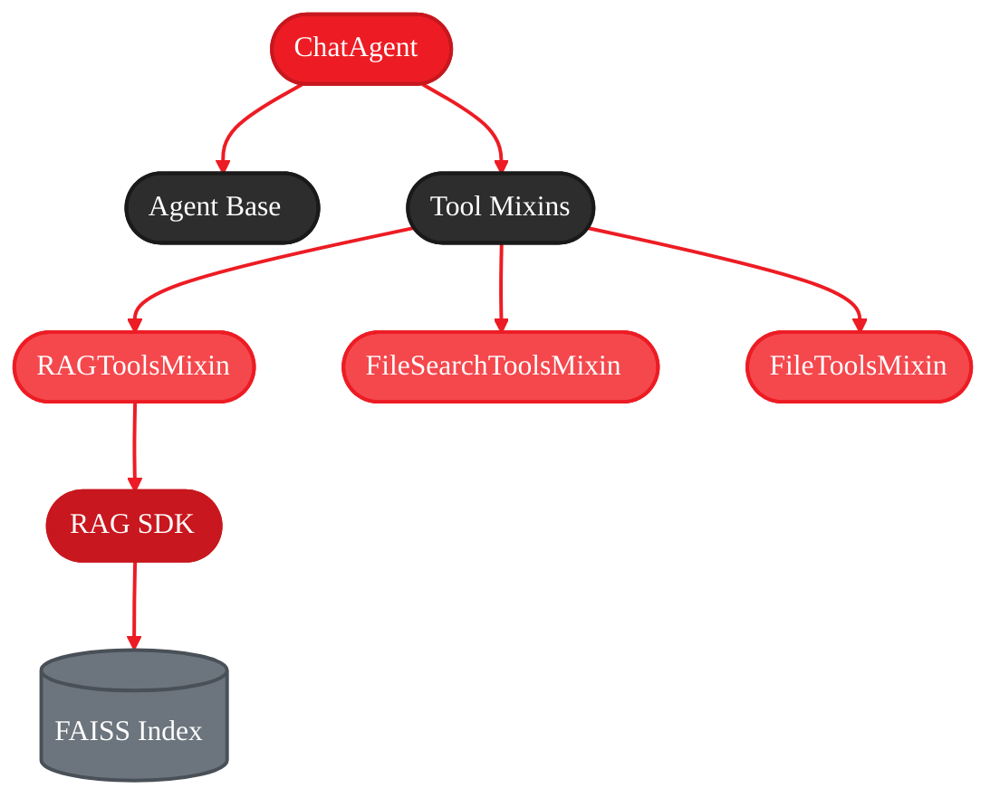
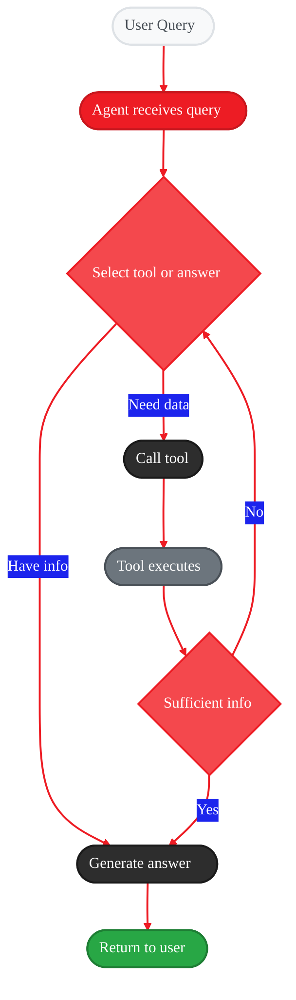
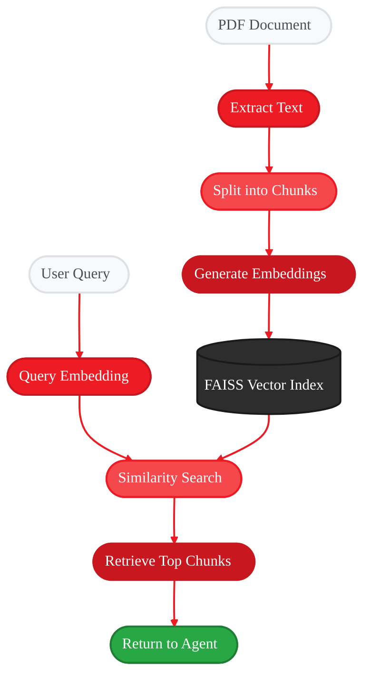

<Info>
  **Source Code:** [`src/gaia/chat/sdk.py`](https://github.com/amd/gaia/blob/main/src/gaia/chat/sdk.py) | [`src/gaia/rag/sdk.py`](https://github.com/amd/gaia/blob/main/src/gaia/rag/sdk.py)
</Info>

<Badge text="development" color="orange" />

- **Time to complete:** 15-20 minutes
- **What you'll build:** A basic chat agent with RAG and file discovery
- **What you'll learn:** Agent architecture, RAG integration, and the tool system
- **Platform:** Runs locally on AI PCs with Ryzen AI (NPU/iGPU acceleration)

---

## Why Build This Agent?

<Info>
**Privacy-First AI:** This agent runs entirely on your AI PC with Ryzen AI. All processing happens locally—document content never leaves your machine.
</Info>

If you have hundreds of PDF documents spread across your system—manuals, reports, specifications—finding specific information is tedious. You need to remember which file contains what, open each one, search manually, and piece together information from multiple sources.

This agent automates that process entirely on your AI PC:

1. Finds relevant documents on your drive
2. Indexes them with vector embeddings (NPU-accelerated on Ryzen AI)
3. Searches semantically using cosine similarity
4. Returns specific information with source citations
5. Runs completely locally—no cloud, no data leaving your machine

**What you're building:**

A chat agent that combines:
- **Agent reasoning** - LLM-based tool selection and orchestration
- **RAG (Retrieval-Augmented Generation)** - Vector search over document chunks
- **File discovery** - Automated search across common directories
- **File monitoring** - Watches folders and re-indexes on changes
- **Session persistence** - Saves indexed state across restarts
- **Local execution** - Runs entirely on your AI PC using Ryzen AI NPU/iGPU acceleration

---

## The Architecture (What You're Building)

<Frame>

</Frame>

**Flow:**
1. User query → ChatAgent (orchestrator)
2. Agent selects tool → RAGToolsMixin
3. RAGToolsMixin calls → RAG SDK
4. RAG SDK retrieves chunks from vector index → back to Agent
5. Agent synthesizes answer → User receives response

---

## Quick Start (5 Minutes)

Get a working agent running to understand the basic flow.

<Steps>
  <Step title="Install dependencies">
    ```bash
    uv pip install -e ".[rag]"
    ```
  </Step>

  <Step title="Start Lemonade Server">
    ```bash
    # Start local LLM server with AMD NPU/iGPU acceleration
    lemonade-server serve
    ```

    <Info>
    Lemonade Server provides AMD-optimized inference for AI PCs with Ryzen AI. Models run on your NPU or iGPU for fast, private processing.
    </Info>
  </Step>

  <Step title="Create your first agent">
    Create `my_chat_agent.py`:

    ```python title="my_chat_agent.py"
    import json
    from gaia.agents.chat.agent import ChatAgent, ChatAgentConfig

    # Create agent with a document
    config = ChatAgentConfig(
        rag_documents=["./manual.pdf"]  # Your document here
    )
    agent = ChatAgent(config)

    # Ask a question
    result = agent.process_query("What does the manual say about installation?")
    import json

    print(json.dumps(result, indent=2))
    ```
  </Step>

  <Step title="Run it">
    ```bash
    python my_chat_agent.py
    ```

    **What happens:**
    1. PDF text extraction (PyMuPDF)
    2. Chunking into 500-token segments
    3. Embedding generation (nomic-embed running on NPU/iGPU)
    4. FAISS index creation
    5. Query processing via vector search
    6. LLM generates answer using retrieved chunks (Ryzen AI acceleration)
  </Step>
</Steps>

<Note>
If you don't have a PDF, the agent operates in general conversation mode using the LLM's training data.

```python title="no_documents.py"
agent = ChatAgent()  # No documents specified
result = agent.process_query("What is Python?")
# No RAG retrieval, uses general knowledge
```
</Note>

---

## Understanding the Components

Before we build step-by-step, let's understand what each piece does **under the hood**.

### 1. The Agent Base Class

<Tabs>
  <Tab title="Code">
    ```python
    from gaia.agents.base.agent import Agent
    ```
  </Tab>

  <Tab title="Purpose">
    The base `Agent` class implements a reasoning loop that orchestrates tool calls based on LLM decisions.
  </Tab>
</Tabs>

**Processing flow when you call `process_query()`:**

<Frame>

</Frame>

**Trade-off:** You delegate control flow to the LLM. This is flexible but less deterministic than traditional programming.

---

### 2. The Tool Decorator

<Tabs>
  <Tab title="Code">
    ```python
    from gaia.agents.base.tools import tool

    @tool
    def search_documents(query: str) -> dict:
        """Search for documents."""
        # Your implementation
        return {"results": [...]}
    ```
  </Tab>

  <Tab title="What It Does">
    The `@tool` decorator:
    1. Introspects function signature and docstring
    2. Generates JSON schema for parameters
    3. Registers function with agent's tool registry
    4. Adds tool to LLM's context
    5. Enables LLM to invoke your function
  </Tab>

  <Tab title="How LLM Sees It">
    ```json
    {
      "name": "search_documents",
      "description": "Search for documents.",
      "parameters": {
        "type": "object",
        "properties": {
          "query": {"type": "string"}
        },
        "required": ["query"]
      }
    }
    ```
  </Tab>
</Tabs>

**Implementation:** The LLM receives tool schemas as context and decides when to invoke each function based on the user's query and conversation state.

---

### 3. RAG SDK (Document Retrieval)

<Tabs>
  <Tab title="Import">
    ```python
    from gaia.rag.sdk import RAGSDK, RAGConfig
    ```
  </Tab>

  <Tab title="Configuration">
    ```python
    config = RAGConfig(
        chunk_size=500,        # Tokens per chunk
        chunk_overlap=100,     # Context preservation
        max_chunks=5,          # Top-k retrieval
        embedding_model="nomic-embed-text-v2-moe-GGUF"  # Runs on NPU/iGPU
    )
    ```

    <Tip>
    On AI PCs with Ryzen AI, embedding generation runs on the NPU for efficient, low-power processing.
    </Tip>
  </Tab>

  <Tab title="Usage">
    ```python
    rag = RAGSDK(config)
    rag.index_document("document.pdf")
    response = rag.query("your question")
    ```
  </Tab>
</Tabs>

**RAG pipeline:**

<Frame>

</Frame>

**Why chunks?**
- LLMs have context window limits (e.g., 4096 tokens)
- Smaller chunks enable more precise semantic matching
- Overlap preserves context at chunk boundaries and reduces information loss

<Note>
**AMD Hardware Acceleration:** Embedding generation runs on the Ryzen AI NPU/iGPU, enabling fast document indexing with minimal CPU usage on AI PCs.
</Note>

---

### 4. Tool Mixins

<Info>
**Mixins** are classes that provide reusable tool sets via Python multiple inheritance.
</Info>

<Tabs>
  <Tab title="Usage">
    ```python
    class ChatAgent(Agent, RAGToolsMixin, FileToolsMixin):
        # Inherits tools from all mixins
        pass
    ```
  </Tab>

  <Tab title="Available Mixins">
    - **RAGToolsMixin** - Document indexing and querying
    - **FileToolsMixin** - Directory monitoring
    - **FileSearchToolsMixin** - File discovery
    - **ShellToolsMixin** - Command execution
  </Tab>

  <Tab title="Benefits">
    - Reusable across agent implementations
    - Tested tool implementations
    - Reduces boilerplate
    - Composition pattern
  </Tab>
</Tabs>

<CodeGroup>
```python Example: Multiple Mixins
from gaia.agents.base.agent import Agent
from gaia.agents.chat.tools import RAGToolsMixin, FileToolsMixin

class MyAgent(Agent, RAGToolsMixin, FileToolsMixin):
    def _register_tools(self):
        self.register_rag_tools()    # Gets all RAG tools
        self.register_file_tools()   # Gets all file tools
        # Agent now has ~15 tools available
```

```python Mixin Internals
class RAGToolsMixin:
    def register_rag_tools(self):
        @tool
        def query_documents(query: str) -> dict:
            # Implementation
            pass

        @tool
        def index_document(file_path: str) -> dict:
            # Implementation
            pass
        # More tools defined here...
```
</CodeGroup>

---

## Building It: The Step-by-Step Journey

Now let's build this agent incrementally, understanding each piece as we go.

### Step 1: The Simplest Possible Agent

Start with a minimal agent implementation to understand the core structure.

<Tabs>
  <Tab title="Implementation">
    ```python title="step1_basic.py"
    from gaia.agents.base.agent import Agent
    from gaia.agents.base.console import AgentConsole

    class SimpleChatAgent(Agent):
        """Minimal chat agent with no tools."""

        def _get_system_prompt(self) -> str:
            return "You are a helpful AI assistant."

        def _create_console(self):
            return AgentConsole()

        def _register_tools(self):
            # No tools registered yet
            pass

    # Use it
    agent = SimpleChatAgent()
    result = agent.process_query("Hello! How are you?")
    print(result)
    ```
  </Tab>

  <Tab title="Run">
    ```bash
    python step1_basic.py
    ```

    **Expected output:**
    ```
    Agent: Hello! I'm doing well, thank you for asking. How can I help you today?
    ```
  </Tab>

  <Tab title="What You Have">
    - ✓ Agent with reasoning loop
    - ✓ System prompt definition
    - ✓ Console output
    - ✗ No tools (can only chat)
    - ✗ No document access
  </Tab>
</Tabs>

<Accordion title="Under the Hood: Execution Flow">
**Initialization:**
```python
SimpleChatAgent()
  → Agent.__init__()
  → Initialize LLM client
  → Load system prompt
  → Create console
  → Register tools (none in this case)
```

**Query processing:**
```python
process_query("Hello! How are you?")
  → Construct messages: [system_prompt, user_message]
  → Send to LLM (Lemonade Server)
  → LLM generates response
  → Display via AgentConsole
  → Return result dict
```

**Limitations:**
- No tools = no ability to execute actions
- Cannot access external data sources
- Relies solely on LLM training data
</Accordion>

<Warning>
This basic agent cannot retrieve information from documents or perform actions. It's limited to conversation using the LLM's pre-trained knowledge.
</Warning>

---

### Step 2: Add RAG (Document Understanding)

Add RAG capability to enable document search and retrieval.

<Tabs>
  <Tab title="Implementation">
    ```python title="step2_with_rag.py"
    from gaia.agents.base.agent import Agent
    from gaia.agents.base.console import AgentConsole
    from gaia.agents.base.tools import tool
    from gaia.rag.sdk import RAGSDK, RAGConfig

    class DocQAAgent(Agent):
        """Agent with document Q&A capability."""

        def __init__(self, documents=None, **kwargs):
            # Initialize RAG SDK first
            rag_config = RAGConfig(
                chunk_size=500,
                max_chunks=5,
                chunk_overlap=100
            )
            self.rag = RAGSDK(rag_config)
            self.indexed_files = set()

            # Index documents
            if documents:
                for doc in documents:
                    self.rag.index_document(doc)
                    self.indexed_files.add(doc)
                    print(f"✓ Indexed: {doc}")

            super().__init__(**kwargs)

        def _get_system_prompt(self) -> str:
            indexed = "\n".join(f"- {doc}" for doc in self.indexed_files)
            return f"""You are a document Q&A assistant.

    Currently indexed:
    {indexed}

    Use query_documents to search for information."""

        def _create_console(self):
            return AgentConsole()

        def _register_tools(self):
            @tool
            def query_documents(query: str) -> dict:
                """Search indexed documents."""
                if not self.rag.indexed_files:
                    return {"error": "No documents indexed"}

                response = self.rag.query(query)
                return {
                    "chunks": response.chunks,
                    "scores": response.chunk_scores,
                    "sources": response.source_files,
                    "answer": response.text
                }

# Use it
agent = DocQAAgent(documents=["./manual.pdf"])
response = agent.process_query("What does the manual say about installation?")
print(response)
    ```
  </Tab>

  <Tab title="Usage">
    ```python
    # Create agent with document
    agent = DocQAAgent(documents=["./manual.pdf"])

    # Query it
    result = agent.process_query("What are the system requirements?")
    print(result)
    ```
  </Tab>

  <Tab title="Output Example">
    ```json
    {
      "answer": "According to the manual, system requirements are: Python 3.10+, 8GB RAM, 50GB disk space...",
      "sources": ["manual.pdf"],
      "steps": 2,
      "tools_used": ["query_documents"]
    }
    ```
  </Tab>
</Tabs>

<Accordion title="Under the Hood: Indexing and Retrieval">
**Indexing phase (`__init__`):**
```python
DocQAAgent(documents=["manual.pdf"])
  → RAGSDK instance created
  → For each PDF:
      → PyMuPDF extracts text
      → Text split into 500-token chunks (100 overlap)
      → nomic-embed generates embeddings (384 dimensions, runs on NPU/iGPU)
      → Embeddings stored in FAISS index (in-memory)
  → Ready for queries
```

<Info>
On AI PCs with Ryzen AI, the embedding model runs on the NPU for efficient processing.
</Info>

**Query phase (`process_query`):**
```python
process_query("What are the system requirements?")
  → Agent decides to use query_documents tool
  → Tool execution:
      → Generate query embedding (nomic-embed on NPU)
      → Compute cosine similarity vs all chunk embeddings
      → Sort by similarity score
      → Return top 5 chunks
  → Agent receives chunks
  → LLM synthesizes answer using chunks as context (Ryzen AI acceleration)
  → Return result
```

**Key benefit:** Grounding LLM responses in actual document text reduces hallucination for domain-specific content.
</Accordion>

<Check>
**What you have:** Document retrieval via vector search. The agent can answer questions using your specific documents rather than general knowledge.
</Check>

---

### Step 3: Add Smart File Discovery

Add file discovery to avoid hardcoding document paths.

<CodeGroup>
```python step3_with_discovery.py
from gaia.agents.base.agent import Agent
from gaia.agents.base.console import AgentConsole
from gaia.agents.base.tools import tool
from gaia.rag.sdk import RAGSDK, RAGConfig
from fnmatch import fnmatch
from pathlib import Path

class SmartDocAgent(Agent):
    """Agent with smart document discovery."""

    def __init__(self, **kwargs):
        self.rag = RAGSDK(RAGConfig())
        self.indexed_files = set()
        super().__init__(**kwargs)

    def _get_system_prompt(self) -> str:
        indexed_docs = "\n".join(f"- {Path(f).name}" for f in self.indexed_files)

        return f"""You are an intelligent document assistant.

Indexed documents:
{indexed_docs or "None yet"}

**Smart Discovery Workflow:**
When user asks about something (e.g., "oil & gas manual"):
1. Use search_files to find it
2. Index it automatically
3. Then query to answer their question

This creates a more natural user experience where file paths don't need to be specified."""

    def _create_console(self):
        return AgentConsole()

    def _register_tools(self):
        @tool
        def search_files(pattern: str) -> dict:
            """Find files matching a pattern (searches common locations)."""
            # Search common directories
            search_paths = [
                Path.home() / "Documents",
                Path.home() / "Downloads",
                Path.home() / "Desktop",
                Path.cwd(),
            ]

            # Support "*" wildcards (agent sends patterns with them) and fall back to
            # substring matching by wrapping non-wildcard patterns with "*".
            normalized_pattern = pattern.lower()
            if "*" not in normalized_pattern and "?" not in normalized_pattern:
                normalized_pattern = f"*{normalized_pattern}*"

            found_files = []
            for search_path in search_paths:
                if search_path.exists():
                    # Find PDF files matching pattern
                    for pdf in search_path.rglob("*.pdf"):
                        if fnmatch(pdf.name.lower(), normalized_pattern):
                            found_files.append(str(pdf))

            return {
                "files": found_files,
                "count": len(found_files),
                "message": f"Found {len(found_files)} file(s)"
            }

        @tool
        def index_document(file_path: str) -> dict:
            """Index a document for searching."""
            if not Path(file_path).exists():
                return {"error": f"File not found: {file_path}"}

            result = self.rag.index_document(file_path)
            if result.get("success"):
                self.indexed_files.add(file_path)
                return {
                    "status": "success",
                    "chunks": result.get("num_chunks"),
                    "file": Path(file_path).name
                }
            return {"error": result.get("error")}

        @tool
        def query_documents(query: str) -> dict:
            """Search all indexed documents."""
            if not self.indexed_files:
                return {"error": "No documents indexed"}

            response = self.rag.query(query)
            return {
                "answer": response.text,
                "sources": [Path(f).name for f in response.source_files],
                "scores": response.chunk_scores
            }

# Use it
agent = SmartDocAgent()

# User can now ask naturally!
result = agent.process_query("Find and search the user manual for installation steps")
# Agent will:
# 1. Call search_files("user manual")
# 2. Call index_document(found_file)
# 3. Call query_documents("installation steps")
# 4. Return the answer!
```
</CodeGroup>

<Accordion title="Under the Hood: Smart Discovery Pattern">
**Example query:** *"Find the oil manual and tell me about safety"*

**LLM orchestration (automatic):**
```json
// Step 1: Locate file
{
  "thought": "Need to find oil manual first",
  "tool": "search_files",
  "tool_args": {"pattern": "oil manual"}
}
// Returns: ["C:/Docs/Oil-Gas-Manual.pdf"]

// Step 2: Index document
{
  "thought": "Found file, index it for searching",
  "tool": "index_document",
  "tool_args": {"file_path": "C:/Docs/Oil-Gas-Manual.pdf"}
}
// Returns: {"status": "success", "chunks": 150}

// Step 3: Query for safety info
{
  "thought": "Document indexed, search for safety",
  "tool": "query_documents",
  "tool_args": {"query": "safety"}
}
// Returns: Relevant chunks about safety protocols

// Step 4: Synthesize answer
{
  "answer": "According to the Oil & Gas Manual, safety protocols include..."
}
```

**Implementation note:** You define Python functions. The LLM decides when to call them based on tool schemas and user intent.
</Accordion>

<Check>
**What you have:** File discovery without hardcoded paths. The agent can locate, index, and query documents based on pattern matching.
</Check>

---

## Next Steps

You've built a functional document Q&A agent with RAG and file discovery! Continue with Part 2 to add more capabilities:

<Card title="Part 2: Advanced Features & Customization" icon="wrench" href="./part-2-advanced-features">
  Add tool mixins, file monitoring, session persistence, and learn how to customize your agent for specific use cases.
</Card>

---

<small style="color: #666;">

**License**

Copyright(C) 2025-2026 Advanced Micro Devices, Inc. All rights reserved.

SPDX-License-Identifier: MIT

</small>
