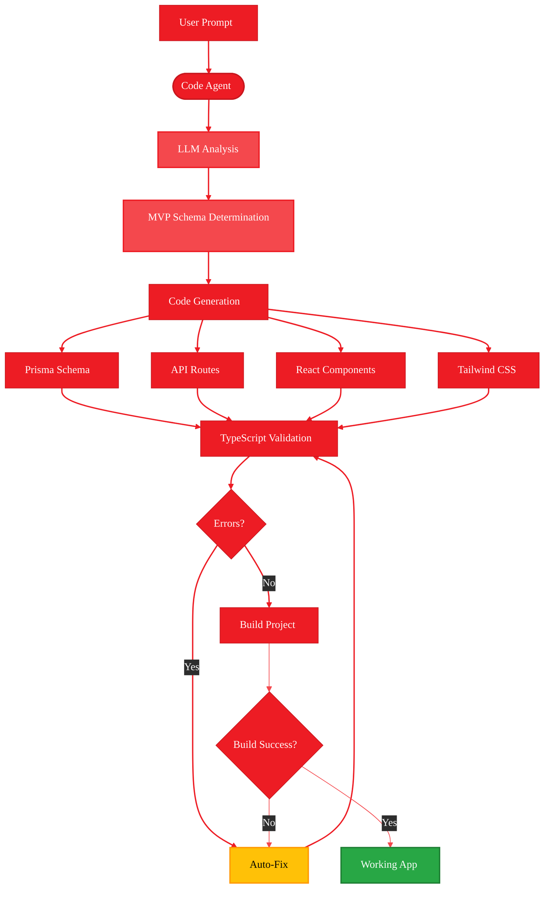

<Info>
  **Source Code:** [`src/gaia/agents/code/`](https://github.com/amd/gaia/blob/main/src/gaia/agents/code/)
</Info>

<Info>
  **First time here?** Complete the [Setup](/setup) guide first to install GAIA and its dependencies.
</Info>

<Tip>
  **Just want to use the agent?** See the [Code Agent Guide](/guides/code) for quick start instructions without building from scratch.
</Tip>

- **Time to complete:** 20-25 minutes
- **What you'll build:** Understanding of GAIA Code's architecture and capabilities
- **What you'll learn:** How the agent generates Next.js apps from natural language
- **Platform:** Runs locally on AI PCs with Ryzen AI (NPU/iGPU acceleration)

---

## What is GAIA Code?

GAIA Code is an AI-powered agent that generates complete Next.js web applications from natural language descriptions. It runs entirely on your local machine using AMD Ryzen AI hardware acceleration.

**Key capabilities:**
- Generates full-stack Next.js 15 applications
- Creates SQLite database schemas via Prisma
- Builds REST API endpoints with Zod validation
- Generates React components (list, form, detail views)
- Applies Tailwind CSS styling
- Validates TypeScript and iterates to fix errors

---

## Why GAIA Code?

Building modern web applications requires:
- Database schema design
- API endpoint creation with validation
- React component development
- Styling and theming
- TypeScript configuration
- Error handling and testing

**GAIA Code automates all of this.** Describe your app in plain English, and the agent generates a working Next.js application.

### Example

```bash
gaia code "Build me a movie tracking app in nextjs where I can track the movie title, genre, date watched, and a score out of 10"
```

**Result:** A complete Next.js app with:
- SQLite database with Movie model
- API routes (GET, POST, PUT, DELETE)
- React pages (list, create, detail views)
- Tailwind CSS styling
- TypeScript validation
- No errors, ready to run

---

## System Architecture

<Frame>

</Frame>

### Architecture Layers

#### 1. User Interface Layer
- **Input:** Natural language prompt describing the application
- **Output:** Complete Next.js project structure

#### 2. LLM Analysis Layer
- **Local LLM** via Lemonade Server analyzes requirements
- **MVP Determination:** Identifies minimal viable schema
- **Contextual Understanding:** Interprets user intent

#### 3. Code Generation Layer
Multiple specialized tools work in parallel:

| Component | Generates | Example |
|-----------|-----------|---------|
| **Prisma Tools** | SQLite database schema | Movie model with fields |
| **API Tools** | REST endpoints with validation | GET/POST/PUT/DELETE routes |
| **React Tools** | UI components | List, form, detail pages |
| **Styling Tools** | Tailwind CSS | Consistent theme |

#### 4. Validation & Build Layer
- **TypeScript Validation:** Checks type safety
- **Build Process:** Runs Next.js build
- **Error Detection:** Identifies issues
- **Auto-Fix Loop:** Iterates until success

---

## How It Works: The MVP Approach

GAIA Code uses a **Minimum Viable Product (MVP) approach** when generating applications.

### Schema Determination Process

1. **User provides prompt:** "Build me a movie tracking app"
2. **LLM analyzes requirements:** What's the minimum needed?
3. **MVP schema generated:** Just title and watched status
4. **User can iterate:** Add more fields later

### Example: Movie Tracker Evolution

<Tabs>
  <Tab title="Initial Prompt">
    ```bash
    gaia code "Build me a movie tracking app"
    ```
  </Tab>

  <Tab title="MVP Schema Generated">
    ```prisma
    model Movie {
      id       Int      @id @default(autoincrement())
      title    String
      watched  Boolean  @default(false)
      createdAt DateTime @default(now())
      updatedAt DateTime @updatedAt
    }
    ```
    
    **Why minimal?** The agent creates only what's explicitly needed or clearly implied.
  </Tab>

  <Tab title="Specific Prompt">
    ```bash
    gaia code "Build me a movie tracking app in nextjs where I can track the movie title, genre, date watched, and a score out of 10"
    ```
  </Tab>

  <Tab title="Detailed Schema Generated">
    ```prisma
    model Movie {
      id          Int       @id @default(autoincrement())
      title       String
      genre       String
      dateWatched DateTime
      score       Int
      createdAt   DateTime  @default(now())
      updatedAt   DateTime  @updatedAt
    }
    ```
    
    **More specific prompt = more detailed schema.**
  </Tab>
</Tabs>

---

## Technology Stack

GAIA Code generates applications using modern web technologies:

### Frontend
- **Next.js 15** with App Router
- **React** for UI components
- **TypeScript** for type safety
- **Tailwind CSS** for styling

### Backend
- **Next.js API Routes** (serverless functions)
- **Prisma** ORM for database access
- **SQLite** database (file-based, no server needed)
- **Zod** for runtime validation

### Development
- **Local LLM** via Lemonade Server (AMD NPU/iGPU accelerated)
- **TypeScript Compiler** for validation
- **Next.js Build System** for optimization

---

## Generated Project Structure

Every generated application follows this structure:

```
your-app/
├── prisma/
│   ├── schema.prisma          # Database models
│   └── dev.db                 # SQLite database file (after setup)
├── src/
│   ├── app/
│   │   ├── api/
│   │   │   └── [resource]/
│   │   │       ├── route.ts        # GET, POST
│   │   │       └── [id]/route.ts   # GET, PUT, DELETE
│   │   ├── [resource]/
│   │   │   ├── page.tsx        # List view
│   │   │   ├── new/page.tsx    # Create form
│   │   │   └── [id]/page.tsx   # Detail view
│   │   ├── layout.tsx          # Root layout
│   │   ├── page.tsx            # Home page
│   │   └── globals.css         # Global styles
│   └── lib/
│       └── prisma.ts           # Database client
├── package.json
├── tsconfig.json
├── tailwind.config.ts
└── next.config.js
```

---

## Key Concepts

### 1. MVP-First Generation

The agent doesn't overengineer. It creates the minimum viable product based on your prompt.

```bash
# Simple prompt = minimal schema
gaia code "Build me a workout tracker"
# Likely generates: workout name, date, completed

# Detailed prompt = detailed schema
gaia code "Build me a workout tracking app in nextjs where I can track workout, duration, date, and goal"
# Generates exactly what you specified
```

### 2. Iterative Error Fixing

The agent doesn't just generate code once—it validates and fixes errors automatically:

1. Generate initial code
2. Run TypeScript validation
3. Found errors? → Fix them
4. Run Next.js build
5. Build failed? → Fix issues
6. Repeat until working

### 3. Full-Stack Integration

Everything is connected:
- Database models → TypeScript types
- API routes → Zod validators
- React components → API clients
- All type-safe and validated

---

## Quick Start

Let's see GAIA Code in action:

<Steps>
  <Step title="Prerequisites">
    ```bash
    git clone https://github.com/amd/gaia.git
    cd gaia
    uv pip install -e ".[dev]"
    ```
  </Step>

  <Step title="Start Lemonade Server">
    ```bash
    lemonade-server serve --ctx-size 32768
    ```
    
    The local LLM server with AMD NPU/iGPU acceleration.
  </Step>

  <Step title="Generate an app">
    ```bash
    gaia code "Build me a todo tracking app using typescript"
    ```
  </Step>

  <Step title="Run the app">
    ```bash
    cd todo-tracking-app
    npm install
    npx prisma generate
    npx prisma db push
    npm run dev
    ```
    
    Opens at http://localhost:3000
  </Step>
</Steps>

---

## What's Next?

<CardGroup cols={2}>
  <Card title="Part 2: App Creation & Components" icon="puzzle-piece" href="./part-2-app-creation">
    Learn how the agent generates schemas, APIs, and React components from your prompt
  </Card>

  <Card title="Part 3: Validation & Building" icon="hammer" href="./part-3-validation-building">
    Understand TypeScript validation, build process, and error iteration
  </Card>
</CardGroup>

---

<small style="color: #666;">

**License**

Copyright(C) 2024-2025 Advanced Micro Devices, Inc. All rights reserved.

SPDX-License-Identifier: MIT

</small>
