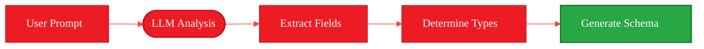

<Info>
  **Source Code:** [`src/gaia/agents/code/`](https://github.com/amd/gaia/blob/main/src/gaia/agents/code/)
</Info>

<Note>
**This is Part 2 of 3.** If you haven't completed Part 1, start there: [Part 1: Introduction & Architecture](./part-1-introduction)
</Note>

- **Time to complete:** 20-25 minutes
- **What you'll build:** Understanding of how GAIA Code generates complete applications
- **What you'll learn:** Schema generation, API creation, React components, MVP approach
- **Platform:** Runs locally on AI PCs with Ryzen AI (NPU/iGPU acceleration)

---

## Generating Your First App

Let's walk through creating a movie tracking app to understand each component.

### The Prompt

```bash
gaia code "Build me a movie tracking app in nextjs where I can track the movie title, genre, date watched, and a score out of 10"
```

This single command triggers a complete generation pipeline.

---

## Component 1: Database Schema Generation

The agent's first task is creating the database schema via Prisma.

### How Schema Generation Works

<Frame>

</Frame>

### Generated Schema

From our movie tracker prompt:

```prisma title="prisma/schema.prisma"
generator client {
  provider = "prisma-client-js"
}

datasource db {
  provider = "sqlite"
  url      = "file:./dev.db"
}

model Movie {
  id          Int      @id @default(autoincrement())
  title       String
  genre       String
  dateWatched DateTime
  score       Int
  createdAt   DateTime @default(now())
  updatedAt   DateTime @updatedAt
}
```

**What happened:**
- `title, genre` → `String` fields
- `dateWatched` → `DateTime` field
- `score out of 10` → `Int` field
- Auto-added: `id`, `createdAt`, `updatedAt` (standard fields)

### Schema Features

<Accordion title="Primary Keys & IDs">
Every model gets:
- `id Int @id @default(autoincrement())` - Auto-incrementing primary key
- Ensures unique records
</Accordion>

<Accordion title="Timestamps">
Automatic tracking:
- `createdAt DateTime @default(now())` - When record was created
- `updatedAt DateTime @updatedAt` - Auto-updates on changes
</Accordion>

<Accordion title="Field Types">
LLM intelligently maps:
- Text → `String`
- Numbers → `Int` or `Float`
- Dates → `DateTime`
- True/False → `Boolean`
- Optional fields → `String?` (nullable)
</Accordion>

---

## Component 2: API Route Generation

Next, the agent creates REST API endpoints with validation.

### API Structure

For each model, the agent generates two route files:

```
src/app/api/movies/
├── route.ts        # GET (list), POST (create)
└── [id]/route.ts   # GET (one), PUT (update), DELETE
```

### GET All Movies

```typescript title="src/app/api/movies/route.ts"
import { NextResponse } from 'next/server';
import { prisma } from '@/lib/prisma';

export async function GET() {
  try {
    const movies = await prisma.movie.findMany({
      orderBy: { createdAt: 'desc' },
    });
    return NextResponse.json(movies);
  } catch (error) {
    return NextResponse.json(
      { error: 'Failed to fetch movies' },
      { status: 500 }
    );
  }
}
```

### POST Create Movie

```typescript title="src/app/api/movies/route.ts"
import { z } from 'zod';

const createMovieSchema = z.object({
  title: z.string().min(1, 'Title is required'),
  genre: z.string().min(1, 'Genre is required'),
  dateWatched: z.string().datetime(),
  score: z.number().min(1).max(10),
});

export async function POST(request: Request) {
  try {
    const body = await request.json();
    
    // Validate with Zod
    const validatedData = createMovieSchema.parse(body);
    
    // Create in database
    const movie = await prisma.movie.create({
      data: {
        ...validatedData,
        dateWatched: new Date(validatedData.dateWatched),
      },
    });
    
    return NextResponse.json(movie, { status: 201 });
  } catch (error) {
    if (error instanceof z.ZodError) {
      return NextResponse.json(
        { error: error.errors },
        { status: 400 }
      );
    }
    return NextResponse.json(
      { error: 'Failed to create movie' },
      { status: 500 }
    );
  }
}
```

### PUT Update Movie

```typescript title="src/app/api/movies/[id]/route.ts"
const updateMovieSchema = z.object({
  title: z.string().min(1).optional(),
  genre: z.string().optional(),
  dateWatched: z.string().datetime().optional(),
  score: z.number().min(1).max(10).optional(),
});

export async function PUT(
  request: Request,
  { params }: { params: { id: string } }
) {
  try {
    const id = parseInt(params.id);
    const body = await request.json();
    
    const validatedData = updateMovieSchema.parse(body);
    
    const movie = await prisma.movie.update({
      where: { id },
      data: validatedData.dateWatched 
        ? { ...validatedData, dateWatched: new Date(validatedData.dateWatched) }
        : validatedData,
    });
    
    return NextResponse.json(movie);
  } catch (error) {
    return NextResponse.json(
      { error: 'Failed to update movie' },
      { status: 500 }
    );
  }
}
```

### DELETE Movie

```typescript title="src/app/api/movies/[id]/route.ts"
export async function DELETE(
  request: Request,
  { params }: { params: { id: string } }
) {
  try {
    const id = parseInt(params.id);
    
    await prisma.movie.delete({
      where: { id },
    });
    
    return NextResponse.json({ message: 'Movie deleted' });
  } catch (error) {
    return NextResponse.json(
      { error: 'Failed to delete movie' },
      { status: 500 }
    );
  }
}
```

### API Features

<CardGroup cols={2}>
  <Card title="Validation" icon="shield-check">
    Zod schemas validate all inputs before database operations
  </Card>

  <Card title="Error Handling" icon="triangle-exclamation">
    Try-catch blocks with appropriate HTTP status codes
  </Card>

  <Card title="Type Safety" icon="code">
    Full TypeScript integration with Prisma types
  </Card>

  <Card title="REST Standards" icon="network-wired">
    Proper HTTP methods and status codes
  </Card>
</CardGroup>

---

## Component 3: React Component Generation

The agent generates four types of pages for each resource.

### Generated Page Structure

```
src/app/movies/
├── page.tsx        # List all movies
├── new/
│   └── page.tsx    # Create new movie form
└── [id]/
    └── page.tsx    # View/edit single movie
```

### List View

```typescript title="src/app/movies/page.tsx"
'use client';

import { useEffect, useState } from 'react';
import Link from 'next/link';

interface Movie {
  id: number;
  title: string;
  genre: string;
  dateWatched: string;
  score: number;
}

export default function MoviesPage() {
  const [movies, setMovies] = useState<Movie[]>([]);
  const [loading, setLoading] = useState(true);

  useEffect(() => {
    fetchMovies();
  }, []);

  const fetchMovies = async () => {
    try {
      const res = await fetch('/api/movies');
      const data = await res.json();
      setMovies(data);
    } catch (error) {
      console.error('Failed to fetch movies:', error);
    } finally {
      setLoading(false);
    }
  };

  const handleDelete = async (id: number) => {
    if (!confirm('Delete this movie?')) return;
    
    try {
      await fetch(`/api/movies/${id}`, { method: 'DELETE' });
      fetchMovies();
    } catch (error) {
      console.error('Failed to delete:', error);
    }
  };

  if (loading) return <div>Loading...</div>;

  return (
    <div className="container mx-auto p-6">
      <div className="flex justify-between items-center mb-6">
        <h1 className="text-3xl font-bold">Movies</h1>
        <Link
          href="/movies/new"
          className="px-4 py-2 bg-blue-600 text-white rounded hover:bg-blue-700"
        >
          Add Movie
        </Link>
      </div>

      <div className="grid gap-4">
        {movies.map((movie) => (
          <div
            key={movie.id}
            className="p-4 border rounded-lg flex justify-between items-center"
          >
            <div>
              <h3 className="text-xl font-semibold">{movie.title}</h3>
              <p className="text-gray-600">{movie.genre}</p>
              <p className="text-sm text-gray-500">
                Watched: {new Date(movie.dateWatched).toLocaleDateString()}
              </p>
              <p className="text-sm">Score: {movie.score}/10</p>
            </div>
            <div className="flex gap-2">
              <Link
                href={`/movies/${movie.id}`}
                className="px-3 py-1 bg-gray-200 rounded hover:bg-gray-300"
              >
                View
              </Link>
              <button
                onClick={() => handleDelete(movie.id)}
                className="px-3 py-1 bg-red-600 text-white rounded hover:bg-red-700"
              >
                Delete
              </button>
            </div>
          </div>
        ))}
      </div>
    </div>
  );
}
```

### Create Form

```typescript title="src/app/movies/new/page.tsx"
'use client';

import { useState } from 'react';
import { useRouter } from 'next/navigation';

export default function NewMoviePage() {
  const router = useRouter();
  const [formData, setFormData] = useState({
    title: '',
    genre: '',
    dateWatched: '',
    score: 5,
  });
  const [error, setError] = useState('');

  const handleSubmit = async (e: React.FormEvent) => {
    e.preventDefault();
    setError('');

    try {
      const res = await fetch('/api/movies', {
        method: 'POST',
        headers: { 'Content-Type': 'application/json' },
        body: JSON.stringify({
          ...formData,
          dateWatched: new Date(formData.dateWatched).toISOString(),
        }),
      });

      if (!res.ok) {
        const data = await res.json();
        throw new Error(data.error || 'Failed to create movie');
      }

      router.push('/movies');
    } catch (err) {
      setError(err instanceof Error ? err.message : 'An error occurred');
    }
  };

  return (
    <div className="container mx-auto p-6 max-w-2xl">
      <h1 className="text-3xl font-bold mb-6">Add New Movie</h1>

      <form onSubmit={handleSubmit} className="space-y-4">
        {error && (
          <div className="p-4 bg-red-100 text-red-700 rounded">{error}</div>
        )}

        <div>
          <label className="block text-sm font-medium mb-2">Title *</label>
          <input
            type="text"
            value={formData.title}
            onChange={(e) => setFormData({ ...formData, title: e.target.value })}
            required
            className="w-full px-4 py-2 border rounded"
          />
        </div>

        <div>
          <label className="block text-sm font-medium mb-2">Genre *</label>
          <input
            type="text"
            value={formData.genre}
            onChange={(e) => setFormData({ ...formData, genre: e.target.value })}
            required
            className="w-full px-4 py-2 border rounded"
          />
        </div>

        <div>
          <label className="block text-sm font-medium mb-2">Date Watched *</label>
          <input
            type="date"
            value={formData.dateWatched}
            onChange={(e) => setFormData({ ...formData, dateWatched: e.target.value })}
            required
            className="w-full px-4 py-2 border rounded"
          />
        </div>

        <div>
          <label className="block text-sm font-medium mb-2">
            Score (1-10) *
          </label>
          <input
            type="number"
            min="1"
            max="10"
            value={formData.score}
            onChange={(e) => setFormData({ ...formData, score: parseInt(e.target.value) })}
            required
            className="w-full px-4 py-2 border rounded"
          />
        </div>

        <div className="flex gap-4">
          <button
            type="submit"
            className="px-6 py-2 bg-blue-600 text-white rounded hover:bg-blue-700"
          >
            Create Movie
          </button>
          <button
            type="button"
            onClick={() => router.back()}
            className="px-6 py-2 border rounded hover:bg-gray-100"
          >
            Cancel
          </button>
        </div>
      </form>
    </div>
  );
}
```

---

## Component 4: Styling with Tailwind CSS

The agent applies consistent styling using Tailwind CSS.

### Generated Styles

```css title="src/app/globals.css"
@tailwind base;
@tailwind components;
@tailwind utilities;

@layer base {
  body {
    @apply bg-gray-50 text-gray-900;
  }
}
```

### Styling Features

- Consistent color scheme
- Responsive design
- Form styling
- Button states
- Loading states
- Error messages

---

## The MVP Creation Process

Understanding how the agent determines what to build:

<Steps>
  <Step title="Analyze Prompt">
    LLM parses the user's request and extracts key information
  </Step>

  <Step title="Identify Core Entities">
    Determines main models needed (e.g., "Movie")
  </Step>

  <Step title="Extract Fields">
    Lists specific fields mentioned ("title, genre, date watched, score")
  </Step>

  <Step title="Determine Types">
    Maps fields to appropriate types (String, DateTime, Int)
  </Step>

  <Step title="Generate Minimal Schema">
    Creates MVP schema without extra features
  </Step>

  <Step title="Build Full Stack">
    Generates API routes, React components, and styling
  </Step>
</Steps>

---

## Working Examples

Here are verified prompts that generate complete applications:

### Movie Tracking App

```bash
gaia code "Build me a movie tracking app in nextjs where I can track the movie title, genre, date watched, and a score out of 10"
```

### Workout Tracking App

```bash
gaia code "Build me a workout tracking app in nextjs where I can track workout, duration, date, and goal"
```

### Restaurant Rating App

```bash
gaia code "Build me a restaurant rating application. I want to be able to put the location of the restaurant, the food that I ate, and my review"
```

### AI Tool Rating with Leaderboard

```bash
gaia code "Build me an AI tool rating algorithm in nextjs where I can give the name of the AI programming tool, give it a score out of 10 for speed and quality in a text box, as well as provide a description. Show a little leaderboard that will show the highest performing to lowest performing tools by averaging those scores"
```

### Simple Todo Tracker

```bash
gaia code "Build me a todo tracking app using typescript"
```

---

## What's Next?

<Card title="Part 3: Validation & Building" icon="hammer" href="./part-3-validation-building">
  Learn how TypeScript validation works, the build process, and how the agent iterates to fix errors
</Card>

---

<small style="color: #666;">

**License**

Copyright(C) 2024-2025 Advanced Micro Devices, Inc. All rights reserved.

SPDX-License-Identifier: MIT

</small>
