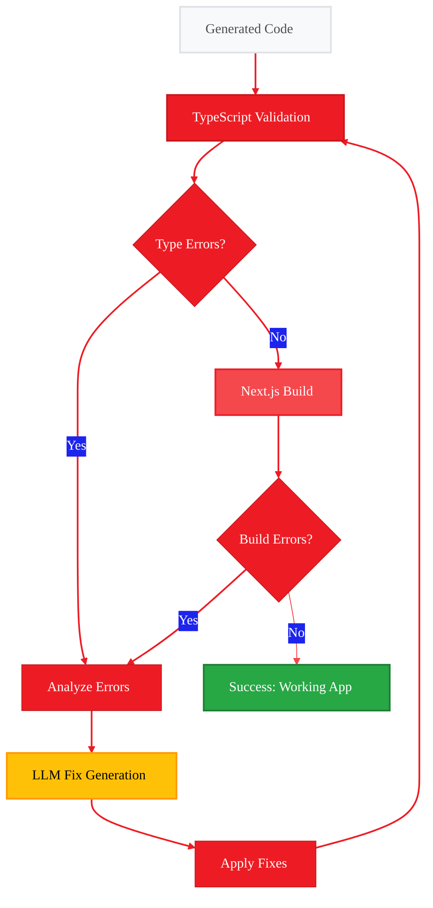

<Info>
  **Source Code:** [`src/gaia/agents/code/`](https://github.com/amd/gaia/blob/main/src/gaia/agents/code/)
</Info>

<Note>
**This is Part 3 of 3.** If you haven't completed the previous parts:
- [Part 1: Introduction & Architecture](./part-1-introduction)
- [Part 2: App Creation & Components](./part-2-app-creation)
</Note>

- **Time to complete:** 15-20 minutes
- **What you'll learn:** TypeScript validation, build process, error fixing loop
- **Platform:** Designed for AI PCs with Ryzen AI (NPU/iGPU acceleration)

---

## The Validation & Build Pipeline

After generating code, GAIA Code doesn't just stop—it validates, builds, and fixes errors automatically until the application works.

<Frame>

</Frame>

This iterative process ensures every generated application is functional.

---

## Phase 1: TypeScript Validation

The first validation step checks for type errors.

### What TypeScript Validation Checks

<CardGroup cols={2}>
  <Card title="Type Safety" icon="shield-check">
    Variables used with correct types
  </Card>

  <Card title="Import Errors" icon="file-import">
    All imports resolve correctly
  </Card>

  <Card title="API Compatibility" icon="plug">
    Function calls match signatures
  </Card>

  <Card title="Null Safety" icon="ban">
    Nullable values handled properly
  </Card>
</CardGroup>

### Example: Type Error Detection

**Generated code with error:**

```typescript
// Error: Property 'map' does not exist on type 'Movie | undefined'
export default function MoviesPage() {
  const [movies, setMovies] = useState<Movie[]>();
  
  return (
    <div>
      {movies.map((movie) => (  // ❌ Error: movies might be undefined
        <div key={movie.id}>{movie.title}</div>
      ))}
    </div>
  );
}
```

**TypeScript compiler output:**

```
src/app/movies/page.tsx:15:14 - error TS2532: Object is possibly 'undefined'.

15       {movies.map((movie) => (
              ~~~~~~
```

### Auto-Fix Process

1. **Error detected:** TypeScript compiler identifies the issue
2. **LLM analyzes:** Understands the error context
3. **Fix generated:** Provides corrected code
4. **Applied:** Code is updated

**Fixed code:**

```typescript
export default function MoviesPage() {
  const [movies, setMovies] = useState<Movie[]>([]);  // ✅ Default to empty array
  
  return (
    <div>
      {movies.map((movie) => (  // ✅ Now safe - movies is always an array
        <div key={movie.id}>{movie.title}</div>
      ))}
    </div>
  );
}
```

---

## Phase 2: Next.js Build Process

After TypeScript validation passes, the agent runs the Next.js build.

### Build Steps

```bash
npm run build
```

This command:
1. **Compiles TypeScript** → JavaScript
2. **Bundles code** → Optimized chunks
3. **Generates static pages** → Pre-rendered HTML
4. **Optimizes images** → Next.js image optimization
5. **Creates server bundles** → API routes

### Build Output Example

```
▲ Next.js 15.0.0

  Creating an optimized production build ...
✓ Compiled successfully
✓ Linting and checking validity of types
✓ Collecting page data
✓ Generating static pages (5/5)
✓ Finalizing page optimization

Route (app)                              Size     First Load JS
┌ ○ /                                    142 B          87.2 kB
├ ○ /api/movies                          0 B                0 B
├ ○ /movies                              2.1 kB         89.3 kB
├ ○ /movies/new                          1.8 kB         89.0 kB
└ ○ /movies/[id]                         1.9 kB         89.1 kB

○ (Static) prerendered as static content
```

### Common Build Errors

<Accordion title="Import Resolution Errors">
**Error:**
```
Module not found: Can't resolve '@/lib/prisma'
```

**Cause:** Missing or incorrect path alias

**Auto-fix:**
- Check tsconfig.json paths
- Verify file exists
- Update import statement
</Accordion>

<Accordion title="Prisma Client Errors">
**Error:**
```
@prisma/client did not initialize yet
```

**Cause:** Prisma client not generated

**Auto-fix:**
- Run `npx prisma generate`
- Ensure schema is valid
- Check database connection
</Accordion>

<Accordion title="Type Import Errors">
**Error:**
```
Cannot find name 'NextResponse'
```

**Cause:** Missing Next.js imports

**Auto-fix:**
- Add missing import
- Verify Next.js version
- Check API route syntax
</Accordion>

---

## Phase 3: Error Iteration Loop

When errors are found, the agent enters an iteration loop.

### Iteration Process

<Steps>
  <Step title="Error Collection">
    Gather all TypeScript and build errors with line numbers and context
  </Step>

  <Step title="Error Analysis">
    LLM analyzes each error:
    - What caused it?
    - What's the fix?
    - Will this fix break anything else?
  </Step>

  <Step title="Fix Generation">
    Generate minimal fixes:
    - Change only what's needed
    - Maintain code style
    - Keep functionality intact
  </Step>

  <Step title="Apply Fixes">
    Update files with corrections
  </Step>

  <Step title="Re-validate">
    Run TypeScript validation and build again
  </Step>

  <Step title="Repeat or Complete">
    - More errors? → Back to step 1
    - No errors? → Success!
  </Step>
</Steps>

### Example: Complete Iteration

**Iteration 1:**

```
Error: Type 'string' is not assignable to type 'Date'
Location: src/app/api/movies/route.ts:24

Fix: Convert string to Date object before storing
```

**Applied fix:**

```typescript
const movie = await prisma.movie.create({
  data: {
    ...validatedData,
    dateWatched: new Date(validatedData.dateWatched),  // ✅ Convert to Date
  },
});
```

**Iteration 2:**

```
Error: Property 'dateWatched' does not exist on type 'InferSelectModel<typeof movies>'
Location: src/app/movies/page.tsx:32

Fix: Update Prisma schema or TypeScript interface
```

**Applied fix:**

```typescript
interface Movie {
  id: number;
  title: string;
  genre: string;
  dateWatched: string;  // ✅ Match database type
  score: number;
}
```

**Iteration 3:**

```
✓ Compiled successfully
✓ No type errors found
✓ Build completed

Success: Application is ready!
```

---

## Validation Features

### 1. Intelligent Error Detection

The agent recognizes different error types:

| Error Type | Detection Method | Fix Strategy |
|------------|------------------|--------------|
| **Type Errors** | TypeScript compiler | Type conversion, interface updates |
| **Import Errors** | Module resolution | Add imports, fix paths |
| **Build Errors** | Next.js build | Configuration fixes, dependency updates |
| **Runtime Errors** | Code analysis | Logic fixes, null checks |

### 2. Context-Aware Fixes

Fixes consider the broader context:

```typescript
// Not just: Add null check
if (movie) {
  console.log(movie.title);
}

// But: Initialize properly at source
const [movie, setMovie] = useState<Movie | null>(null);

// And: Handle loading state
if (!movie) return <div>Loading...</div>;
console.log(movie.title);
```

### 3. Minimal Changes

The agent makes the smallest possible fix:

```typescript
// ❌ Don't rewrite entire component
// ✅ Change only the problematic line

// Before:
const [movies, setMovies] = useState<Movie[]>();

// After:
const [movies, setMovies] = useState<Movie[]>([]);  // ← Only this changed
```

---

## Build Optimization

The agent ensures optimal build configuration.

### Generated Configuration Files

<Tabs>
  <Tab title="tsconfig.json">
    ```json
    {
      "compilerOptions": {
        "target": "ES2017",
        "lib": ["dom", "dom.iterable", "esnext"],
        "allowJs": true,
        "skipLibCheck": true,
        "strict": true,
        "noEmit": true,
        "esModuleInterop": true,
        "module": "esnext",
        "moduleResolution": "bundler",
        "resolveJsonModule": true,
        "isolatedModules": true,
        "jsx": "preserve",
        "incremental": true,
        "plugins": [
          {
            "name": "next"
          }
        ],
        "paths": {
          "@/*": ["./src/*"]
        }
      },
      "include": ["next-env.d.ts", "**/*.ts", "**/*.tsx", ".next/types/**/*.ts"],
      "exclude": ["node_modules"]
    }
    ```
  </Tab>

  <Tab title="next.config.js">
    ```javascript
    /** @type {import('next').NextConfig} */
    const nextConfig = {
      reactStrictMode: true,
    }

    module.exports = nextConfig
    ```
  </Tab>

  <Tab title="package.json">
    ```json
    {
      "name": "movie-tracking-app",
      "version": "0.1.0",
      "private": true,
      "scripts": {
        "dev": "next dev",
        "build": "next build",
        "start": "next start",
        "lint": "next lint"
      },
      "dependencies": {
        "next": "15.0.0",
        "react": "^18",
        "react-dom": "^18",
        "@prisma/client": "^5",
        "zod": "^3"
      },
      "devDependencies": {
        "typescript": "^5",
        "@types/node": "^20",
        "@types/react": "^18",
        "@types/react-dom": "^18",
        "prisma": "^5",
        "tailwindcss": "^3",
        "postcss": "^8",
        "autoprefixer": "^10"
      }
    }
    ```
  </Tab>
</Tabs>

---

## Testing the Final Application

Once validation passes and build succeeds, test the application:

### Run the app

```bash
cd movie-tracking-app
npm run dev
```

### Verification Checklist

<CardGroup cols={2}>
  <Card title="Database" icon="database">
    ✓ Schema applied<br/>
    ✓ Tables created<br/>
    ✓ Migrations work
  </Card>

  <Card title="API Routes" icon="server">
    ✓ GET returns data<br/>
    ✓ POST creates records<br/>
    ✓ PUT updates records<br/>
    ✓ DELETE removes records
  </Card>

  <Card title="UI Components" icon="desktop">
    ✓ List view displays data<br/>
    ✓ Create form works<br/>
    ✓ Detail view shows record<br/>
    ✓ Delete confirms action
  </Card>

  <Card title="Validation" icon="shield-check">
    ✓ Required fields enforced<br/>
    ✓ Type validation works<br/>
    ✓ Error messages display<br/>
    ✓ Edge cases handled
  </Card>
</CardGroup>

---

## Summary

GAIA Code's validation and build process ensures:

1. **Type Safety** - TypeScript catches type errors
2. **Build Success** - Next.js builds without issues
3. **Automatic Fixes** - Errors are fixed iteratively
4. **Working App** - Final output is functional

This three-phase process (validation → build → iteration) is what makes GAIA Code reliable for generating production-ready applications.

---

## Complete Example

From prompt to working app:

```bash
# 1. Generate
gaia code "Build me a workout tracking app in nextjs where I can track workout, duration, date, and goal"

# 2. Run
cd workout-tracking-app
npm run dev

# 3. Use
# Opens at http://localhost:3000
# ✓ Create workouts
# ✓ View workout list
# ✓ Edit workouts
# ✓ Delete workouts
```

---

<small style="color: #666;">

**License**

Copyright(C) 2024-2025 Advanced Micro Devices, Inc. All rights reserved.

SPDX-License-Identifier: MIT

</small>
