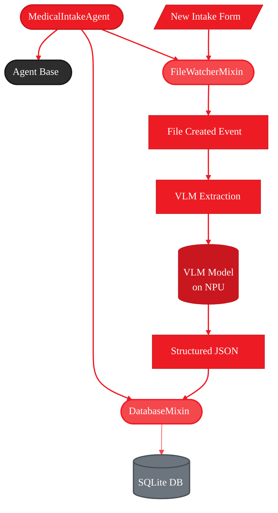

<Info>
  **Source Code:** [`src/gaia/agents/emr/`](https://github.com/amd/gaia/blob/main/src/gaia/agents/emr/)
</Info>

<Info>
  **First time here?** Complete the [Setup](/setup) guide first to install GAIA and its dependencies.
</Info>

<Tip>
  **Just want to use the agent?** See the [Medical Intake Agent Guide](/guides/emr) for quick start instructions without building from scratch.
</Tip>

- **Time to complete:** 20-25 minutes
- **What you'll build:** An automated medical intake form processor
- **What you'll learn:** FileWatcherMixin, DatabaseMixin, VLM integration, and agent composition
- **Platform:** Runs locally on AI PCs with Ryzen AI (NPU/iGPU acceleration)

---

## Why Build This Agent?

Medical staff spend hours manually entering intake form data. This agent automates the process—form arrives, VLM extracts data, database stores it—all running locally on your AI PC.

**What you'll learn:** FileWatcherMixin, DatabaseMixin, VLM integration, and agent composition patterns.

---

## The Architecture (What You're Building)

<Frame>

</Frame>

**Flow:**
1. New form dropped in watched folder
2. FileWatcherMixin triggers callback → `_on_file_created()`
3. VLM extracts patient data (running on NPU for speed)
4. JSON parsed and validated
5. DatabaseMixin stores structured record in SQLite
6. Agent can now query patients via natural language

---

## Quick Start (5 Minutes)

Get a working intake agent running to understand the basic flow.

<Steps>
  <Step title="Clone and install">
    <Warning>
      **Developer Preview:** The Medical Intake Agent requires cloning the repository. PyPI package coming soon.
    </Warning>

    ```bash
    git clone https://github.com/amd/gaia.git
    cd gaia
    uv pip install -e ".[api,rag]"
    ```

    The `api` extra provides FastAPI/uvicorn for the web dashboard. The `rag` extra provides PyMuPDF for PDF processing.
  </Step>

  <Step title="Start Lemonade Server">
    ```bash
    # Start local LLM server with AMD NPU/iGPU acceleration
    lemonade-server serve
    ```

    <Info>
    The VLM model (Qwen3-VL-4B-Instruct-GGUF) will be downloaded automatically on first use. This may take time depending on your connection.
    </Info>
  </Step>

  <Step title="Create your first intake agent">
    Create `intake_agent.py`:

    ```python title="intake_agent.py"
    from gaia.agents.emr import MedicalIntakeAgent

    # Create agent watching a directory
    agent = MedicalIntakeAgent(
        watch_dir="./intake_forms",
        db_path="./data/patients.db",
    )

    # Agent automatically processes new files in intake_forms/
    # Query the agent
    agent.process_query("How many patients were processed today?")
    agent.process_query("Find patient John Smith")
    ```
  </Step>

  <Step title="Run it">
    ```bash
    python intake_agent.py
    ```

    **What happens:**
    1. Creates `./intake_forms/` directory
    2. Creates `./data/patients.db` SQLite database
    3. Starts watching for new files
    4. Processes your query using patient data
  </Step>

  <Step title="Test with a sample form">
    Drop an image of an intake form in `./intake_forms/`:

    ```bash
    # Copy your intake form
    cp ~/Downloads/patient_form.jpg ./intake_forms/
    ```

    **You'll see:**
    ```
    📄 New file detected: patient_form.jpg
       Size: 2.3 MB
       Type: .jpg

    ℹ️  Processing: patient_form.jpg
    ✅ Patient record created: John Smith (ID: 1)
    ```
  </Step>
</Steps>

---

## Core Components

Three components power this agent:

| Component | Import | Purpose |
|-----------|--------|---------|
| `FileWatcherMixin` | `from gaia.utils import FileWatcherMixin` | Auto-detect new files in a directory |
| `DatabaseMixin` | `from gaia.database import DatabaseMixin` | SQLite storage with `query()`, `insert()`, `update()` |
| `VLMClient` | `from gaia.llm.vlm_client import VLMClient` | Extract structured data from images |

```python
# FileWatcherMixin - monitors directory, calls callback on new files
self.watch_directory("./intake_forms", on_created=self._process_form, extensions=[".jpg", ".pdf"])

# DatabaseMixin - SQLite with simple interface
self.init_db("./data/patients.db")
self.insert("patients", {"first_name": "John", "last_name": "Smith"})
results = self.query("SELECT * FROM patients WHERE last_name = :name", {"name": "Smith"})

# VLMClient - image to structured data
vlm = VLMClient(vlm_model="Qwen3-VL-4B-Instruct-GGUF")
json_str = vlm.extract_from_image(image_bytes, prompt="Extract as JSON: {first_name, last_name}")
```

---

## Step-by-Step Implementation

Build the agent incrementally to understand each component.

### Step 1: Basic Agent Shell

Start with the simplest version—no file watching yet, just database setup.

<Tabs>
  <Tab title="Code">
    ```python title="step1_basic.py"
    from gaia.agents.base import Agent
    from gaia.agents.base.tools import tool
    from gaia.database import DatabaseMixin

    class IntakeAgent(Agent, DatabaseMixin):
        """Medical intake agent (basic version)."""

        def __init__(self, db_path: str = "./data/patients.db", **kwargs):
            self._db_path = db_path
            super().__init__(**kwargs)

            # Initialize database
            self.init_db(db_path)
            self.execute("""
                CREATE TABLE IF NOT EXISTS patients (
                    id INTEGER PRIMARY KEY AUTOINCREMENT,
                    first_name TEXT,
                    last_name TEXT,
                    date_of_birth TEXT,
                    phone TEXT
                )
            """)

        def _get_system_prompt(self) -> str:
            return "You manage patient records. Use the available tools."

        def _register_tools(self):
            agent = self

            @tool
            def add_patient(first_name: str, last_name: str, phone: str) -> dict:
                """Add a patient manually."""
                patient_id = agent.insert("patients", {
                    "first_name": first_name,
                    "last_name": last_name,
                    "phone": phone,
                })
                return {"id": patient_id, "status": "created"}

            @tool
            def search_patients(name: str) -> dict:
                """Search for patients by name."""
                results = agent.query(
                    "SELECT * FROM patients WHERE first_name LIKE :name OR last_name LIKE :name",
                    {"name": f"%{name}%"}
                )
                return {"patients": results, "count": len(results)}

    # Test it
    if __name__ == "__main__":
        agent = IntakeAgent()

        # Add a patient manually
        result = agent.process_query("Add patient named John Smith with phone 555-1234")
        print(result)
    ```
  </Tab>

  <Tab title="What You Built">
    - ✅ Agent with database storage
    - ✅ Manual patient entry via tools
    - ✅ Patient search capability
    - ❌ No file watching yet
    - ❌ No VLM extraction yet
  </Tab>
</Tabs>

<Check>
**Checkpoint:** Run it and verify database is created at `./data/patients.db`. Use a SQLite browser to inspect the schema.
</Check>

---

### Step 2: Add VLM Extraction

Add VLM to extract patient data from images.

<Tabs>
  <Tab title="Code">
    ```python title="step2_with_vlm.py"
    import json
    from pathlib import Path
    from gaia.agents.base import Agent
    from gaia.agents.base.tools import tool
    from gaia.database import DatabaseMixin
    from gaia.llm.vlm_client import VLMClient

    EXTRACTION_PROMPT = """Extract patient data from this intake form.
    Return ONLY valid JSON: {"first_name": "", "last_name": "", "date_of_birth": "YYYY-MM-DD", "phone": ""}"""

    class IntakeAgent(Agent, DatabaseMixin):
        def __init__(self, db_path: str = "./data/patients.db", **kwargs):
            self._db_path = db_path
            self._vlm = None
            super().__init__(**kwargs)
            self.init_db(db_path)
            # (schema creation same as step 1)

        def _get_vlm(self):
            """Lazy VLM initialization."""
            if self._vlm is None:
                self._vlm = VLMClient(vlm_model="Qwen3-VL-4B-Instruct-GGUF")
            return self._vlm

        def _register_tools(self):
            agent = self

            @tool
            def process_intake_form(image_path: str) -> dict:
                """Extract patient data from an intake form image."""
                path = Path(image_path)
                if not path.exists():
                    return {"error": f"File not found: {image_path}"}

                # Read image
                image_bytes = path.read_bytes()

                # Extract with VLM
                vlm = agent._get_vlm()
                raw_text = vlm.extract_from_image(image_bytes, prompt=EXTRACTION_PROMPT)

                # Parse JSON
                try:
                    patient_data = json.loads(raw_text)
                except json.JSONDecodeError:
                    return {"error": "Failed to parse VLM output as JSON"}

                # Store in database
                patient_id = agent.insert("patients", patient_data)
                return {"patient_id": patient_id, "name": f"{patient_data['first_name']} {patient_data['last_name']}"}

    # Test it
    if __name__ == "__main__":
        agent = IntakeAgent()
        result = agent.process_query("Process the intake form at ./forms/patient1.jpg")
        print(result)
    ```
  </Tab>

  <Tab title="What You Built">
    - ✅ VLM integration for image extraction
    - ✅ JSON parsing and validation
    - ✅ Automatic patient record creation
    - ❌ No automatic file watching
    - ❌ Manual tool invocation required
  </Tab>
</Tabs>

<Accordion title="Under the Hood: VLM Extraction">
**Extraction flow:**
```python
process_intake_form("patient1.jpg")
  → Read image file as bytes
  → Send to VLM with extraction prompt
  → VLM processes image (running on NPU for speed)
  → Returns JSON string: {"first_name": "John", ...}
  → Parse JSON to dict
  → Insert into database
  → Return patient_id
```

**VLM prompt engineering:**
- Specify exact JSON structure needed
- Request "ONLY valid JSON" to reduce parsing errors
- Use strict date formats (YYYY-MM-DD)
- Handle null values explicitly
</Accordion>

---

### Step 3: Add Automatic File Watching

Make the agent fully automatic—process forms as soon as they arrive.

<Tabs>
  <Tab title="Code">
    ```python title="step3_automatic.py"
    from gaia.agents.base import Agent
    from gaia.agents.base.tools import tool
    from gaia.database import DatabaseMixin
    from gaia.utils import FileWatcherMixin
    from gaia.llm.vlm_client import VLMClient
    from pathlib import Path
    import json

    class IntakeAgent(Agent, DatabaseMixin, FileWatcherMixin):
        """Automatic intake form processor."""

        def __init__(
            self,
            watch_dir: str = "./intake_forms",
            db_path: str = "./data/patients.db",
            **kwargs
        ):
            # Set before super().__init__()
            self._watch_dir = Path(watch_dir)
            self._db_path = db_path
            self._vlm = None
            super().__init__(**kwargs)

            # Setup database
            self._watch_dir.mkdir(parents=True, exist_ok=True)
            self.init_db(db_path)
            self.execute("""CREATE TABLE IF NOT EXISTS patients ...""")

            # Start watching
            self.watch_directory(
                self._watch_dir,
                on_created=self._on_file_created,
                extensions=[".png", ".jpg", ".jpeg", ".pdf"],
                debounce_seconds=2.0,
            )

        def _on_file_created(self, path: str):
            """Callback when new file arrives."""
            file_path = Path(path)

            # Show notification
            self.console.print_file_created(
                filename=file_path.name,
                size=file_path.stat().st_size,
                extension=file_path.suffix,
            )

            # Process the form
            self._process_form(path)

        def _process_form(self, path: str):
            """Extract data and store in database."""
            # Read image
            image_bytes = Path(path).read_bytes()

            # Extract with VLM
            vlm = self._get_vlm()
            raw_text = vlm.extract_from_image(image_bytes, prompt=EXTRACTION_PROMPT)

            # Parse and store
            patient_data = json.loads(raw_text)
            patient_id = self.insert("patients", patient_data)

            self.console.print_success(
                f"Patient record created: {patient_data['first_name']} {patient_data['last_name']} (ID: {patient_id})"
            )

        def _get_system_prompt(self) -> str:
            return f"""You manage patient intake records.
            Watching: {self._watch_dir}
            Use search_patients tool to find records."""

        def _register_tools(self):
            agent = self

            @tool
            def search_patients(name: str) -> dict:
                """Search for patients by name."""
                results = agent.query(
                    "SELECT * FROM patients WHERE first_name LIKE :name OR last_name LIKE :name",
                    {"name": f"%{name}%"}
                )
                return {"patients": results, "count": len(results)}

    # Run the agent
    if __name__ == "__main__":
        with IntakeAgent() as agent:
            print(f"Watching: {agent._watch_dir}")
            print("Drop intake forms in the folder...")

            # Interactive loop
            while True:
                query = input("\nYou: ").strip()
                if query.lower() in ("quit", "exit"):
                    break
                result = agent.process_query(query)
    ```
  </Tab>

  <Tab title="What You Built">
    - ✅ Automatic file watching
    - ✅ VLM extraction on file arrival
    - ✅ Database storage
    - ✅ Natural language patient search
    - ✅ Rich console output
    - ✅ Context manager cleanup
  </Tab>
</Tabs>

<Check>
**Try it:**
1. Run `python step3_automatic.py`
2. In another terminal: `cp sample_form.jpg ./intake_forms/`
3. Watch the agent automatically process it
4. Query: "Show me all patients named Smith"
</Check>

---

## Testing Your Agent

Use GAIA's testing utilities to test without real VLM/LLM.

<Tabs>
  <Tab title="Unit Test">
    ```python title="test_intake_agent.py"
    from gaia.testing import MockVLMClient, temp_directory
    from intake_agent import IntakeAgent

    def test_patient_extraction():
        """Test VLM extraction and storage."""
        with temp_directory() as tmp_dir:
            # Create agent with temp database
            agent = IntakeAgent(
                watch_dir=str(tmp_dir / "forms"),
                db_path=str(tmp_dir / "test.db"),
                skip_lemonade=True,
                silent_mode=True,
                auto_start_watching=False,
            )

            # Mock VLM
            mock_vlm = MockVLMClient(
                extracted_text='{"first_name": "Test", "last_name": "Patient", "phone": "555-0000"}'
            )
            agent._vlm = mock_vlm

            # Create test image
            test_form = tmp_dir / "forms" / "test.jpg"
            test_form.parent.mkdir(parents=True)
            test_form.write_bytes(b"fake image data")

            # Process it
            agent._process_form(str(test_form))

            # Verify
            assert mock_vlm.was_called
            patients = agent.query("SELECT * FROM patients")
            assert len(patients) == 1
            assert patients[0]["first_name"] == "Test"

            agent.stop()
    ```
  </Tab>

  <Tab title="Run Test">
    ```bash
    pytest test_intake_agent.py -v
    ```
  </Tab>
</Tabs>

---

## Key Patterns and Best Practices

### Pattern 1: Initialize Attributes Before super().__init__()

```python
def __init__(self, watch_dir: str, **kwargs):
    # ✅ Set attributes BEFORE super().__init__()
    self._watch_dir = Path(watch_dir)
    self._db_path = db_path
    super().__init__(**kwargs)

    # ❌ WRONG - _get_system_prompt() called during super().__init__()
    # super().__init__(**kwargs)
    # self._watch_dir = Path(watch_dir)  # Too late!
```

**Why:** `super().__init__()` calls `_get_system_prompt()`, which may reference your attributes.

### Pattern 2: Lazy VLM Initialization

```python
def _get_vlm(self):
    """Lazy initialization - only create when needed."""
    if self._vlm is None:
        from gaia.llm.vlm_client import VLMClient
        self._vlm = VLMClient()
    return self._vlm
```

**Why:** VLM model loading is slow. Don't load it until you actually process a file.

### Pattern 3: Robust JSON Parsing

```python
from gaia.utils import extract_json_from_text

def _parse_extraction(self, raw_text: str) -> Optional[Dict]:
    """Parse VLM output with fallback."""
    # Uses balanced brace counting to handle nested JSON
    result = extract_json_from_text(raw_text)
    if result is None:
        logger.warning(f"No valid JSON found in: {raw_text[:200]}")
    return result
```

**Why:** VLMs sometimes add explanatory text around JSON. GAIA's `extract_json_from_text` handles nested objects correctly (unlike simple regex).

### Pattern 4: Context Manager Cleanup

```python
class IntakeAgent(...):
    def stop(self):
        """Clean up resources."""
        self.stop_all_watchers()  # FileWatcherMixin
        self.close_db()           # DatabaseMixin

    def __enter__(self):
        return self

    def __exit__(self, exc_type, exc_val, exc_tb):
        self.stop()
        return False

# Usage:
with IntakeAgent() as agent:
    # Agent runs
    pass
# Automatic cleanup
```

**Why:** Ensures database connections close and file watchers stop properly.

---

## What's Next?

<CardGroup cols={2}>
  <Card title="Part 2: Dashboard & API" icon="chart-line" href="./part-2-dashboard">
    Build a real-time web dashboard with FastAPI, SSE streaming, and React components
  </Card>

  <Card title="Part 3: Architecture" icon="sitemap" href="./part-3-architecture">
    Deep dive into database schema, processing pipeline, and production considerations
  </Card>
</CardGroup>

---

## Full Working Example

The complete `MedicalIntakeAgent` implementation is available in GAIA:

```python
from gaia.agents.emr import MedicalIntakeAgent

# All features included:
# - Automatic file watching
# - VLM extraction
# - Database storage
# - Patient search tools
# - Statistics tracking

agent = MedicalIntakeAgent(
    watch_dir="./intake_forms",
    db_path="./data/patients.db",
)

# Use interactively
agent.process_query("Find all patients processed today")
agent.process_query("Show me patient #5")
agent.process_query("What are the stats?")
```

**Source code:** [`src/gaia/agents/emr/agent.py`](https://github.com/amd/gaia/blob/main/src/gaia/agents/emr/agent.py)

---

<small style="color: #666;">

**License**

Copyright(C) 2025-2026 Advanced Micro Devices, Inc. All rights reserved.

SPDX-License-Identifier: MIT

</small>
