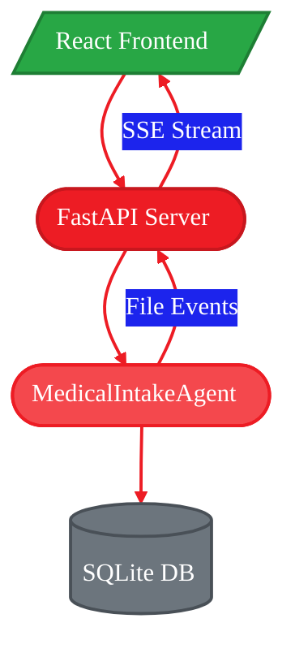

<Note>
**This is Part 2 of 3.** If you haven't completed Part 1, start there: [Part 1: Getting Started](./part-1-getting-started)
</Note>

<Tip>
  **Just want to use the dashboard?** See the [Medical Intake Agent Guide](/guides/emr) for quick start instructions.
</Tip>

- **Time to complete:** 20-25 minutes
- **What you'll build:** A React dashboard with real-time SSE updates
- **What you'll learn:** FastAPI integration, SSE streaming, React state management
- **Platform:** Runs locally on AI PCs with Ryzen AI (NPU/iGPU acceleration)

---

## Why Build a Dashboard?

The CLI is great for developers, but healthcare staff need a visual interface. The dashboard provides:

- **Real-time monitoring** - Watch forms process as they arrive
- **Patient management** - Search, filter, and view patient records
- **Alert handling** - Acknowledge critical allergies and missing fields
- **Efficiency metrics** - Track time savings and ROI

---

## Dashboard Architecture

<Frame>

</Frame>

**Data flow:**
1. New file arrives → Agent processes it
2. Agent emits event → FastAPI broadcasts via SSE
3. React receives event → Updates UI in real-time
4. No polling required!

---

## Quick Start

<Note>
  This assumes you've already cloned the repository and installed dependencies from [Part 1](./part-1-getting-started).
</Note>

### Launch the Dashboard

```bash
# Build frontend (first time only)
cd src/gaia/agents/emr/dashboard/frontend
npm install && npm run build
cd -

# Start dashboard (opens in Electron app by default)
gaia-emr dashboard --watch-dir ./intake_forms --port 8080

# Or force browser mode
gaia-emr dashboard --watch-dir ./intake_forms --port 8080 --browser
```

The dashboard opens automatically in a native Electron window. If Node.js/Electron is not available, it falls back to your default web browser.

### Launch Options

| Option | Description |
|--------|-------------|
| `--port` | Server port (default: 8080) |
| `--host` | Server host (default: 127.0.0.1) |
| `--browser` | Force browser mode instead of Electron |
| `--no-open` | Don't auto-open, server only |

---

## Dashboard Views

The dashboard has four main views accessible via navigation tabs.

### Dashboard View (Home)

The main monitoring view with live updates.

| Component | Description |
|-----------|-------------|
| **Watch Folder Panel** | Left column showing all files with status indicators |
| **Time Saved Widget** | Cumulative minutes saved vs manual processing |
| **Stats Row** | Patients processed, avg processing time, pending reviews |
| **Critical Alerts** | Allergy and missing field warnings with ACKNOWLEDGE button |
| **Live Feed** | Real-time SSE events with step-by-step processing animations |
| **Pending Reviews** | Patients with detected changes awaiting approval |
| **Efficiency Metrics** | Cumulative totals: forms processed, AI time, manual time estimate |

**Watch Folder Panel Features:**
- **Status indicators** with color-coded dots:
  - 🟢 **Green** - Processed files
  - 🔴 **Red (flashing)** - Currently processing
  - 🟠 **Orange** - Queued for processing
- **Drag-and-drop upload** - Drop files directly onto the panel to upload
- **File type icons** - Visual indicators for PDFs vs images
- **Click to navigate** - Click processed files to view patient details

**Efficiency Metrics Panel:**
- **Forms Processed** - Total count of successfully extracted forms
- **Manual Would Take** - Cumulative estimated time for manual data entry
- **AI Processing Time** - Cumulative actual VLM processing time
- **Time Saved** - Running total of time saved (resets with database)

The Live Feed shows detailed processing progress including:
- File detection events
- Step-by-step progress (Reading file → Checking duplicates → Extracting data → Saving)
- Processing times and success/error states

### Patient Database View

Searchable patient list with filtering.

| Component | Description |
|-----------|-------------|
| **Search Bar** | Filter patients by name, ID, or phone number |
| **Quick Filters** | All, New, Returning, With Allergies, Pending Review |
| **Data Table** | Sortable columns with patient info, status, allergies |
| **Click to View** | Click any row to view full patient details |
| **Action Icons** | View, edit, and alert indicators per patient |
| **Pagination** | Navigate through large patient lists |

### Patient Detail View

Complete patient information and workflow history.

| Component | Description |
|-----------|-------------|
| **Scanned Form Image** | Displays the actual scanned intake form image |
| **OCR Stats** | Confidence score, processing time, fields extracted |
| **Alert Boxes** | Critical allergies and missing consent warnings |
| **Data Grid** | All patient fields with validation checkmarks |
| **Consent Status** | HIPAA, Treatment, Financial consent tracking |
| **Workflow Log** | Step-by-step agent processing timeline |
| **Delete Patient** | Delete patient record (optionally with source file) |

<Note>
When deleting a patient, you can choose to also delete the source intake form file. This keeps the watched directory in sync with the database.
</Note>

### Chat View

Natural language interface for querying patients.

| Component | Description |
|-----------|-------------|
| **Chat Input** | Ask questions about patients in natural language |
| **Response Display** | AI-generated answers with patient data |
| **Query History** | Previous questions and responses |

Example queries:
- "How many patients were processed today?"
- "Find patients with penicillin allergies"
- "Show me patients missing insurance information"

### Settings View

Configuration and file upload.

| Component | Description |
|-----------|-------------|
| **Watch Directory** | View and change the monitored intake forms directory |
| **File Upload** | Browse to upload intake forms directly |
| **System Info** | Agent status, VLM model, database path display |
| **Danger Zone** | Reset database and clear all patient data |

<Tip>
You can upload intake forms in two ways: drag-and-drop onto the Watch Folder panel on the Dashboard, or use the file browser in Settings.
</Tip>

---

## REST API Reference

The dashboard exposes a REST API for integration with other systems. Full API docs are available at `http://localhost:8080/docs` when running.

### Patient Endpoints

| Endpoint | Method | Description |
|----------|--------|-------------|
| `/api/patients` | GET | List patients with pagination and search |
| `/api/patients/:id` | GET | Get patient details by ID |
| `/api/patients/:id` | DELETE | Delete patient record (and optionally source file) |
| `/api/patients/:id/file` | GET | Download or display original intake form image |

**Query Parameters for GET `/api/patients`:**

| Parameter | Type | Default | Description |
|-----------|------|---------|-------------|
| `limit` | int | 100 | Maximum results to return |
| `offset` | int | 0 | Pagination offset |
| `search` | string | - | Search by first or last name |

**Query Parameters for DELETE `/api/patients/:id`:**

| Parameter | Type | Default | Description |
|-----------|------|---------|-------------|
| `delete_file` | bool | true | Also delete the source intake form file |

**Query Parameters for GET `/api/patients/:id/file`:**

| Parameter | Type | Default | Description |
|-----------|------|---------|-------------|
| `inline` | bool | false | Display inline (for `` tags) instead of download |

**Examples:**
```bash
# List patients with search
curl "http://localhost:8080/api/patients?search=Smith&limit=10"

# Delete patient and source file
curl -X DELETE "http://localhost:8080/api/patients/42?delete_file=true"

# Get intake form image for display
curl "http://localhost:8080/api/patients/42/file?inline=true"
```

### Alert Endpoints

| Endpoint | Method | Description |
|----------|--------|-------------|
| `/api/alerts` | GET | List alerts with patient info |
| `/api/alerts/:id/acknowledge` | POST | Acknowledge an alert |

**Query Parameters for GET `/api/alerts`:**

| Parameter | Type | Default | Description |
|-----------|------|---------|-------------|
| `unacknowledged_only` | bool | true | Only show unacknowledged alerts |
| `limit` | int | 50 | Maximum alerts to return |

**Examples:**
```bash
# List unacknowledged alerts
curl "http://localhost:8080/api/alerts"

# Acknowledge alert
curl -X POST "http://localhost:8080/api/alerts/15/acknowledge"
```

### Session Endpoints

| Endpoint | Method | Description |
|----------|--------|-------------|
| `/api/sessions` | GET | List intake sessions for audit trail |

**Query Parameters:**

| Parameter | Type | Default | Description |
|-----------|------|---------|-------------|
| `limit` | int | 50 | Maximum sessions to return |

### Chat Endpoint

| Endpoint | Method | Description |
|----------|--------|-------------|
| `/api/chat` | POST | Send natural language query to the agent |

**Request Body:**
```json
{
  "message": "How many patients were processed today?"
}
```

**Response:**
```json
{
  "success": true,
  "message": "How many patients were processed today?",
  "response": "3 patients were processed today.",
  "timestamp": "2025-01-15T10:30:00Z"
}
```

### Configuration Endpoints

| Endpoint | Method | Description |
|----------|--------|-------------|
| `/api/config` | GET | Get current agent configuration |
| `/api/config/watch-dir` | PUT | Update the watch directory |
| `/api/upload` | POST | Upload and process an intake form file |
| `/api/database` | DELETE | Clear all data and reset statistics |

**Upload Example:**
```bash
curl -X POST "http://localhost:8080/api/upload" \
  -F "file=@patient_form.jpg"
```

**Clear Database Example:**
```bash
curl -X DELETE "http://localhost:8080/api/database"
```

### Watch Folder Endpoint

| Endpoint | Method | Description |
|----------|--------|-------------|
| `/api/watch-folder` | GET | Get watch folder status and file list |

**Response Example:**
```json
{
  "watch_dir": "./intake_forms",
  "files": [
    {"name": "form1.jpg", "status": "processed", "size_formatted": "2.3 MB", "patient_name": "John Smith"},
    {"name": "form2.jpg", "status": "processing", "size_formatted": "1.8 MB"},
    {"name": "form3.jpg", "status": "queued", "size_formatted": "2.1 MB"}
  ],
  "total": 3,
  "processed_count": 1,
  "processing_count": 1,
  "queued_count": 1
}
```

### Stats & Health

| Endpoint | Method | Description |
|----------|--------|-------------|
| `/api/stats` | GET | Get processing statistics |
| `/api/events` | GET | SSE stream for real-time updates |
| `/api/health` | GET | Health check endpoint |

**Stats Response Example:**
```json
{
  "total_patients": 42,
  "processed_today": 5,
  "new_patients": 3,
  "returning_patients": 2,
  "files_processed": 5,
  "extraction_success": 5,
  "extraction_failed": 0,
  "success_rate": "100.0%",
  "total_estimated_manual_seconds": 1380,
  "total_ai_processing_seconds": 150,
  "time_saved_minutes": 20.5,
  "time_saved_percent": "89%",
  "avg_processing_seconds": 30.0,
  "unacknowledged_alerts": 2,
  "watching_directory": "./intake_forms",
  "uptime_seconds": 3600
}

---

## Server-Sent Events (SSE)

The `/api/events` endpoint streams real-time updates to the frontend. The server sends heartbeats every 30 seconds to keep connections alive.

### Event Types

| Event Type | Description |
|------------|-------------|
| `processing_started` | File detected and processing begun |
| `processing_step` | Progress update during processing |
| `patient_created` | Patient record created/updated |
| `processing_completed` | Processing finished (success or failure) |
| `processing_error` | Error during processing |
| `status_update` | General status update |
| `database_cleared` | Database was reset |
| `heartbeat` | Keep-alive ping (every 30s) |

### JavaScript Example

```javascript
// Connect to SSE stream
const eventSource = new EventSource('/api/events');

eventSource.onmessage = (event) => {
  const data = JSON.parse(event.data);

  switch (data.type) {
    case 'processing_started':
      console.log(`Processing: ${data.data.filename}`);
      break;

    case 'processing_step':
      // Step-by-step progress
      const step = data.data;
      console.log(`Step ${step.step_num}/${step.total_steps}: ${step.step_name}`);
      break;

    case 'patient_created':
      console.log(`Patient: ${data.data.first_name} ${data.data.last_name}`);
      break;

    case 'processing_completed':
      console.log(`Completed: ${data.data.filename} (success: ${data.data.success})`);
      break;

    case 'processing_error':
      console.error(`Error: ${data.data.error}`);
      break;

    case 'heartbeat':
      // Keep-alive, no action needed
      break;
  }
};
```

### Event Payload Examples

```json
// processing_started
{
  "type": "processing_started",
  "data": {"filename": "patient_form.jpg"},
  "timestamp": "2025-01-15T10:30:00Z"
}

// processing_step (7 steps total)
{
  "type": "processing_step",
  "data": {
    "filename": "patient_form.jpg",
    "step_num": 5,
    "total_steps": 7,
    "step_name": "Extracting patient data",
    "status": "running"
  },
  "timestamp": "2025-01-15T10:30:05Z"
}

// patient_created
{
  "type": "patient_created",
  "data": {
    "id": 42,
    "first_name": "John",
    "last_name": "Smith",
    "is_new_patient": true,
    "processing_time_seconds": 5.2,
    "changes_detected": []
  },
  "timestamp": "2025-01-15T10:30:10Z"
}

// processing_error
{
  "type": "processing_error",
  "data": {
    "filename": "bad_form.jpg",
    "error": "Missing required fields: first_name and/or last_name",
    "error_type": "validation_error"
  },
  "timestamp": "2025-01-15T10:30:15Z"
}
```

### Processing Steps

The agent emits 7 processing steps via SSE:

| Step | Name | Description |
|------|------|-------------|
| 1 | Reading file | Load file from disk |
| 2 | Checking for duplicates | Hash comparison |
| 3 | Preparing image | Convert PDF to image if needed |
| 4 | Loading AI model | Initialize VLM (first time only) |
| 5 | Extracting patient data | VLM inference |
| 6 | Parsing extracted data | JSON extraction |
| 7 | Saving to database | Store patient record |

---

## Development Mode

For frontend development with hot reload:

### Terminal 1: Backend API

```bash
gaia-emr dashboard --port 8080
```

### Terminal 2: Vite Dev Server

```bash
cd src/gaia/agents/emr/dashboard/frontend
npm install
npm run dev
```

Access http://localhost:3000 for the Vite dev server (proxies API to port 8080).

### Project Structure

```
src/gaia/agents/emr/dashboard/
├── server.py           # FastAPI server with SSE
├── electron/           # Electron wrapper
│   ├── main.js         # Electron entry point
│   └── package.json    # Electron dependencies
├── frontend/
│   ├── src/
│   │   ├── App.jsx     # Main app component
│   │   ├── main.jsx    # Entry point
│   │   ├── index.css   # Global styles
│   │   └── components/
│   │       ├── Dashboard.jsx        # Main dashboard view
│   │       ├── WatchFolderPanel.jsx # Watch folder with drag-and-drop
│   │       ├── PatientDatabase.jsx  # Patient list view
│   │       ├── PatientDetail.jsx    # Patient detail view
│   │       ├── Header.jsx           # Navigation header
│   │       └── ...
│   ├── package.json
│   └── vite.config.js
```

### Electron Wrapper

The dashboard includes a minimal Electron wrapper for a native desktop experience:

```javascript title="electron/main.js"
// Loads dashboard URL from environment
const DASHBOARD_URL = process.env.EMR_DASHBOARD_URL || 'http://localhost:8080';

// Creates native window
mainWindow = new BrowserWindow({
  width: 1400,
  height: 900,
  title: 'EMR Dashboard',
  backgroundColor: '#0a0f1a',  // Match dashboard theme
});

mainWindow.loadURL(DASHBOARD_URL);
```

The Electron wrapper:
- Loads automatically when running `gaia-emr dashboard`
- Shows a connection error page with retry if server is unavailable
- Opens external links in the default browser
- Falls back to browser mode if Electron/Node.js is not available

---

## Building the FastAPI Server

Let's understand how the backend is built.

### Basic Server Setup

```python title="server.py"
from fastapi import FastAPI, HTTPException
from fastapi.staticfiles import StaticFiles
from fastapi.responses import StreamingResponse
from gaia.agents.emr import MedicalIntakeAgent
import asyncio
import json

app = FastAPI()

# Global agent instance
agent: MedicalIntakeAgent = None

@app.on_event("startup")
async def startup():
    global agent
    agent = MedicalIntakeAgent(
        watch_dir="./intake_forms",
        db_path="./data/patients.db",
    )

@app.on_event("shutdown")
async def shutdown():
    if agent:
        agent.stop()
```

### Implementing SSE

```python title="server.py (continued)"
# Event queue for SSE broadcasting
event_queue: asyncio.Queue = asyncio.Queue()

async def event_generator():
    """Generate SSE events from queue."""
    while True:
        event = await event_queue.get()
        yield f"data: {json.dumps(event)}\n\n"

@app.get("/api/events")
async def events():
    return StreamingResponse(
        event_generator(),
        media_type="text/event-stream",
        headers={
            "Cache-Control": "no-cache",
            "Connection": "keep-alive",
        }
    )

# Broadcast helper
async def broadcast_event(event_type: str, data: dict):
    await event_queue.put({"type": event_type, **data})
```

### Hooking Into Agent Events

```python title="server.py (continued)"
class DashboardAgent(MedicalIntakeAgent):
    """Agent with SSE event broadcasting."""

    def _on_file_created(self, path: str):
        # Broadcast file detection
        asyncio.create_task(broadcast_event("file_detected", {
            "filename": Path(path).name,
            "size_bytes": Path(path).stat().st_size,
        }))

        # Call parent to process
        super()._on_file_created(path)

    def _store_patient(self, data: dict) -> int:
        patient_id = super()._store_patient(data)

        # Broadcast patient creation
        asyncio.create_task(broadcast_event("patient_created", {
            "patient_id": patient_id,
            "patient_name": f"{data['first_name']} {data['last_name']}",
        }))

        return patient_id
```

---

## Building the React Frontend

### Main App Component

```jsx title="App.jsx"
import { useState, useEffect } from 'react';

function App() {
  const [patients, setPatients] = useState([]);
  const [stats, setStats] = useState({});
  const [events, setEvents] = useState([]);

  // Connect to SSE on mount
  useEffect(() => {
    const eventSource = new EventSource('/api/events');

    eventSource.onmessage = (event) => {
      const data = JSON.parse(event.data);

      // Add to events feed
      setEvents(prev => [data, ...prev].slice(0, 50));

      // Handle specific event types
      if (data.type === 'patient_created') {
        fetchPatients(); // Refresh patient list
      }
      if (data.type === 'stats_updated') {
        setStats(data.stats);
      }
    };

    return () => eventSource.close();
  }, []);

  // Fetch initial data
  useEffect(() => {
    fetchPatients();
    fetchStats();
  }, []);

  const fetchPatients = async () => {
    const res = await fetch('/api/patients');
    const data = await res.json();
    setPatients(data.patients);
  };

  const fetchStats = async () => {
    const res = await fetch('/api/stats');
    const data = await res.json();
    setStats(data);
  };

  return (
    <div className="dashboard">
      <StatsRow stats={stats} />
      <LiveFeed events={events} />
      <PatientTable patients={patients} />
    </div>
  );
}
```

### Live Feed Component

```jsx title="components/LiveFeed.jsx"
function LiveFeed({ events }) {
  return (
    <div className="live-feed">
      <h2>Live Feed</h2>
      <div className="events-list">
        {events.map((event, i) => (
          <EventCard key={i} event={event} />
        ))}
      </div>
    </div>
  );
}

function EventCard({ event }) {
  const icons = {
    file_detected: '📄',
    processing_started: '⚙️',
    patient_created: '✅',
    alert_created: '⚠️',
  };

  return (
    <div className={`event-card ${event.type}`}>
      <span className="icon">{icons[event.type]}</span>
      <span className="message">{formatEvent(event)}</span>
      <span className="time">{formatTime(event.timestamp)}</span>
    </div>
  );
}
```

---

## Time Savings Calculation

The dashboard calculates time savings per-form based on extracted data (not fixed estimates). See [Part 3: Architecture](./part-3-architecture#time-savings-calculation) for the formula details.

**Summary:** A typical 15-field form takes ~4-5 minutes to enter manually. VLM extracts it in ~30 seconds. That's ~89% time savings.

---

## What's Next?

<Card title="Part 3: Architecture & Internals" icon="sitemap" href="./part-3-architecture">
  Deep dive into database schema, processing pipeline, and system design decisions
</Card>

---

<small style="color: #666;">

**License**

Copyright(C) 2024-2025 Advanced Micro Devices, Inc. All rights reserved.

SPDX-License-Identifier: MIT

</small>
