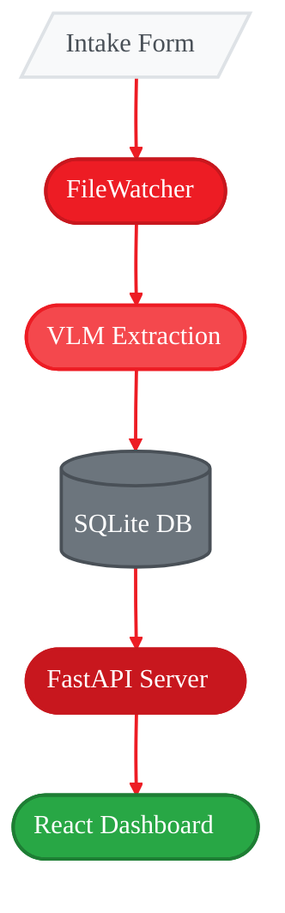
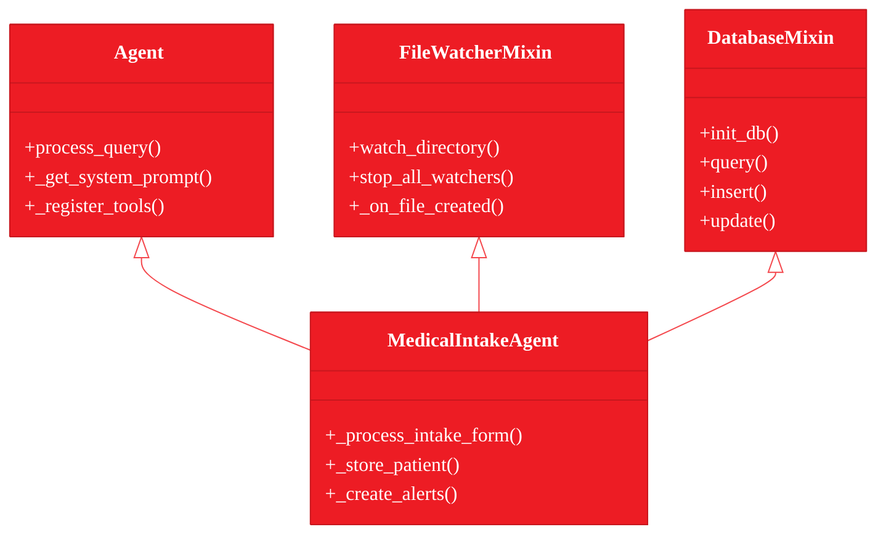

<Note>
**This is Part 3 of 3.** If you haven't completed the previous parts:
- [Part 1: Getting Started](./part-1-getting-started)
- [Part 2: Dashboard & API](./part-2-dashboard)
</Note>

<Tip>
  **Reference only?** This part is also useful as a standalone architecture reference. See the [Medical Intake Agent Guide](/guides/emr) for usage instructions.
</Tip>

- **Time to complete:** 15-20 minutes
- **What you'll learn:** Database design, processing pipeline, system architecture
- **Platform:** Designed for AI PCs with Ryzen AI (NPU/iGPU acceleration)

---

## System Architecture

<Frame>

</Frame>

### Component Overview

| Component | Technology | Purpose |
|-----------|------------|---------|
| **FileWatcher** | watchdog library | Monitors directory for new intake forms |
| **VLM Extraction** | Qwen3-VL on NPU | Extracts patient data from images/PDFs |
| **SQLite DB** | sqlite3 | Local storage for patients, alerts, sessions |
| **FastAPI Server** | FastAPI + uvicorn | REST API + SSE events for real-time updates |
| **React Dashboard** | React + Vite | Four views: Dashboard, Patients, Chat, Settings |
| **Electron Wrapper** | Electron.js | Native desktop app experience (optional) |

---

## Database Schema

The agent creates three tables to manage patient data and processing state.

### patients

The main table storing extracted patient information.

| Column | Type | Description |
|--------|------|-------------|
| `id` | INTEGER | Primary key (auto-increment) |
| `first_name` | TEXT | Patient first name |
| `last_name` | TEXT | Patient last name |
| `date_of_birth` | TEXT | DOB in YYYY-MM-DD format |
| `phone` | TEXT | Contact phone number |
| `email` | TEXT | Email address |
| `address` | TEXT | Street address |
| `city` | TEXT | City |
| `state` | TEXT | State/Province |
| `zip_code` | TEXT | Postal code |
| `insurance_provider` | TEXT | Insurance company name |
| `insurance_id` | TEXT | Policy/member number |
| `reason_for_visit` | TEXT | Chief complaint |
| `allergies` | TEXT | Comma-separated list of allergies |
| `medications` | TEXT | Current medications |
| `emergency_contact_name` | TEXT | Emergency contact person |
| `emergency_contact_phone` | TEXT | Emergency contact phone |
| `is_new_patient` | BOOLEAN | TRUE for first visit, FALSE for returning |
| `processing_time_seconds` | REAL | VLM extraction duration |
| `source_file` | TEXT | Original file path |
| `source_file_hash` | TEXT | SHA-256 hash for deduplication |
| `file_content` | BLOB | Binary image data for display |
| `file_hash` | TEXT | File content hash for duplicate detection |
| `created_at` | TEXT | ISO timestamp of record creation |
| `updated_at` | TEXT | ISO timestamp of last update |

### alerts

Critical notifications requiring staff attention.

| Column | Type | Description |
|--------|------|-------------|
| `id` | INTEGER | Primary key |
| `patient_id` | INTEGER | Foreign key to patients table |
| `alert_type` | TEXT | Type: `allergy`, `missing_field`, `consent` |
| `priority` | TEXT | Priority: `critical`, `high`, `medium` |
| `message` | TEXT | Human-readable alert description |
| `acknowledged` | BOOLEAN | FALSE until staff acknowledges |
| `acknowledged_by` | TEXT | Staff member who acknowledged |
| `acknowledged_at` | TEXT | ISO timestamp of acknowledgment |
| `created_at` | TEXT | ISO timestamp of alert creation |

**Alert Types:**

| Type | Priority | Trigger |
|------|----------|---------|
| `allergy` | critical | Non-empty allergies field detected |
| `missing_field` | medium | Required field (phone, DOB) is empty |

### intake_sessions

Tracks each processing session for audit and analytics.

| Column | Type | Description |
|--------|------|-------------|
| `id` | INTEGER | Primary key |
| `patient_id` | INTEGER | Foreign key to patients |
| `source_file` | TEXT | Original file path |
| `processing_time_seconds` | REAL | Extraction duration |
| `is_new_patient` | BOOLEAN | New or returning patient |
| `changes_detected` | TEXT | JSON of field changes for returning patients |
| `extraction_confidence` | REAL | VLM confidence score (0-1) |
| `created_at` | TEXT | ISO timestamp |

---

## Processing Pipeline

The agent follows a 7-step pipeline from file detection to database storage.

### Pipeline Steps

<Steps>
  <Step title="File Detection">
    **Component:** FileWatcherMixin with watchdog

    The file watcher monitors the directory for new files:

    ```python
    self.watch_directory(
        "./intake_forms",
        on_created=self._on_file_created,
        extensions=[".png", ".jpg", ".jpeg", ".pdf"],
        debounce_seconds=2.0,  # Wait for file to finish writing
    )
    ```

    **Key behaviors:**
    - Filters by extension (only images/PDFs)
    - Debounces events to avoid processing incomplete files
    - Runs in background thread
  </Step>

  <Step title="Image Conversion">
    **For PDFs:** Convert to PNG using PyMuPDF at 2x resolution

    ```python
    def _convert_pdf_to_image(self, pdf_path: Path) -> bytes:
        import fitz  # PyMuPDF

        doc = fitz.open(pdf_path)
        page = doc[0]  # First page only

        # 2x zoom for better OCR quality
        matrix = fitz.Matrix(2.0, 2.0)
        pix = page.get_pixmap(matrix=matrix)

        return pix.tobytes("png")
    ```

    **Why 2x resolution?** Higher resolution improves VLM extraction accuracy, especially for handwritten text.
  </Step>

  <Step title="VLM Extraction">
    **Model:** Qwen3-VL-4B-Instruct running on NPU/iGPU

    ```python
    EXTRACTION_PROMPT = """Extract patient data from this medical intake form.
    Return ONLY valid JSON with these fields:
    {
      "first_name": "", "last_name": "", "date_of_birth": "YYYY-MM-DD",
      "phone": "", "email": "", "address": "", "city": "", "state": "",
      "zip_code": "", "insurance_provider": "", "insurance_id": "",
      "reason_for_visit": "", "allergies": "", "medications": "",
      "emergency_contact_name": "", "emergency_contact_phone": ""
    }
    Use empty string "" for fields not found on the form."""
    ```

    **Why Qwen3-VL?** Best performance for document understanding on AMD hardware.
  </Step>

  <Step title="JSON Parsing">
    **Robust brace-counting parser** handles nested objects and VLM quirks

    ```python
    def _parse_json_safely(self, raw_text: str) -> Optional[Dict]:
        """Extract JSON even when surrounded by explanation text."""
        # Find JSON object boundaries
        brace_count = 0
        start_idx = None

        for i, char in enumerate(raw_text):
            if char == '{':
                if brace_count == 0:
                    start_idx = i
                brace_count += 1
            elif char == '}':
                brace_count -= 1
                if brace_count == 0 and start_idx is not None:
                    json_str = raw_text[start_idx:i+1]
                    try:
                        return json.loads(json_str)
                    except json.JSONDecodeError:
                        continue

        return None
    ```

    **Why custom parsing?** VLMs sometimes add explanatory text before/after JSON.
  </Step>

  <Step title="Duplicate Check">
    **Match on name + DOB** to identify returning patients

    ```python
    def _find_existing_patient(self, data: Dict) -> Optional[int]:
        """Check if patient already exists."""
        result = self.query("""
            SELECT id FROM patients
            WHERE LOWER(first_name) = LOWER(:first_name)
              AND LOWER(last_name) = LOWER(:last_name)
              AND date_of_birth = :dob
        """, {
            "first_name": data.get("first_name", ""),
            "last_name": data.get("last_name", ""),
            "dob": data.get("date_of_birth", ""),
        })
        return result[0]["id"] if result else None
    ```
  </Step>

  <Step title="Change Detection">
    **Compare 10 fields** for returning patients

    ```python
    TRACKED_FIELDS = [
        "phone", "email", "address", "city", "state", "zip_code",
        "insurance_provider", "insurance_id", "medications", "allergies"
    ]

    def _detect_changes(self, existing: Dict, new_data: Dict) -> Dict:
        """Find fields that changed since last visit."""
        changes = {}
        for field in TRACKED_FIELDS:
            old_val = existing.get(field, "")
            new_val = new_data.get(field, "")
            if old_val != new_val:
                changes[field] = {"old": old_val, "new": new_val}
        return changes
    ```
  </Step>

  <Step title="Database Storage">
    **INSERT for new, UPDATE for returning**

    ```python
    def _store_patient(self, data: Dict) -> int:
        existing_id = self._find_existing_patient(data)

        if existing_id:
            # Update returning patient
            changes = self._detect_changes(
                self._get_patient(existing_id),
                data
            )
            data["is_new_patient"] = False
            self.update("patients", existing_id, data)

            # Log changes for review
            self.insert("intake_sessions", {
                "patient_id": existing_id,
                "changes_detected": json.dumps(changes),
                "is_new_patient": False,
            })
            return existing_id
        else:
            # Insert new patient
            data["is_new_patient"] = True
            return self.insert("patients", data)
    ```
  </Step>

  <Step title="Alert Creation">
    **Critical alerts for allergies and missing fields**

    ```python
    def _create_alerts(self, patient_id: int, data: Dict):
        # Allergy alert (critical)
        if data.get("allergies"):
            self.insert("alerts", {
                "patient_id": patient_id,
                "alert_type": "allergy",
                "priority": "critical",
                "message": f"Patient has allergies: {data['allergies']}",
                "acknowledged": False,
            })

        # Missing field alerts (high)
        for field in ["first_name", "last_name", "date_of_birth"]:
            if not data.get(field):
                self.insert("alerts", {
                    "patient_id": patient_id,
                    "alert_type": "missing_field",
                    "priority": "high",
                    "message": f"Missing required field: {field}",
                    "acknowledged": False,
                })
    ```
  </Step>

  <Step title="Console Output">
    **Rich formatted success/warning messages**

    ```python
    # Success message
    self.console.print_success(
        f"Patient record created: {data['first_name']} {data['last_name']} (ID: {patient_id})"
    )

    # Warning for returning patient with changes
    if changes:
        self.console.print_warning(
            f"Returning patient with {len(changes)} field(s) changed - review required"
        )
    ```
  </Step>
</Steps>

---

## File Deduplication

The agent uses SHA-256 hashing to prevent processing the same file twice.

```python
import hashlib

def _compute_file_hash(self, file_path: Path) -> str:
    """Compute SHA-256 hash of file contents."""
    sha256 = hashlib.sha256()
    with open(file_path, "rb") as f:
        for chunk in iter(lambda: f.read(8192), b""):
            sha256.update(chunk)
    return sha256.hexdigest()

def _is_duplicate_file(self, file_hash: str) -> bool:
    """Check if file was already processed."""
    result = self.query(
        "SELECT id FROM patients WHERE source_file_hash = :hash",
        {"hash": file_hash}
    )
    return len(result) > 0
```

---

## Time Savings Calculation

The agent calculates per-form time savings based on actual extracted data, not fixed estimates.

### Per-Field Estimation Formula

```python
# Time per field = (BASE_TIME + chars * TYPING_TIME) * COMPLEXITY * (1 + VERIFICATION)
TYPING_SECONDS_PER_CHAR = 0.3    # Slower than normal due to form lookup
BASE_SECONDS_PER_FIELD = 10     # Time to locate field, click, prepare to type
VERIFICATION_OVERHEAD = 0.15    # 15% extra for checking/verification

# Field complexity multipliers
FIELD_COMPLEXITY = {
    "gender": 0.5,           # Dropdown
    "state": 0.5,            # Dropdown
    "allergies": 1.8,        # Critical, needs careful entry
    "medications": 1.8,      # Multiple items
    "reason_for_visit": 1.5, # Detailed text
    # ... most fields default to 1.0
}
```

### Example Calculation

A form with 15 fields and ~300 characters:
- Base time: 15 × 10 sec = 150 sec
- Typing: 300 × 0.3 sec = 90 sec
- Subtotal: ~240 sec (4 min)
- With verification (+15%): **~276 sec (4.6 min)**

### Expected Results

| Patients | Manual Time | AI Time | Time Saved | % Saved |
|----------|-------------|---------|------------|---------|
| 10 | ~46 min | ~5 min | ~41 min | ~89% |
| 50 | ~230 min | ~25 min | ~205 min | ~89% |
| 100 | ~460 min | ~50 min | ~410 min | ~89% |

*Based on typical 15-field forms. Actual savings depend on form complexity.*

---

## Agent Composition

The Medical Intake Agent combines three GAIA mixins.

<Frame>

</Frame>

### Mixin Responsibilities

| Mixin | Provides | Methods |
|-------|----------|---------|
| **Agent** | LLM reasoning loop | `process_query()`, tool registration |
| **FileWatcherMixin** | Directory monitoring | `watch_directory()`, event callbacks |
| **DatabaseMixin** | SQLite operations | `query()`, `insert()`, `update()` |

---

## Production Considerations

### Security

- **Local processing only** - No PHI leaves the machine
- **SQLite file permissions** - Set appropriate OS-level access controls
- **Watch directory isolation** - Don't share with untrusted users

### Performance

- **VLM on NPU** - Ryzen AI accelerates inference
- **Lazy VLM loading** - Model loaded only when first file arrives
- **Connection pooling** - DatabaseMixin reuses SQLite connections

### Reliability

- **File debouncing** - 2-second wait avoids partial file reads
- **JSON parsing fallbacks** - Handles VLM output variations
- **Graceful cleanup** - Context manager ensures proper shutdown

---

## Extending the Agent

### Add Custom Extraction Fields

```python
class CustomIntakeAgent(MedicalIntakeAgent):
    """Extended agent with additional fields."""

    EXTRACTION_PROMPT = """Extract patient data including:
    - Standard fields (name, DOB, phone, etc.)
    - Custom fields: preferred_language, interpreter_needed, mobility_aids
    Return as JSON..."""

    def _setup_database(self):
        super()._setup_database()

        # Add custom columns
        self.execute("""
            ALTER TABLE patients ADD COLUMN preferred_language TEXT;
            ALTER TABLE patients ADD COLUMN interpreter_needed BOOLEAN;
            ALTER TABLE patients ADD COLUMN mobility_aids TEXT;
        """)
```

### Add Custom Alert Types

```python
def _create_alerts(self, patient_id: int, data: Dict):
    super()._create_alerts(patient_id, data)

    # Custom: Flag if interpreter needed
    if data.get("interpreter_needed"):
        self.insert("alerts", {
            "patient_id": patient_id,
            "alert_type": "interpreter",
            "priority": "medium",
            "message": f"Interpreter needed: {data.get('preferred_language')}",
        })
```

---

## Summary

The Medical Intake Agent demonstrates several GAIA patterns:

1. **Mixin composition** - Combine FileWatcherMixin + DatabaseMixin + Agent
2. **Event-driven processing** - React to file system events
3. **VLM integration** - Extract structured data from images
4. **Real-time updates** - SSE streaming to web dashboard
5. **Audit trail** - Track all processing in intake_sessions table

These patterns are reusable for other document processing agents: invoice processing, contract analysis, form digitization, and more.

---

<small style="color: #666;">

**License**

Copyright(C) 2024-2025 Advanced Micro Devices, Inc. All rights reserved.

SPDX-License-Identifier: MIT

</small>
