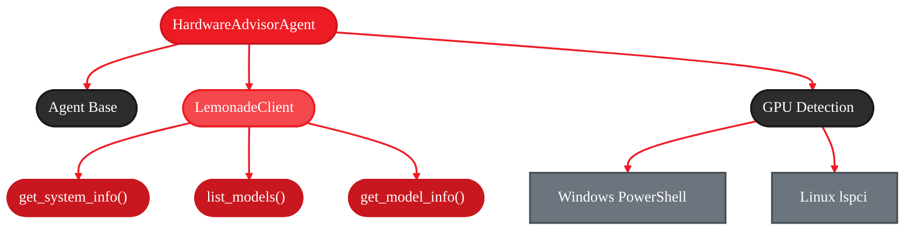

<Badge text="development" color="orange" />

**Time to complete:** 15-20 minutes
**What you'll build:** A hardware analysis agent that recommends which LLMs you can run
**What you'll learn:** LemonadeClient APIs, GPU/NPU detection, memory-based recommendations
**Platform:** Runs locally on AI PCs with Ryzen AI (NPU/iGPU acceleration)

---

## Why Build This Agent?

<Info>
**Privacy-First AI:** This agent runs entirely on your AI PC. Hardware detection and model recommendations happen locally—no data leaves your machine.
</Info>

When users ask "What size LLM can I run?", the answer depends on their actual hardware. Instead of guessing or looking up specifications manually, this agent:

1. Detects system RAM, GPU, and NPU via Lemonade Server
2. Queries the available model catalog with size estimates
3. Calculates which models fit in available memory
4. Provides personalized recommendations based on real hardware specs

**What you're building:**

A hardware advisor agent that combines:
- **LemonadeClient SDK** - System info and model catalog APIs
- **Platform-specific detection** - Windows PowerShell / Linux lspci for GPU info
- **Memory calculations** - 70% rule for safe model sizing
- **Interactive CLI** - Natural language queries about capabilities
- **Local execution** - Runs entirely on your AI PC using Ryzen AI acceleration

---

## The Architecture (What You're Building)

<Frame>

</Frame>

**Flow:**
1. User query → HardwareAdvisorAgent (orchestrator)
2. Agent selects tool → get_hardware_info / list_available_models / recommend_models
3. Tools call → LemonadeClient SDK + OS-specific detection
4. Results aggregated → Agent synthesizes recommendation
5. User receives personalized advice

---

## Quick Start (5 Minutes)

Get a working agent running to understand the basic flow.

<Steps>
  <Step title="Install GAIA">
    ```bash
    uv pip install amd-gaia
    ```
  </Step>

  <Step title="Start Lemonade Server">
    ```bash
    # Start local LLM server with AMD NPU/iGPU acceleration
    lemonade-server serve
    ```

    <Info>
    Lemonade Server provides AMD-optimized inference for AI PCs with Ryzen AI. It also exposes system info and model catalog APIs that this agent uses.
    </Info>
  </Step>

  <Step title="Run the Hardware Advisor">
    ```bash
    python examples/hardware_advisor_agent.py
    ```

    **Try asking:**
    - "What size LLM can I run?"
    - "Show me my system specs"
    - "What models are available?"
    - "Can I run a 30B model?"
  </Step>

  <Step title="See it in action">
    **Example interaction:**
    ```
    You: What size LLM can I run?

    Agent: Let me check your hardware specs...

    [Tool: get_hardware_info]
    RAM: 32 GB, GPU: AMD Radeon RX 7900 XTX (24 GB), NPU: Available

    [Tool: recommend_models]
    Based on your 32 GB RAM, you can safely run models up to ~22 GB.

    Agent: Great news! With 32 GB RAM and a 24 GB GPU, you can run:
    - 30B parameter models (like Qwen3-Coder-30B)
    - Most 7B-14B models comfortably
    - NPU acceleration available for smaller models
    ```
  </Step>
</Steps>

<Note>
The agent requires Lemonade Server to be running for hardware detection and model catalog queries. GAIA auto-starts it on first use if not running.
</Note>

---

## Understanding the Components

Before we build step-by-step, let's understand what each piece does **under the hood**.

### 1. LemonadeClient SDK

<Tabs>
  <Tab title="Import">
    ```python
    from gaia.llm.lemonade_client import LemonadeClient

    client = LemonadeClient(keep_alive=True)
    ```
  </Tab>

  <Tab title="get_system_info()">
    ```python
    info = client.get_system_info()

    # Returns:
    {
        "OS Version": "Windows 11 Pro",
        "Processor": "AMD Ryzen 9 7950X",
        "Physical Memory": "32.0 GB",
        "devices": {
            "cpu": {"name": "...", "available": True},
            "gpu": {"name": "...", "memory": 8192, "available": True},
            "npu": {"name": "Ryzen AI NPU", "available": True}
        }
    }
    ```
  </Tab>

  <Tab title="list_models()">
    ```python
    response = client.list_models(show_all=True)

    # Returns:
    {
        "data": [
            {
                "id": "Qwen2.5-0.5B-Instruct-CPU",
                "name": "Qwen 2.5 0.5B (CPU)",
                "downloaded": True,
                "labels": ["hot", "cpu", "small"]
            },
            # ... more models
        ]
    }
    ```
  </Tab>

  <Tab title="get_model_info()">
    ```python
    model_info = client.get_model_info("Qwen3-Coder-30B-A3B-Instruct-GGUF")

    # Returns:
    {
        "id": "Qwen3-Coder-30B-A3B-Instruct-GGUF",
        "name": "Qwen3 Coder 30B",
        "size_gb": 18.5,
        "downloaded": False
    }
    ```
  </Tab>
</Tabs>

**Why LemonadeClient?**
- Provides unified API for system detection
- Returns NPU/GPU availability from Lemonade Server
- Model catalog with size estimates for recommendations

---

### 2. Platform-Specific GPU Detection

<Tabs>
  <Tab title="Windows">
    ```python
    # PowerShell query (wmic deprecated on Windows 11)
    ps_command = (
        "Get-WmiObject Win32_VideoController | "
        "Select-Object Name,AdapterRAM | "
        "ConvertTo-Csv -NoTypeInformation"
    )
    result = subprocess.run(
        ["powershell", "-Command", ps_command],
        capture_output=True, text=True, timeout=5
    )
    # Parse CSV output for GPU name and VRAM
    ```
  </Tab>

  <Tab title="Linux">
    ```python
    # lspci for VGA devices
    result = subprocess.run(
        ["lspci"], capture_output=True, text=True, timeout=5
    )
    # Parse output for "VGA compatible controller" lines
    # Note: Memory not available via lspci
    ```
  </Tab>

  <Tab title="Why Not PyTorch?">
    **Benefits of OS-native detection:**
    - Works without GPU drivers installed
    - Detects GPUs even if not CUDA-capable
    - Faster (no heavy library imports)
    - Cross-platform (Windows/Linux)

    **Limitation:** Linux lspci doesn't report VRAM
  </Tab>
</Tabs>

---

### 3. The 70% Memory Rule

<Info>
**Rule:** Model size should be less than 70% of available RAM to leave 30% overhead for inference operations.
</Info>

**Why 30% overhead?**
- KV cache for context window
- Batch processing buffers
- Runtime memory spikes during generation

**Example calculation:**
```
System: 32 GB RAM
Max safe model size: 32 × 0.7 = 22.4 GB
30B model (~18.5 GB): ✓ Fits safely
70B model (~42 GB): ✗ Too large
```

---

## Building It: The Step-by-Step Journey

Now let's build this agent incrementally, understanding each piece as we go.

### Step 1: The Simplest Possible Agent

Start with a minimal agent that just has a system prompt.

<Tabs>
  <Tab title="Implementation">
    ```python title="step1_basic.py"
    from gaia import Agent

    class SimpleAdvisorAgent(Agent):
        """Minimal hardware advisor with no tools."""

        def _get_system_prompt(self) -> str:
            return """You are a hardware advisor for running local LLMs.

    When users ask about LLM capabilities, explain that you need
    to check their actual hardware to give accurate recommendations.

    Be helpful and explain concepts in plain language."""

        def _register_tools(self):
            # No tools yet
            pass

    # Use it
    agent = SimpleAdvisorAgent()
    result = agent.process_query("What size LLM can I run?")
    print(result)
    ```
  </Tab>

  <Tab title="Run">
    ```bash
    python step1_basic.py
    ```

    **Expected output:**
    ```
    Agent: To give you accurate recommendations, I would need to check
    your actual hardware specifications. Generally, the size of LLM
    you can run depends on your RAM, GPU memory, and whether you have
    an NPU available...
    ```
  </Tab>

  <Tab title="What You Have">
    - ✓ Agent with reasoning loop
    - ✓ System prompt definition
    - ✗ No tools (can only give general advice)
    - ✗ Cannot detect actual hardware
  </Tab>
</Tabs>

<Warning>
This basic agent cannot check real hardware. It can only provide generic advice based on LLM training data.
</Warning>

---

### Step 2: Add Hardware Detection

Add the first tool to detect system specs via LemonadeClient.

<Tabs>
  <Tab title="Implementation">
    ```python title="step2_hardware.py"
    from typing import Dict, Any
    from gaia import Agent, tool
    from gaia.llm.lemonade_client import LemonadeClient

    class HardwareDetectorAgent(Agent):
        """Agent that can check system hardware."""

        def __init__(self, **kwargs):
            self.client = LemonadeClient(keep_alive=True)
            super().__init__(**kwargs)

        def _get_system_prompt(self) -> str:
            return """You are a hardware advisor for running local LLMs.

    Use get_hardware_info to check the user's actual system specs.
    Always check real hardware - never guess specifications."""

        def _register_tools(self):
            client = self.client

            @tool
            def get_hardware_info() -> Dict[str, Any]:
                """Get system RAM, GPU, and NPU information."""
                try:
                    info = client.get_system_info()

                    # Parse RAM
                    ram_str = info.get("Physical Memory", "0 GB")
                    ram_gb = float(ram_str.split()[0]) if ram_str else 0

                    # Get NPU info
                    devices = info.get("devices", {})
                    npu_info = devices.get("npu", {})
                    npu_available = npu_info.get("available", False)

                    return {
                        "success": True,
                        "ram_gb": ram_gb,
                        "processor": info.get("Processor", "Unknown"),
                        "npu_available": npu_available
                    }
                except Exception as e:
                    return {"success": False, "error": str(e)}

    # Test it
    agent = HardwareDetectorAgent()
    result = agent.process_query("How much RAM do I have?")
    ```
  </Tab>

  <Tab title="Output Example">
    ```
    You: How much RAM do I have?

    [Tool: get_hardware_info]
    {"success": true, "ram_gb": 32.0, "processor": "AMD Ryzen 9", "npu_available": true}

    Agent: You have 32 GB of RAM and an AMD Ryzen 9 processor.
    Your system also has an NPU available for accelerated inference!
    ```
  </Tab>
</Tabs>

<Check>
**What you have:** Real hardware detection via Lemonade Server. The agent can now tell users their actual specs.
</Check>

---

### Step 3: Add Model Catalog

Add a tool to list available models with their sizes.

<Tabs>
  <Tab title="Implementation">
    ```python title="step3_models.py"
    # Add to existing agent...

    @tool
    def list_available_models() -> Dict[str, Any]:
        """List all models with their sizes and download status."""
        try:
            response = client.list_models(show_all=True)
            models_data = response.get("data", [])

            enriched_models = []
            for model in models_data:
                model_id = model.get("id", "")
                model_info = client.get_model_info(model_id)
                size_gb = model_info.get("size_gb", 0)

                enriched_models.append({
                    "id": model_id,
                    "name": model.get("name", model_id),
                    "size_gb": size_gb,
                    "downloaded": model.get("downloaded", False)
                })

            # Sort by size (largest first)
            enriched_models.sort(key=lambda m: m["size_gb"], reverse=True)

            return {
                "success": True,
                "models": enriched_models,
                "count": len(enriched_models)
            }
        except Exception as e:
            return {"success": False, "error": str(e)}
    ```
  </Tab>

  <Tab title="Output Example">
    ```
    You: What models are available?

    [Tool: list_available_models]
    {"success": true, "models": [...], "count": 15}

    Agent: I found 15 models in the catalog:
    - Qwen3-Coder-30B (18.5 GB) - Not downloaded
    - Llama-3.1-8B (4.7 GB) - Downloaded ✓
    - Qwen2.5-0.5B (0.3 GB) - Downloaded ✓
    ...
    ```
  </Tab>
</Tabs>

<Check>
**What you have:** Model catalog queries with size estimates. The agent can show what's available.
</Check>

---

### Step 4: Add Smart Recommendations

Add the final tool that combines hardware info with model sizes to give recommendations.

<Tabs>
  <Tab title="Implementation">
    ```python title="step4_recommend.py"
    # Add to existing agent...

    @tool
    def recommend_models(ram_gb: float, gpu_memory_mb: int = 0) -> Dict[str, Any]:
        """Recommend models based on available memory.

        Args:
            ram_gb: Available system RAM in GB
            gpu_memory_mb: Available GPU memory in MB (0 if no GPU)
        """
        try:
            # Get all models
            models_result = list_available_models()
            if not models_result.get("success"):
                return models_result

            all_models = models_result.get("models", [])

            # Apply 70% rule
            max_model_size_gb = ram_gb * 0.7

            # Filter models that fit
            fitting_models = [
                model for model in all_models
                if model["size_gb"] <= max_model_size_gb and model["size_gb"] > 0
            ]

            # Add runtime estimates
            for model in fitting_models:
                model["estimated_runtime_gb"] = round(model["size_gb"] * 1.3, 2)
                model["fits_in_ram"] = model["estimated_runtime_gb"] <= ram_gb

            return {
                "success": True,
                "recommendations": fitting_models,
                "max_model_size_gb": round(max_model_size_gb, 2),
                "total_fitting": len(fitting_models)
            }
        except Exception as e:
            return {"success": False, "error": str(e)}
    ```
  </Tab>

  <Tab title="Output Example">
    ```
    You: What size LLM can I run?

    [Tool: get_hardware_info]
    {"ram_gb": 32.0, "npu_available": true}

    [Tool: recommend_models]
    {"max_model_size_gb": 22.4, "recommendations": [...], "total_fitting": 12}

    Agent: With your 32 GB RAM, you can safely run models up to 22.4 GB!

    Top recommendations:
    1. Qwen3-Coder-30B (18.5 GB) - Best for coding tasks
    2. Llama-3.1-8B (4.7 GB) - Great general purpose
    3. Qwen2.5-0.5B (0.3 GB) - Fast, runs on NPU

    Your NPU is available for accelerated inference on smaller models.
    ```
  </Tab>
</Tabs>

<Check>
**What you have:** Complete hardware advisor! The agent detects hardware, queries models, and provides personalized recommendations.
</Check>

---

## Under the Hood

<Accordion title="Under the Hood: Hardware Detection Flow">
**Detection sequence:**

```python
get_hardware_info()
  → LemonadeClient.get_system_info()
      → Query Lemonade Server /api/system endpoint
      → Returns: OS, CPU, RAM, devices dict

  → Parse RAM string
      → Input: "32.0 GB"
      → Extract: 32.0 (float)

  → Detect GPU (OS-specific)
      → Windows: PowerShell Get-WmiObject Win32_VideoController
      → Linux: lspci | grep "VGA compatible controller"
      → Returns: {"name": "AMD Radeon...", "memory_mb": 24576}

  → Detect NPU
      → Query devices.npu from Lemonade response
      → Check availability flag
      → Returns: {"name": "Ryzen AI NPU", "available": True}
```

**Platform-specific notes:**
- **Windows**: Uses WMI queries via PowerShell (wmic deprecated on Windows 11)
- **Linux**: Uses lspci for GPU detection (memory not available via this method)
- **NPU**: Only available on Ryzen AI processors (8000/9000 series)

**Performance:**
- System info query: ~50ms
- GPU detection: ~200ms (subprocess overhead)
- NPU detection: ~10ms (cached in Lemonade Server)
</Accordion>

<Accordion title="Under the Hood: Recommendation Algorithm">
**Memory calculation logic:**

```python
recommend_models(ram_gb=32, gpu_memory_mb=8192)

  1. Calculate max safe model size:
      → max_model_size_gb = ram_gb * 0.7
      → Reason: 30% overhead for inference context/KV cache
      → For 32 GB RAM: max = 22.4 GB

  2. Fetch model catalog:
      → list_models(show_all=True)
      → Enrich with size estimates via get_model_info()

  3. Filter models:
      → Keep models where: size_gb <= 22.4 GB AND size_gb > 0
      → Example: 30B model (~18.5 GB) ✓ fits
      →          70B model (~42 GB) × too large

  4. Add runtime metadata:
      → estimated_runtime_gb = size_gb * 1.3 (30% overhead)
      → fits_in_ram = estimated_runtime_gb <= ram_gb
      → fits_in_gpu = size_gb <= (gpu_memory_gb * 0.9)

  5. Sort by capability:
      → Largest models first (more parameters = better quality)
      → Return top recommendations
```

**Safety margins explained:**
- **70% rule**: Prevents OOM errors during inference peaks
- **30% overhead**: Accounts for KV cache, context window, batch processing
- **GPU 90% rule**: Reserves 10% VRAM for driver overhead
</Accordion>

<Accordion title="Under the Hood: Error Handling Pattern">
**Consistent response structure:**

All tools return dictionaries with this pattern:
```python
# Success case
{
    "success": True,
    "data": ...,
    "message": "Optional status message"
}

# Error case
{
    "success": False,
    "error": "Error description",
    "message": "User-friendly explanation"
}
```

**Benefits:**
- LLM can check `success` field before using data
- Error messages help LLM explain issues to users
- Consistent pattern across all tools
</Accordion>

---

## The Complete Implementation

The full implementation is available at:

```bash
examples/hardware_advisor_agent.py
```

**Key additions in the complete version:**
- GPU detection for both Windows and Linux
- Interactive CLI with suggested questions
- Timeout handling for subprocess calls
- Graceful error recovery

<Card title="View Source" icon="code" href="https://github.com/amd/gaia/blob/main/examples/hardware_advisor_agent.py">
  See the complete Hardware Advisor Agent implementation on GitHub
</Card>

---

## Try It Out

Run the agent and try these queries:

```bash
python examples/hardware_advisor_agent.py
```

**Example questions:**
- "What size LLM can I run?"
- "Show me my system specs"
- "What models are available?"
- "Can I run a 30B model?"
- "Which models are already downloaded?"

---

## Next Steps

You've built a hardware advisor agent! Here are ways to extend it:

<CardGroup cols={2}>
  <Card title="LemonadeClient SDK" icon="lemon" href="/sdk/lemonade-client">
    Explore more LemonadeClient APIs for model management
  </Card>

  <Card title="Voice Integration" icon="microphone" href="/guides/talk">
    Add speech recognition and text-to-speech to your agent
  </Card>
</CardGroup>

---

<small style="color: #666;">

**License**

Copyright(C) 2024-2025 Advanced Micro Devices, Inc. All rights reserved.

SPDX-License-Identifier: MIT

</small>