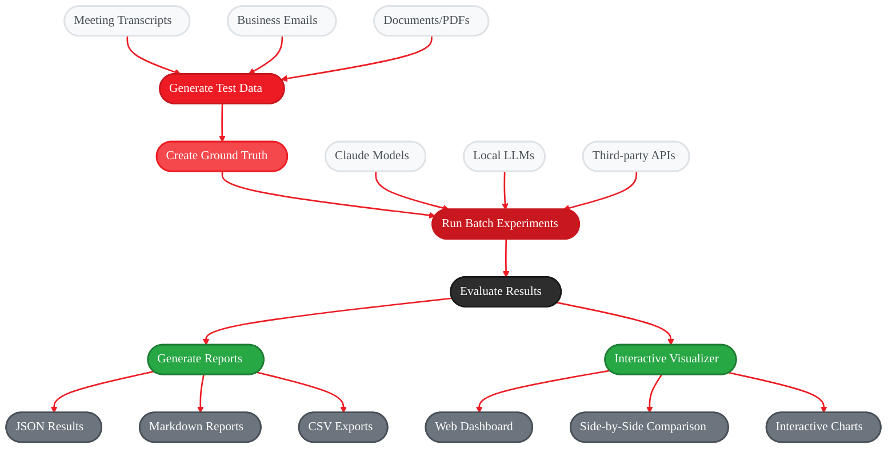

<Info>
  **Source Code:** [`src/gaia/eval/`](https://github.com/amd/gaia/tree/main/src/gaia/eval)
</Info>

<Badge text="development" color="orange" />

## Overview

The GAIA evaluation framework provides systematic tools for testing and comparing AI model performance across different deployment scenarios. This framework enables generation of synthetic test data, creation of evaluation standards, and automated performance comparison.

### Quick Example: Email Summarization

Here's what happens when you evaluate email summarization:

1. **Generate Test Data** → Creates `customer_support_email.txt` with realistic email content
   - *Why needed:* Real emails contain sensitive data; synthetic data provides realistic scenarios without privacy concerns

2. **Create Ground Truth** → Produces `customer_support_email.summarization.groundtruth.json` with expected summary
   - *Why needed:* Models need objective standards to measure against; human experts define what "good" looks like

3. **Run Experiments** → Generates `Claude-Email-Summary.experiment.json` with model responses  
   - *Why needed:* Captures actual model outputs under controlled conditions for repeatable testing

4. **Evaluate Results** → Creates `Claude-Email-Summary.experiment.eval.json` with scored comparisons
   - *Why needed:* Converts subjective quality into measurable metrics (accuracy, completeness, relevance)

5. **Generate Reports** → Outputs `email_evaluation_report.md` with human-readable analysis
   - *Why needed:* Raw scores don't tell the story; reports reveal patterns, strengths, and improvement areas

Each step builds on the previous, creating a complete evaluation pipeline from raw data to actionable insights.

## System Architecture

<Frame>

</Frame>

## Prerequisites

Before using the evaluation framework, ensure you have completed the initial GAIA setup:

1. **Initial Setup**: Follow the [GAIA Development Guide](/reference/dev) to:
   - Install Python 3.12
   - Create and activate the virtual environment (`.venv`)
   - Install base GAIA dependencies

2. **Continue below** to add evaluation-specific dependencies

## Installation

```bash
uv pip install -e ".[eval]"
```

Set up Claude API for synthetic data generation:

```bash
export ANTHROPIC_API_KEY=your_key_here
```

Optional: Start Lemonade for local LLM processing if not running:

```bash
lemonade-server serve
```

**Additional Requirements:**
- **Node.js (with npm)**: Required for the interactive visualizer (`gaia visualize` command)
  - Download from [nodejs.org](https://nodejs.org/en/download) or install via a package manager
  - Verify both are available (you may need to restart your shell):

    ```bash
    node -v
    ```

    ```bash
    npm -v
    ```

  - If either command fails:
    - Windows: `winget install OpenJS.NodeJS.LTS`, then restart your shell
    - Linux: use your distro package manager (e.g., `apt install nodejs npm`)
  - The visualizer will automatically install its webapp dependencies on first launch

## Quick Start

**Try your first evaluation in 5 minutes with minimal commands:**

Ultra-simplified workflow using all defaults:

```bash
gaia generate --meeting-transcript --meeting-types standup --count-per-type 1
```

```bash
gaia groundtruth
```

```bash
gaia batch-experiment -c ./src/gaia/eval/configs/basic_summarization.json
```

```bash
gaia eval
```

```bash
gaia visualize
```

**That's it!** All directory parameters use sensible defaults - no need to specify input/output directories.

**Note:** Test data is automatically organized in subdirectories:
- Meetings → `./output/test_data/meetings/`
- Emails → `./output/test_data/emails/`

**Prerequisites:**
- Claude API key: `export ANTHROPIC_API_KEY=your_key_here`
- Lemonade server running: `lemonade-server serve`
- Node.js installed for visualizer

This creates one synthetic meeting transcript, generates evaluation standards, tests it with multiple models, scores the results, and launches an interactive comparison interface. The default configuration uses **individual prompts** for maximum reliability and accuracy.

**Note:** This workflow uses **Comparative Evaluation** mode with groundtruth data for objective, reliable results (see Evaluation Modes section for details).

### Understanding the Output

After running the Quick Start, you'll have these directories:

- **`./output/test_data/`** - Synthetic meeting transcript(s) for testing
- **`./output/groundtruth/`** - Expected "correct" summaries and evaluation criteria
- **`./output/experiments/`** - Raw responses from each model tested
- **`./output/evaluations/`** - Scored comparisons showing which model performed best
- **`./reports/`** - Human-readable markdown report with analysis and insights

The visualizer shows side-by-side comparisons with quality ratings (Excellent/Good/Fair/Poor) and cost breakdowns. When using Comparative Evaluation mode, these ratings are based on objective comparison against groundtruth data.

## Step-by-Step Workflows

Follow these complete workflows to reproduce evaluation experiments from start to finish.

### Workflow 1: Meeting Transcript Summarization

**Complete example: Evaluate how well different models summarize meeting transcripts**

Step 1: Generate synthetic meeting transcripts

```bash
gaia generate --meeting-transcript -o ./output/test_data/meetings --meeting-types standup planning --count-per-type 2
```

Step 2: Create evaluation standards (ground truth)

```bash
gaia groundtruth -d ./output/test_data/meetings --use-case summarization -o ./output/groundtruth
```

Step 3: Run experiments with multiple models

Note: Edit `./src/gaia/eval/configs/basic_summarization.json` to customize models or create your own config

```bash
gaia batch-experiment -c ./src/gaia/eval/configs/basic_summarization.json -i ./output/groundtruth/consolidated_summarization_groundtruth.json -o ./output/experiments
```

Optional: If interrupted, resume (automatically skips completed experiments)

```bash
gaia batch-experiment -c ./src/gaia/eval/configs/basic_summarization.json -i ./output/groundtruth/consolidated_summarization_groundtruth.json -o ./output/experiments
```

Step 4: Evaluate results and calculate scores

```bash
gaia eval -d ./output/experiments -o ./output/evaluations
```

Step 5: Generate human-readable report

```bash
gaia report -d ./output/evaluations -o ./reports/meeting_summarization_report.md
```

Step 6: Launch interactive visualizer for detailed analysis

```bash
gaia visualize --experiments-dir ./output/experiments --evaluations-dir ./output/evaluations
```

**What you'll get:**
- Synthetic meeting transcripts in `./output/test_data/meetings/`
- Ground truth standards in `./output/groundtruth/`
- Model responses in `./output/experiments/` (with embedded groundtruth for **Comparative Evaluation**)
- Evaluation scores in `./output/evaluations/` (objective ratings based on groundtruth comparison)
- Summary report in `./reports/meeting_summarization_report.md`
- Interactive web interface for comparison

### Workflow 2: Email Summarization

**Complete example: Compare models on business email summarization**

Step 1: Generate synthetic business emails

```bash
gaia generate --email -o ./output/test_data/emails --email-types customer_support project_update meeting_request --count-per-type 2
```

Step 2: Create evaluation standards

```bash
gaia groundtruth -d ./output/test_data/emails --use-case email -o ./output/groundtruth
```

Step 3: Run experiments

Note: Edit `./src/gaia/eval/configs/basic_summarization.json` to customize models or create your own config

```bash
gaia batch-experiment -c ./src/gaia/eval/configs/basic_summarization.json -i ./output/groundtruth/consolidated_email_groundtruth.json -o ./output/experiments
```

Step 4: Evaluate and report

```bash
gaia eval -d ./output/experiments -o ./output/evaluations
```

```bash
gaia report -d ./output/evaluations -o ./reports/email_summarization_report.md
```

Step 5: View results interactively

```bash
gaia visualize --experiments-dir ./output/experiments --evaluations-dir ./output/evaluations
```

### Workflow 3: Document Q&A

**Complete example: Test question-answering capabilities on documents**

Step 1: Create Q&A evaluation standards directly from existing PDF directory

Important: Use `--num-samples 3` to match the `qa_config.num_qa_pairs: 3` in `basic_qa.json`

```bash
gaia groundtruth -d ./data/pdf --use-case qa --num-samples 3 -o ./output/groundtruth
```

Step 2: Run experiments (use `basic_qa.json` for Q&A experiments)

Note: Edit `./src/gaia/eval/configs/basic_qa.json` to customize models or create your own config

```bash
gaia batch-experiment -c ./src/gaia/eval/configs/basic_qa.json -i ./output/groundtruth/consolidated_qa_groundtruth.json -o ./output/experiments
```

Step 3: Evaluate and report

```bash
gaia eval -d ./output/experiments -o ./output/evaluations
```

```bash
gaia report -d ./output/evaluations -o ./reports/document_qa_report.md
```

Step 4: Analyze results

Note: Include `test-data-dir` and `groundtruth-dir` to view source PDFs and Q&A pairs

```bash
gaia visualize --experiments-dir ./output/experiments --evaluations-dir ./output/evaluations --test-data-dir ./data/pdf --groundtruth-dir ./output/groundtruth
```

### Workflow 4: Third-Party Model Testing

**Complete example: Test external models (OpenAI, etc.) that can't be integrated directly**

Step 1: Generate test data and standards

```bash
gaia generate --meeting-transcript -o ./output/test_data/meetings --meeting-types standup --count-per-type 2
```

```bash
gaia groundtruth -d ./output/test_data/meetings --use-case summarization -o ./output/groundtruth
```

Step 2: Create template for manual testing

```bash
gaia create-template -d ./output/groundtruth --use-case summarization -o ./templates/
```

Step 3: Manual step - Fill template with third-party responses

Edit `./templates/*.template.json` - paste responses into "response" fields

Step 4: Evaluate completed template

```bash
gaia eval -d ./templates -o ./output/evaluations
```

```bash
gaia report -d ./output/evaluations -o ./reports/third_party_report.md
```

**Template structure for step 3:**
```json
{
  "test_id": "meeting_001",
  "input_text": "Full meeting transcript...",
  "ground_truth": "Expected summary...",
  "response": "", // <- Paste third-party LLM response here
  "evaluation_criteria": {...}
}
```

## Important: Two Evaluation Workflows

The evaluation system supports **two different workflows** for handling groundtruth data:

### Method 1: Embedded Groundtruth (Recommended)

Use groundtruth files as input to batch-experiment:

```bash
gaia batch-experiment -i ./output/groundtruth/consolidated_*.json -o ./output/experiments
```

```bash
gaia eval -d ./output/experiments -o ./output/evaluations
```

No `-g` flag needed.

**Advantages:** Self-contained experiment files, no risk of missing groundtruth, simpler eval command

### Method 2: External Groundtruth

Use test data as input to batch-experiment:

```bash
gaia batch-experiment -i ./output/test_data -o ./output/experiments
```

```bash
gaia eval -d ./output/experiments -g ./output/groundtruth/consolidated_*.json -o ./output/evaluations
```

Note: `-g` flag required

**Advantages:** Separate concerns, easier to swap different groundtruth files for comparison

### ⚠️ Important: Q&A RAG Use Cases

**For Q&A and RAG evaluations, you MUST use Method 1 (Embedded Groundtruth):**

Required for Q&A - groundtruth contains the input queries:

```bash
gaia batch-experiment -i ./output/groundtruth/consolidated_qa_groundtruth.json -o ./output/experiments
```

```bash
gaia eval -d ./output/experiments -o ./output/evaluations
```

**Why:** Q&A groundtruth files contain the specific questions that models need to answer. Batch-experiment must read these questions from the groundtruth file to ensure all models answer the exact same queries for fair comparison.

**For summarization only:** Both methods work since the input (transcript) is independent of the expected output (summary).

**⚠️ Important:** If you use Method 2, you **MUST** provide the `-g/--groundtruth` flag to the eval command, otherwise evaluation will fall back to standalone quality assessment (see Evaluation Modes below).

## Evaluation Modes: Comparative vs Standalone

The evaluation system operates in two distinct modes depending on groundtruth availability:

### 🎯 Comparative Evaluation (Recommended)

**When groundtruth data is available** (embedded or via `-g` flag):

Example: Comparative evaluation with embedded groundtruth

```bash
gaia batch-experiment -i ./output/groundtruth/consolidated_*.json -o ./output/experiments
```

```bash
gaia eval -d ./output/experiments -o ./output/evaluations
```

**What it does:**
- **Compares** generated summaries against known-correct reference summaries
- **Measures accuracy** by checking if key facts, decisions, and action items match
- **Provides objective scoring** based on how well the output matches the expected result
- **Enables reliable model comparison** with consistent benchmarks

**Evaluation criteria:**
- Executive Summary **Accuracy**: How well does it match the reference?
- **Completeness**: Are all important details from groundtruth covered?
- Action Items **Accuracy**: Are action items correctly identified vs reference?
- Key Decisions **Accuracy**: Are decisions properly captured vs reference?
- Participant **Identification**: Are participants correctly identified vs reference?
- Topic **Coverage**: Are all discussed topics included vs reference?

### 🔍 Standalone Quality Assessment (Fallback)

**When no groundtruth data is available**:

Example: Standalone assessment (not recommended for production evaluation)

```bash
gaia batch-experiment -i ./output/test_data -o ./output/experiments
```

No groundtruth embedded

```bash
gaia eval -d ./output/experiments -o ./output/evaluations
```

No `-g` flag provided

**What it does:**
- **Analyzes** summary quality based on general best practices
- **Subjective assessment** using Claude's judgment alone
- **No accuracy verification** (Claude doesn't know if facts are correct)
- **Inconsistent standards** (Claude's judgment may vary between runs)

**Evaluation criteria:**
- Executive Summary **Quality**: Is it clear and high-level?
- Detail **Completeness**: Does it provide sufficient context?
- Action Items **Structure**: Are items specific and actionable?
- Key Decisions **Clarity**: Are decisions clearly stated?
- Participant **Information**: Are participants properly identified?
- Topic **Organization**: Are topics well-organized and comprehensive?

### 📊 Reliability Comparison

| Aspect | Comparative Evaluation | Standalone Assessment |
|--------|----------------------|---------------------|
| **Accuracy Measurement** | ✅ Verified against known facts | ❌ No fact verification |
| **Model Comparison** | ✅ Objective benchmarking | ⚠️ Subjective, inconsistent |
| **Production Readiness** | ✅ Reliable for decisions | ❌ Not recommended |
| **Consistency** | ✅ Repeatable results | ⚠️ May vary between runs |
| **Cost** | 💰 Higher (groundtruth generation) | 💰 Lower (evaluation only) |

### 💡 Best Practices

**For Production Evaluation:**
- Always use **Comparative Evaluation** with groundtruth data
- Generate comprehensive groundtruth covering all expected use cases
- Use consolidated groundtruth files for batch experiments

**For Quick Quality Checks:**
- Standalone assessment is acceptable for rapid prototyping
- Useful for general quality validation during development
- Not suitable for final model selection or production deployment decisions

**Cost vs Quality Trade-off:**
- Initial groundtruth generation has upfront cost but provides objective evaluation
- Standalone assessment is cheaper but less reliable for critical decisions
- Comparative evaluation pays for itself in model selection accuracy
- Individual prompts (default) prioritize quality over cost for production reliability

## Command Reference

### Synthetic Data Generation

Generate realistic test scenarios for evaluation purposes.

#### Meeting Transcripts

Generate meeting transcripts with full options:

```bash
gaia generate --meeting-transcript -o ./output/test_data/meetings --meeting-types standup planning design_review --count-per-type 1 --target-tokens 1000
```

**Available meeting types:**
- `standup` - Daily standup meetings
- `planning` - Sprint/project planning sessions
- `client_call` - Client communication meetings
- `design_review` - Technical design reviews
- `performance_review` - Employee performance discussions
- `all_hands` - Company-wide meetings
- `budget_planning` - Financial planning sessions
- `product_roadmap` - Product strategy meetings

#### Business Emails

Generate business emails with full options:

```bash
gaia generate --email -o ./output/test_data/emails --email-types project_update meeting_request customer_support --count-per-type 1 --target-tokens 1000
```

**Available email types:**
- `project_update` - Project status communications
- `meeting_request` - Meeting scheduling emails
- `customer_support` - Customer service interactions
- `sales_outreach` - Sales and marketing communications
- `internal_announcement` - Company announcements
- `technical_discussion` - Technical team communications
- `vendor_communication` - External vendor interactions
- `performance_feedback` - Performance review communications

### Ground Truth Creation

Transform synthetic data into evaluation standards.

Create evaluation standards with all options:

```bash
gaia groundtruth -d ./output/test_data -p "*.txt" --use-case summarization -o ./output/groundtruth
```

```bash
gaia groundtruth -d ./output/test_data -p "*.pdf" --use-case qa -o ./output/groundtruth
```

```bash
gaia groundtruth -d ./output/test_data -p "*.txt" --use-case email -o ./output/groundtruth
```

Default behavior: skip files that already have ground truth generated

```bash
gaia groundtruth -d ./output/test_data -o ./output/groundtruth
```

Force regeneration of ALL ground truth files (useful for testing prompt changes):

```bash
gaia groundtruth -d ./output/test_data -o ./output/groundtruth --force
```

**Use case options:**
- `qa` - Question-answer pair generation (requires groundtruth input for batch-experiment)
- `summarization` - Summary generation tasks (supports both embedded and external groundtruth)
- `email` - Email processing tasks (supports both embedded and external groundtruth)

#### Skip Existing Ground Truth Files

Ground truth generation automatically skips files that already have ground truth data to avoid redundant processing and API costs.

**Default Behavior**: Automatically skip files where ground truth JSON already exists in the output directory.

**How it works:**
- Checks for existing `.groundtruth.json` files in the output directory
- Skips files where ground truth has already been generated
- Includes skipped files in the consolidated report
- Logs which files were skipped vs newly processed

**CLI Options:**
- `--force`: Force regeneration of all ground truth files, even if they already exist (overrides default skip behavior)

**Usage Scenarios:**

**Resume Interrupted Ground Truth Generation:**

Default behavior: automatically skip any files that already have ground truth

```bash
gaia groundtruth -d ./output/test_data -o ./output/groundtruth
```

**Force Regeneration After Prompt Changes:**

Force regeneration of ALL ground truth files (useful for testing new prompts):

```bash
gaia groundtruth -d ./output/test_data -o ./output/groundtruth --force
```

**Benefits:**
- **Cost Optimization**: Avoid redundant Claude API calls for expensive ground truth generation
- **Reliability**: Resume interrupted runs without losing progress
- **Efficiency**: Only process new files when adding to existing ground truth
- **Development Speed**: Faster iteration during prompt and configuration development

### Batch Experimentation

Run systematic model comparisons.

Create and run batch experiments (can also use your own config, see `./src/gaia/eval/configs` for examples):

```bash
gaia batch-experiment --create-sample-config experiment_config.json
```

```bash
gaia batch-experiment -c experiment_config.json -i ./output/groundtruth/consolidated_summarization_groundtruth.json -o ./output/experiments
```

Alternative: Use test data directly (requires `-g` flag during eval):

```bash
gaia batch-experiment -c experiment_config.json -i ./output/test_data -o ./output/experiments
```

Default behavior: skip experiments that have already been generated

```bash
gaia batch-experiment -c experiment_config.json -i ./output/groundtruth/consolidated_summarization_groundtruth.json -o ./output/experiments
```

Force regeneration of ALL experiments (useful for testing configuration changes):

```bash
gaia batch-experiment -c experiment_config.json -i ./output/groundtruth/consolidated_summarization_groundtruth.json -o ./output/experiments --force
```

#### Resuming Interrupted Experiments

**Default Behavior**: Batch experiments automatically skip already completed experiments to avoid redundant processing. This is particularly useful when:

- **API Rate Limits**: Your batch run was interrupted due to rate limiting
- **System Interruptions**: Power outage, network issues, or manual cancellation
- **Incremental Testing**: Adding new models to an existing experiment set
- **Cost Optimization**: Avoiding redundant API calls for expensive cloud models

**How it works:**
- Checks for existing `.experiment.json` files in the output directory
- Skips experiments where the output file already exists
- Includes skipped experiments in the consolidated report
- Logs which experiments were skipped vs newly generated

**Example workflow:**

Initial run (gets interrupted after 3 of 5 experiments):

```bash
gaia batch-experiment -c config.json -i ./data -o ./output/experiments
```

Resume run (automatically skips existing 3, only runs remaining 2 experiments):

```bash
gaia batch-experiment -c config.json -i ./data -o ./output/experiments
```

Output: "Completed 2 new experiments, skipped 3 existing"

**Sample configuration structure:**
```json
{
  "experiments": [
    {
      "name": "Claude Baseline",
      "model": "claude-3-sonnet-20240229",
      "provider": "anthropic"
    },
    {
      "name": "Local Llama",
      "model": "llama-3.2-3b",
      "provider": "lemonade"
    }
  ]
}
```

### Third-Party LLM Templates

Create standardized templates for external model evaluation.

Generate templates for manual testing:

```bash
gaia create-template -d ./output/test_data --use-case summarization --format json -o ./templates/
```

```bash
gaia create-template -d ./output/test_data --use-case qa --format csv -o ./templates/
```

**Supported formats:** json, csv, jsonl, xml

### Evaluation and Reporting

Analyze experiment results and generate reports.

Evaluate results and generate reports:

```bash
gaia eval -d ./output/experiments -o ./output/evaluations
```

```bash
gaia report -d ./output/evaluations -o ./reports/report.md
```

Default behavior: skip existing evaluations automatically

```bash
gaia eval -d ./output/experiments -o ./output/evaluations
```

Force regeneration of ALL evaluations (overrides default skip behavior):

```bash
gaia eval -d ./output/experiments -o ./output/evaluations --force
```

Update consolidated report incrementally with new evaluations only:

```bash
gaia eval -d ./output/experiments -o ./output/evaluations --incremental-update
```

Force regeneration of consolidated report (useful after manual changes):

```bash
gaia eval -d ./output/experiments -o ./output/evaluations --regenerate-report
```

Launch interactive web visualizer for comparing results:

```bash
gaia visualize --experiments-dir ./results --evaluations-dir ./output/evaluations
```

#### Skip Existing Evaluations and Incremental Updates

The evaluation system supports skipping existing evaluations and incremental report consolidation to improve efficiency and reduce redundant processing.

**CLI Options:**

- `--force`: Force regeneration of all evaluations, even if they already exist (overrides default skip behavior)
- `--incremental-update`: Update consolidated report incrementally with only new evaluations  
- `--regenerate-report`: Force complete regeneration of the consolidated report

**Default Behavior:** Evaluations automatically skip existing files to avoid redundant processing and API costs.

**Usage Scenarios:**

**Resume Interrupted Evaluation Run:**

Default behavior: automatically skip any evaluations that already exist

```bash
gaia eval -d ./output/experiments -o ./output/evaluations
```

**Add New Experiments Without Re-evaluating Existing Ones:**

Default behavior: only evaluate new experiments, skip existing ones, and update consolidated report

```bash
gaia eval -d ./output/experiments -o ./output/evaluations --incremental-update
```

**Force Re-evaluation of All Files:**

Force regeneration of ALL evaluations (useful for testing configuration changes):

```bash
gaia eval -d ./output/experiments -o ./output/evaluations --force
```

**Update Consolidated Report After Manual Changes:**

Force regeneration of the entire consolidated report:

```bash
gaia eval -d ./output/experiments -o ./output/evaluations --regenerate-report
```

**Development/Testing Workflow:**

Step 1: Run initial evaluation (skips existing files automatically)

```bash
gaia eval -d ./output/experiments -o ./output/evaluations
```

Step 2: Add new experiments and only evaluate those (default behavior)

```bash
gaia eval -d ./output/experiments -o ./output/evaluations
```

Step 3: Update consolidated report with new results

```bash
gaia eval -d ./output/experiments -o ./output/evaluations --incremental-update
```

**Benefits:**
- **Performance**: Skip redundant evaluations, avoiding expensive API calls
- **Reliability**: Resume interrupted runs without losing progress  
- **Efficiency**: Incremental updates process only new files vs regenerating entire reports
- **Development Speed**: Faster iteration during experiment development

**Enhanced Consolidated Report Structure:**

The system maintains backwards compatibility while adding enhanced metadata tracking:

```json
{
  "metadata": {
    "report_type": "consolidated_evaluations",
    "created_at": "2025-08-18T10:30:00",
    "last_updated": "2025-08-18T11:45:00", 
    "total_evaluations": 150,
    "evaluation_files": [
      {
        "file_path": "Claude-Sonnet-Basic-Summary.experiment.eval.json",
        "added_at": "2025-08-18T10:30:00", 
        "last_modified": "2025-08-15T11:41:42",
        "fingerprint": "1692179502.5_4532"
      }
    ]
  },
  "evaluations": [...]
}
```

**Detection Logic:**
- **Skip Logic**: Checks for existing `.eval.json` files in both flat and hierarchical structures
- **Change Detection**: Uses file modification time + file size as fingerprint
- **Incremental Updates**: Only processes files not present in consolidated report metadata

#### Evaluation Options

The `gaia eval` command supports multiple input modes and groundtruth handling:

**Single File Mode (`-f`):**

Evaluate a single experiment file (with embedded groundtruth):

```bash
gaia eval -f ./output/experiments/Claude-Sonnet-Basic-Summary.experiment.json -o ./output/evaluations
```

Or with external groundtruth:

```bash
gaia eval -f ./output/experiments/Claude-Sonnet-Basic-Summary.experiment.json -g ./output/groundtruth/file.json -o ./output/evaluations
```

**Directory Mode (`-d`):**

Evaluate all JSON files in a directory (with embedded groundtruth):

```bash
gaia eval -d ./output/experiments -o ./output/evaluations
```

Or with external groundtruth (if experiments were created from `test_data`):

```bash
gaia eval -d ./output/experiments -g ./output/groundtruth/consolidated_summarization_groundtruth.json -o ./output/evaluations
```

**Groundtruth Handling:**
- **No `-g` flag**: Uses groundtruth embedded in experiment files (when batch-experiment input was groundtruth files)
- **With `-g` flag**: Uses external groundtruth file (when batch-experiment input was test_data files)

**Alternative Workflow - External Groundtruth:**

You can also use external groundtruth files directly with the eval command.

Generate experiments from test data (no embedded groundtruth):

```bash
gaia batch-experiment -c config.json -i ./output/test_data -o ./output/experiments
```

Evaluate using external groundtruth file:

```bash
gaia eval -d ./output/experiments -g ./output/groundtruth/consolidated_summarization_groundtruth.json -o ./output/evaluations
```

**Advantages of External Groundtruth Approach:**
- ✅ **Flexibility**: Easy to test different groundtruth versions against same experiments
- ✅ **Separation of Concerns**: Keep experiments and evaluation standards separate
- ✅ **Storage Efficiency**: No groundtruth duplication in experiment files

The directory mode will automatically find and process all `.json` files in the specified directory, providing individual evaluation results for each file plus consolidated usage and cost information.


## Interactive Results Visualizer

The evaluation framework includes a web-based visualizer for interactive comparison of experiment results.

### Overview

The visualizer provides a user-friendly interface to:
- **Compare Multiple Experiments**: Side-by-side comparison of different model configurations
- **Analyze Key Metrics**: Cost breakdowns, token usage, and quality scores
- **Inspect Quality Ratings**: Detailed analysis of evaluation criteria performance
- **Track Performance Trends**: Visual indicators for model improvement areas

### Launch the Visualizer

Launch with default settings (looks for `./output/experiments`, `./output/evaluations`, `./output/test_data`, and `./output/groundtruth` directories):

```bash
gaia visualize
```

Specify custom data directories:

```bash
gaia visualize --experiments-dir ./my_results --evaluations-dir ./my_evaluations --test-data-dir ./my_test_data --groundtruth-dir ./my_groundtruth
```

Launch on different port or host:

```bash
gaia visualize --port 8080 --host 0.0.0.0 --no-browser
```

### Visualizer Features

**Data Loading:**
- Automatically discovers `.experiment.json` files in the experiments directory
- Loads corresponding `.experiment.eval.json` files from the evaluations directory
- Displays test data files (emails, meeting transcripts) with generation metadata and costs
- Shows groundtruth files with evaluation criteria, expected summaries, and generation details
- Real-time file system monitoring for new results

**Comparison Interface:**
- Grid layout for side-by-side experiment comparison
- Expandable sections for detailed metrics review
- Color-coded quality indicators (Excellent/Good/Fair/Poor)

**Performance Analytics:**
- Cost analysis with input/output token breakdown
- Quality score distributions and averages
- Model configuration comparison (temperature, max tokens, etc.)
- Experiment metadata and error tracking

### Integrated Workflow

The visualizer integrates seamlessly with the evaluation pipeline. After running any of the Step-by-Step Workflows above, simply launch the visualizer to explore your results interactively.

Launch visualizer with all data directories:

```bash
gaia visualize --experiments-dir ./output/experiments --evaluations-dir ./output/evaluations --test-data-dir ./output/test_data --groundtruth-dir ./output/groundtruth
```

### System Requirements

- **Node.js**: Required for running the web server (auto-installs dependencies)
- **Modern Browser**: Chrome, Firefox, Safari, or Edge with JavaScript enabled
- **File System Access**: Read permissions for experiment and evaluation directories

## Configuration Options

### Combined Prompt Optimization (Optional)

The evaluation framework supports **combined prompt** as an optional optimization to reduce costs and execution time, but uses **individual prompts by default** for maximum reliability:

**Individual Prompts (Default):**
- **Higher Reliability**: Each summary style gets dedicated attention and analysis
- **Better Quality**: More focused generation per style type
- **Easier Debugging**: Can isolate issues to specific summary styles
- **Production Recommended**: Default choice for critical evaluations

**Combined Prompt (Optional Optimization):**
- **Single API Call**: All requested summary styles generated in one call
- **Cost Reduction**: ~83% cost savings for cloud APIs (1 call vs 6 for all styles)  
- **Time Savings**: 3-5x faster execution (5-7 seconds vs 18-30 seconds)
- **Quality Trade-off**: May produce less focused results for individual styles
- **⚠️ Model Limitations**: Smaller LLMs (e.g., less than 3B parameters) may struggle with complex combined prompts, leading to incomplete outputs or format errors

To enable combined prompt (for cost/speed optimization):

CLI: Use `--combined-prompt` flag to enable optimization

```bash
gaia summarize -i meeting.txt --styles all --combined-prompt
```

Config: Set `"combined_prompt": true` in parameters to enable

```json
{
  "parameters": {
    "combined_prompt": true
  }
}
```

**When to use Combined Prompt:**
- ✅ **Development/Testing**: Quick iterations and prototyping
- ✅ **Cost-Conscious Evaluation**: Budget constraints with acceptable quality trade-off
- ✅ **High-Volume Experiments**: Processing many documents where speed matters
- ✅ **Large Models Only**: Use with models ≥7B parameters (Claude, GPT-4, large Llama models)

**When to use Individual Prompts (Default):**
- ✅ **Production Evaluation**: Critical model selection decisions  
- ✅ **Quality-First**: When accuracy and reliability are paramount
- ✅ **Detailed Analysis**: Need to understand performance per summary style
- ✅ **Smaller Models**: Required for models less than 7B parameters (Qwen3-0.6B, small Llama models) to avoid instruction-following issues

**Note:** All provided configuration files (e.g., `basic_summarization.json`) use `"combined_prompt": false` by default to ensure maximum evaluation reliability.

### Model Providers

- **anthropic** - Claude models via Anthropic API
- **lemonade** - Local models via Lemonade server

### Evaluation Metrics

The framework evaluates responses across multiple dimensions:

- **Correctness** - Factual accuracy relative to source content
- **Completeness** - Comprehensive coverage of key information
- **Conciseness** - Appropriate brevity while maintaining accuracy
- **Relevance** - Direct alignment with query requirements

### Model Performance Grading System

The evaluation framework includes a comprehensive grading system that converts qualitative ratings into numerical quality scores and percentage grades for easy comparison across models.

#### Grade Calculation Formula

Quality scores are calculated using a weighted average approach:

```python
quality_score = (
    (excellent_count * 4 + good_count * 3 + fair_count * 2 + poor_count * 1) 
    / total_summaries - 1
) * 100 / 3
```

**Formula breakdown:**
1. **Weighting**: Excellent=4, Good=3, Fair=2, Poor=1 points
2. **Average**: Divides by total summaries to get weighted average (1.0 to 4.0 scale)
3. **Normalization**: Subtracts 1 to convert to 0-3 scale  
4. **Percentage**: Multiplies by 100/3 to get 0-100% scale

**Example calculations:**
- All Excellent ratings: (4-1) × 100/3 = **100%**
- All Good ratings: (3-1) × 100/3 = **66.7%**
- All Fair ratings: (2-1) × 100/3 = **33.3%**
- All Poor ratings: (1-1) × 100/3 = **0%**

#### Model Performance Summary Table

The system generates a consolidated Model Performance Summary table that displays:
- **Model**: Model name and configuration
- **Grade**: Calculated percentage score (0-100%)
- **Individual Criteria**: Performance ratings across different evaluation aspects
  - Executive Summary Quality
  - Detail Completeness  
  - Action Items Structure
  - Key Decisions Clarity
  - Participant Information
  - Topic Organization

#### Grade Display Locations

Quality scores and grades are displayed in multiple locations:
- **Web Interface**: Interactive visualizer (`gaia visualize`)
- **Markdown Reports**: Generated evaluation reports
- **JSON Files**: Raw evaluation data in `.eval.json` files
- **Consolidated Reports**: Cross-model comparison summaries

#### Interpreting Quality Scores

**Quality Score Ranges:**
- **85-100%**: Excellent performance, production ready
- **67-84%**: Good performance, minor improvements needed
- **34-66%**: Fair performance, significant improvements required  
- **0-33%**: Poor performance, major revisions needed

**Important Notes:**
- Scores are based on qualitative ratings from Claude AI evaluation
- Each model's score reflects performance across multiple test cases
- Model consolidation may aggregate results from different experiments
- Always review individual evaluation details alongside summary grades

### Output Formats

Results are generated in multiple formats:
- JSON files for programmatic analysis
- Markdown reports for human review
- CSV exports for spreadsheet analysis

## Troubleshooting

### Common Issues

**Evaluation Mode Confusion:**
If your `gaia eval` command runs successfully but produces inconsistent results:
- ❓ **Check**: Are you using Comparative Evaluation or Standalone Assessment mode?
- ✅ **Fix**: Ensure groundtruth data is either embedded (batch-experiment input was groundtruth files) or provided via `-g` flag
- 🔍 **Verify**: Look for log message "Loaded ground truth data from:" vs "No ground truth file provided"

**Q&A Experiments Failing:**
If your Q&A batch-experiment fails with "No queries found" or similar errors:
- ❓ **Check**: Are you using groundtruth files as input to batch-experiment?
- ✅ **Fix**: Use `gaia batch-experiment -i ./output/groundtruth/consolidated_qa_groundtruth.json` (not test data)
- 🔍 **Why**: Q&A groundtruth contains the specific questions models need to answer consistently

**Dependency Compatibility Issues:**

If you encounter numpy/pandas/sklearn import errors after installation:
- ❓ **Symptoms**: `ValueError: numpy.dtype size changed` or `ImportError: cannot import name 'ComplexWarning'`
- ✅ **Fix**: Reinstall dependencies to rebuild against current numpy version:

  ```bash
  pip uninstall -y numpy pandas scikit-learn
  ```

  ```bash
  uv pip install -e ".[eval]"
  ```

- 🔍 **Why**: Binary incompatibility between numpy 2.x and older pandas/sklearn versions

**API Key Issues:**

Verify API key is set:

```bash
echo $ANTHROPIC_API_KEY
```

Test API connectivity:

```bash
gaia generate --meeting-transcript -o ./test --count-per-type 1
```

**Lemonade Server Connection:**

Check if server is running:

```bash
curl http://localhost:8000/api/v1/health
```

Start server if needed:

```bash
lemonade-server serve
```

**File Path Issues:**
- Use absolute paths when relative paths fail
- Ensure output directories exist or can be created
- Check file permissions for read/write access

### Performance Tips

- Start with small datasets to validate configuration
- Use `--count-per-type 1` for initial testing
- Monitor token usage and API costs during generation
- Parallelize experiments when testing multiple models
- Default behavior automatically skips existing experiments to avoid redundant processing

### Timing Metrics

The evaluation system now captures detailed timing information:

**Available Metrics:**
- Total experiment execution time
- Per-item processing times (with min/max/average)
- Per-question evaluation times
- Report generation time

### Cost Tracking

The system tracks inference costs with distinction between cloud and local models:

**Cloud Inference (e.g., Claude):**
- Tracks actual API costs per request
- Shows cost breakdown by input/output tokens
- Displays per-item cost analysis

**Local Inference (e.g., Lemonade):**
- Automatically set to $0.00 (FREE)
- No token costs since it runs on your hardware
- Clear visual indication in webapp that inference is local and free

**Accessing Timing Data:**

1. **Via Webapp Visualizer** (Recommended):

```bash
gaia visualize --experiments-dir ./output/experiments --evaluations-dir ./output/evaluations
```

The webapp displays:
- **Inference Type**: Clear indicators for Cloud (☁️) vs Local (🖥️) models
- **Cost Information**:
  - Cloud models show actual costs with breakdown
  - Local models show "FREE" with celebratory banner
- **Timing Metrics**:
  - Main metrics grid (Total Time, Avg/Item, Eval Time)
  - Dedicated "Performance Timing" section with detailed statistics
  - Min/Max/Average breakdowns for each processing phase

2. **Via JSON Files**:

View timing in experiment files:

```bash
cat ./output/experiments/[filename].experiment.json | jq '.metadata.timing'
```

View timing in evaluation files:

```bash
cat ./output/evaluations/[filename].eval.json | jq '.timing'
```

Check consolidated report timing:

```bash
cat ./output/experiments/consolidated_experiments_report.json | jq '.metadata.total_execution_time_seconds'
```

## Examples

See the [evaluation examples](../output/test_data/) directory for sample configurations and test data.

---

<small style="color: #666;">

**License**

Copyright(C) 2025-2026 Advanced Micro Devices, Inc. All rights reserved.

SPDX-License-Identifier: MIT

</small>