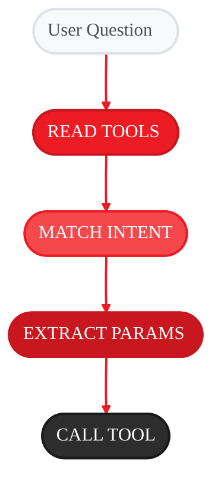

<Note>
📖 **You are viewing:** Conceptual Guide - Learn how tools work and create your own

**See also:** [API Specification](/spec/tool-decorator)
</Note>

<Info>
  **Source Code:** [`src/gaia/agents/base/tools.py`](https://github.com/amd/gaia/blob/main/src/gaia/agents/base/tools.py)
</Info>

<Badge text="development" color="orange" />

<Info>
**What You'll Learn:** How the tool system works under the hood, how LLMs "see" and choose which tools to use, how to write tools that LLMs understand correctly, best practices for parameters, return values, and error handling, and common pitfalls and how to avoid them.
</Info>

## What Are Tools?

LLMs are brilliant at language but can't interact with the real world. Tools are the bridge:

| Without Tools | With Tools |
|---------------|------------|
| "I can't check the weather" | Calls `get_weather()` → "It's 72°F and sunny" |
| "I can't read files" | Calls `read_file()` → Shows file contents |
| "I can't search your database" | Calls `search_db()` → Returns matching records |

**Tools give your agent hands to interact with the world.**

---

## The Tool Contract: What the LLM Actually Sees

Here's the key insight: **The LLM never sees your Python code**. It only sees a "contract" describing the tool.

When you write this:

```python
@tool
def get_weather(city: str, units: str = "fahrenheit") -> dict:
    """Get current weather for a city.

    Args:
        city: Name of the city (e.g., "Seattle", "Tokyo")
        units: Temperature units - "fahrenheit" or "celsius"

    Use this tool when the user asks about weather conditions,
    temperature, or if they need an umbrella.

    Returns:
        Dictionary with temperature, conditions, humidity
    """
    # Your implementation here (LLM never sees this!)
    response = weather_api.get(city, units)
    return {
        "temperature": response.temp,
        "conditions": response.description,
        "humidity": response.humidity
    }
```

The LLM sees this contract:

```json
{
  "name": "get_weather",
  "description": "Get current weather for a city.\n\nUse this tool when the user asks about weather conditions, temperature, or if they need an umbrella.",
  "parameters": {
    "type": "object",
    "properties": {
      "city": {
        "type": "string",
        "description": "Name of the city (e.g., \"Seattle\", \"Tokyo\")"
      },
      "units": {
        "type": "string",
        "description": "Temperature units - \"fahrenheit\" or \"celsius\"",
        "default": "fahrenheit"
      }
    },
    "required": ["city"]
  }
}
```

<Note>
**Key Insight:** Everything the LLM knows about your tool comes from the **function name**, **type hints**, and **docstring**. Your implementation is invisible to it.
</Note>

---

## How LLMs Choose Tools

When a user asks a question, the LLM goes through a decision process:

<Frame>

</Frame>

**This is why clear docstrings matter!** If your description doesn't match user intent, the LLM won't choose your tool.

---

## Building Effective Tools

### Step 1: Start Simple

Begin with the most basic tool structure:

```python
from gaia.agents.base.tools import tool

@tool
def calculate(expression: str) -> float:
    """Calculate a mathematical expression.

    Args:
        expression: Math expression like "2 + 2" or "sqrt(16)"

    Use this tool when the user asks to calculate, compute,
    or do math.
    """
    import math
    # Safe evaluation with only math functions
    return eval(expression, {"__builtins__": {}}, vars(math))
```

**What makes this effective:**
- Clear function name (`calculate`) matches what it does
- Type hint (`str`) tells LLM what to pass
- Return type (`float`) sets expectations
- Docstring explains **when** to use it ("when the user asks to calculate")
- Args section describes the expected format

### Step 2: Add Parameters with Defaults

Make tools flexible with optional parameters:

```python
@tool
def search_files(
    query: str,
    file_type: str = "all",
    max_results: int = 10
) -> dict:
    """Search for files matching a query.

    Args:
        query: Search term to look for in file names and contents
        file_type: Filter by type - "all", "py", "js", "md", etc.
        max_results: Maximum number of results to return (default: 10)

    Use this tool when the user wants to find or locate files.
    """
    # Implementation...
    results = perform_search(query, file_type, max_results)

    return {
        "status": "success",
        "count": len(results),
        "results": results
    }
```

**How defaults work with LLMs:**

```
User: "Find Python files about authentication"

LLM reasons:
- "Find files" → use search_files
- "authentication" → query="authentication"
- "Python files" → file_type="py"
- max_results not mentioned → use default 10

Tool call: search_files(query="authentication", file_type="py")
```

### Step 3: Handle Complex Types

For structured data, use type hints to guide the LLM:

```python
from typing import List, Dict, Optional

@tool
def create_task(
    title: str,
    description: str,
    assignees: List[str],
    priority: str = "medium",
    labels: Optional[List[str]] = None
) -> dict:
    """Create a new task in the project management system.

    Args:
        title: Short title for the task
        description: Detailed description of what needs to be done
        assignees: List of usernames to assign (e.g., ["alice", "bob"])
        priority: Priority level - "low", "medium", or "high"
        labels: Optional list of labels (e.g., ["bug", "frontend"])

    Use this tool when the user wants to create, add, or make a new task.
    """
    # Implementation...
    task = task_system.create(
        title=title,
        description=description,
        assignees=assignees,
        priority=priority,
        labels=labels or []
    )

    return {
        "status": "success",
        "task_id": task.id,
        "url": task.url
    }
```

**The LLM understands:**
- `List[str]` → needs to pass a list of strings
- `Optional[List[str]]` → can be omitted or set to null
- The Args descriptions show example formats

---

## Return Value Patterns

What you return matters—the LLM uses it to form responses.

### Pattern 1: Success with Data

```python
@tool
def get_user(user_id: int) -> dict:
    """Get user information by ID."""
    user = database.get_user(user_id)
    return {
        "status": "success",
        "user": {
            "id": user.id,
            "name": user.name,
            "email": user.email,
            "role": user.role
        }
    }
```

**LLM receives:** `{"status": "success", "user": {"id": 123, "name": "Alice", ...}}`
**LLM responds:** "Alice (alice@example.com) has the Admin role."

### Pattern 2: Error with Guidance

```python
@tool
def get_user(user_id: int) -> dict:
    """Get user information by ID."""
    try:
        user = database.get_user(user_id)
        return {"status": "success", "user": {...}}
    except UserNotFoundError:
        return {
            "status": "error",
            "error": f"No user found with ID {user_id}",
            "suggestion": "Check the user ID or try searching by name"
        }
```

**LLM receives:** `{"status": "error", "error": "No user found...", "suggestion": "..."}`
**LLM responds:** "I couldn't find a user with ID 999. Would you like to search by name instead?"

### Pattern 3: Partial Results

```python
@tool
def search_all(query: str) -> dict:
    """Search across all data sources."""
    results = perform_exhaustive_search(query)

    if len(results) > 50:
        return {
            "status": "success",
            "total_found": len(results),
            "showing": 50,
            "results": results[:50],
            "note": "Results truncated. Be more specific to narrow down."
        }

    return {
        "status": "success",
        "total_found": len(results),
        "results": results
    }
```

**Why this matters:** Prevents context overflow while telling the LLM there's more.

---

## The Power of Good Docstrings

Your docstring teaches the LLM when and how to use your tool. Compare:

<Tabs>
<Tab title="Vague Docstring">
```python
@tool
def search(q: str) -> str:
    """Search for stuff."""
    ...
```

**Problems:** LLM doesn't know what kind of search, `q` parameter name is unclear, no guidance on when to use it, might conflict with other search tools.
</Tab>
<Tab title="Clear Docstring">
```python
@tool
def search_codebase(query: str) -> dict:
    """Search for code patterns in the project's source files.

    Args:
        query: Code pattern to search for (e.g., "def process_",
               "import requests", "TODO")

    Use this tool when the user wants to:
    - Find functions, classes, or variables by name
    - Locate imports or dependencies
    - Search for code patterns or comments

    Do NOT use this tool for:
    - Web searches (use search_web instead)
    - File name searches (use find_files instead)
    - Documentation searches (use search_docs instead)

    Returns:
        Dictionary with matching files and line numbers
    """
    ...
```

**Benefits:** Clear purpose (code search, not web search), example queries help LLM understand format, explicit "when to use" guidance, explicit "when NOT to use" prevents misuse.
</Tab>
</Tabs>

### Docstring Anatomy

```python
@tool
def tool_name(param: type) -> return_type:
    """One-line summary of what the tool does.       ← Required

    Longer description with more details if needed.  ← Optional
    Can span multiple lines.

    Args:                                            ← Highly recommended
        param: Description of what this parameter    ← Include examples!
               expects (e.g., "file path like /src/main.py")

    Use this tool when the user wants to:            ← Critical for selection
    - First trigger phrase
    - Second trigger phrase
    - Third trigger phrase

    Do NOT use when:                                 ← Prevents confusion
    - Situation where another tool is better

    Returns:                                         ← Helps LLM use results
        Description of return format
    """
```

---

## Error Handling: Return, Don't Raise

<Warning>
**Critical Rule:** Tools should never raise exceptions. Always return error information as data.
</Warning>

### Why?

When a tool raises an exception:
1. The agent's reasoning loop may crash
2. The LLM doesn't get useful error information
3. The user sees a technical error instead of helpful guidance

### The Pattern

```python
@tool
def read_file(path: str) -> dict:
    """Read contents of a file.

    Args:
        path: Path to the file to read
    """
    try:
        with open(path, 'r') as f:
            content = f.read()
        return {
            "status": "success",
            "path": path,
            "content": content,
            "size_bytes": len(content)
        }

    except FileNotFoundError:
        return {
            "status": "error",
            "error": f"File not found: {path}",
            "suggestion": "Check the path spelling or use search_files to find it"
        }

    except PermissionError:
        return {
            "status": "error",
            "error": f"Permission denied: {path}",
            "suggestion": "This file may be protected. Try a different file."
        }

    except UnicodeDecodeError:
        return {
            "status": "error",
            "error": f"Cannot read binary file: {path}",
            "suggestion": "This appears to be a binary file, not text"
        }

    except Exception as e:
        return {
            "status": "error",
            "error": f"Unexpected error: {str(e)}",
            "suggestion": "Try a different file or check the path"
        }
```

**Now the LLM can respond helpfully:**

```
Tool result: {"status": "error", "error": "File not found: /src/main.py", ...}

LLM: "I couldn't find /src/main.py. Let me search for it..."
     → Calls search_files("main.py")
```

---

## Common Pitfalls and Solutions

<AccordionGroup>
<Accordion title="Pitfall 1: LLM calls wrong tool">

**Symptom:** User asks to search code, but LLM calls `search_web`.

**Cause:** Tool descriptions are too similar or vague.

**Solution:** Add explicit differentiation:

```python
@tool
def search_codebase(query: str) -> dict:
    """Search for code in PROJECT FILES.

    Use ONLY for searching source code, not web content.
    For web searches, use search_web instead.
    """

@tool
def search_web(query: str) -> dict:
    """Search the INTERNET for information.

    Use for current events, external documentation, general knowledge.
    For project code, use search_codebase instead.
    """
```
</Accordion>

<Accordion title="Pitfall 2: LLM passes wrong parameter type">

**Symptom:** Tool expects integer, receives string like "5".

**Cause:** Missing or unclear type hints.

**Solution:** Always use type hints and validate:

```python
@tool
def get_item(item_id: int) -> dict:  # Type hint tells LLM to pass int
    """Get item by ID.

    Args:
        item_id: Numeric ID of the item (e.g., 123, 456)
    """
    # Defensive validation
    if not isinstance(item_id, int):
        try:
            item_id = int(item_id)
        except (ValueError, TypeError):
            return {
                "status": "error",
                "error": f"Invalid ID format: {item_id}",
                "suggestion": "Please provide a numeric ID"
            }

    # ... rest of implementation
```
</Accordion>

<Accordion title="Pitfall 3: Tool returns too much data">

**Symptom:** Agent becomes slow or gives inconsistent answers.

**Cause:** Tool returns massive amounts of data that overflow context.

**Solution:** Limit and summarize output:

```python
@tool
def search_logs(query: str) -> dict:
    """Search application logs."""
    matches = log_search(query)

    # Always limit results
    MAX_RESULTS = 20
    MAX_LINE_LENGTH = 200

    truncated_matches = []
    for match in matches[:MAX_RESULTS]:
        truncated_matches.append({
            "file": match.file,
            "line_num": match.line,
            "content": match.content[:MAX_LINE_LENGTH]
        })

    result = {
        "status": "success",
        "total_matches": len(matches),
        "showing": len(truncated_matches),
        "matches": truncated_matches
    }

    if len(matches) > MAX_RESULTS:
        result["note"] = f"Showing first {MAX_RESULTS} of {len(matches)}. Refine query for specific results."

    return result
```
</Accordion>

<Accordion title="Pitfall 4: Tool not being discovered">

**Symptom:** LLM says "I don't have a tool for that" when you do.

**Cause:** Tool is defined but not registered with the agent.

**Solution:** Make sure tool is inside `_register_tools()`:

```python
class MyAgent(Agent):
    def _register_tools(self):
        # ✅ Tool is registered
        @tool
        def my_tool():
            ...

# ❌ Tool outside agent - won't be registered!
@tool
def orphan_tool():
    ...
```
</Accordion>

<Accordion title="Pitfall 5: Tool with side effects runs unexpectedly">

**Symptom:** Emails sent, files deleted, or data modified when user was just asking a question.

**Cause:** Destructive tools need safeguards.

**Solution:** Add confirmation or dry-run modes:

```python
@tool
def delete_file(path: str, confirm: bool = False) -> dict:
    """Delete a file from the filesystem.

    Args:
        path: Path to the file to delete
        confirm: Must be True to actually delete. Default False
                 returns what WOULD be deleted.

    Use this tool when the user explicitly asks to delete a file.
    Always show what will be deleted before confirming.
    """
    import os

    if not os.path.exists(path):
        return {"status": "error", "error": f"File not found: {path}"}

    file_info = {
        "path": path,
        "size_bytes": os.path.getsize(path),
        "type": "file" if os.path.isfile(path) else "directory"
    }

    if not confirm:
        return {
            "status": "preview",
            "message": "This would delete:",
            "file": file_info,
            "note": "Call again with confirm=True to delete"
        }

    os.remove(path)
    return {
        "status": "success",
        "deleted": file_info
    }
```

**Now the LLM will preview first:**
```
User: "Delete the old config file"

LLM: "I'll delete /config/old_settings.json (2.3KB). Should I proceed?"
     → First calls delete_file(path="...", confirm=False)

User: "Yes"

LLM: "Done, I've deleted the file."
     → Then calls delete_file(path="...", confirm=True)
```
</Accordion>
</AccordionGroup>

---

## Practice Challenge

<Card title="Build a Database Query Tool" icon="database">
Create a tool that: (1) Accepts a natural language query about users, (2) Translates it to a database operation, (3) Returns structured results, (4) Handles errors gracefully.

**Requirements:** Clear docstring with usage examples, type hints on all parameters, graceful error handling, reasonable result limits.

<Accordion title="Hints">
Use a dict to simulate database records. Include examples in the docstring to guide the LLM. Return both data and metadata (count, any filtering applied).
</Accordion>

<Accordion title="Solution">
```python
from gaia.agents.base.tools import tool
from typing import Optional, List

# Simulated database
USERS_DB = [
    {"id": 1, "name": "Alice", "role": "admin", "department": "Engineering"},
    {"id": 2, "name": "Bob", "role": "developer", "department": "Engineering"},
    {"id": 3, "name": "Carol", "role": "developer", "department": "Design"},
    {"id": 4, "name": "Dave", "role": "manager", "department": "Sales"},
    {"id": 5, "name": "Eve", "role": "developer", "department": "Engineering"},
]

@tool
def query_users(
    name: Optional[str] = None,
    role: Optional[str] = None,
    department: Optional[str] = None,
    limit: int = 10
) -> dict:
    """Query the user database with filters.

    Args:
        name: Filter by name (partial match, case-insensitive)
              Example: "ali" matches "Alice"
        role: Filter by exact role
              Options: "admin", "developer", "manager"
        department: Filter by exact department
              Options: "Engineering", "Design", "Sales"
        limit: Maximum results to return (default: 10)

    Use this tool when the user wants to:
    - Find users by name
    - List users with a specific role
    - See who works in a department
    - Get user counts or lists

    Examples:
    - "Find all developers" → role="developer"
    - "Who works in Engineering?" → department="Engineering"
    - "Find Alice" → name="alice"

    Returns:
        Dictionary with matching users and query metadata
    """
    try:
        # Start with all users
        results = USERS_DB.copy()
        filters_applied = []

        # Apply name filter (partial, case-insensitive)
        if name:
            results = [u for u in results if name.lower() in u["name"].lower()]
            filters_applied.append(f"name contains '{name}'")

        # Apply role filter (exact match)
        if role:
            valid_roles = ["admin", "developer", "manager"]
            if role.lower() not in valid_roles:
                return {
                    "status": "error",
                    "error": f"Invalid role: {role}",
                    "valid_roles": valid_roles,
                    "suggestion": f"Use one of: {', '.join(valid_roles)}"
                }
            results = [u for u in results if u["role"].lower() == role.lower()]
            filters_applied.append(f"role = '{role}'")

        # Apply department filter (exact match)
        if department:
            valid_depts = ["Engineering", "Design", "Sales"]
            if department not in valid_depts:
                return {
                    "status": "error",
                    "error": f"Invalid department: {department}",
                    "valid_departments": valid_depts,
                    "suggestion": f"Use one of: {', '.join(valid_depts)}"
                }
            results = [u for u in results if u["department"] == department]
            filters_applied.append(f"department = '{department}'")

        # Apply limit
        total_matches = len(results)
        results = results[:limit]

        # Build response
        response = {
            "status": "success",
            "total_matches": total_matches,
            "showing": len(results),
            "users": results,
            "filters_applied": filters_applied if filters_applied else ["none"]
        }

        if total_matches > limit:
            response["note"] = f"Showing {limit} of {total_matches}. Increase limit or add filters."

        if total_matches == 0:
            response["suggestion"] = "No matches found. Try different filters."

        return response

    except Exception as e:
        return {
            "status": "error",
            "error": f"Query failed: {str(e)}",
            "suggestion": "Check your filter values and try again"
        }

# Example usage in an agent:
class UserQueryAgent(Agent):
    def _register_tools(self):
        # Register the tool we defined above
        self.tools["query_users"] = query_users
```

**Why this solution works:**

1. **Clear docstring with examples:** LLM knows exactly how to map user requests to parameters
2. **Optional parameters:** LLM can use any combination of filters
3. **Input validation:** Invalid values return helpful error messages
4. **Graceful limits:** Prevents returning too much data
5. **Rich metadata:** LLM knows total count, filters used, and has suggestions
6. **Error handling:** Catches unexpected errors with helpful messages
</Accordion>
</Card>

---

## Deep Dive: Tool Schema Generation

<Accordion title="How @tool Generates JSON Schema">

When you decorate a function with `@tool`, Python introspection extracts the schema:

```python
import inspect
from typing import get_type_hints

def tool(func):
    """Decorator that generates JSON schema from function signature."""

    # Get type hints
    hints = get_type_hints(func)
    sig = inspect.signature(func)

    # Build schema
    schema = {
        "name": func.__name__,
        "description": inspect.getdoc(func) or "",
        "parameters": {
            "type": "object",
            "properties": {},
            "required": []
        }
    }

    # Process each parameter
    for name, param in sig.parameters.items():
        if name == "self":
            continue

        # Get type from hints
        param_type = hints.get(name, str)
        json_type = python_to_json_type(param_type)

        # Add to schema
        schema["parameters"]["properties"][name] = {
            "type": json_type,
            "description": extract_param_description(func.__doc__, name)
        }

        # Check if required (no default value)
        if param.default == inspect.Parameter.empty:
            schema["parameters"]["required"].append(name)
        else:
            schema["parameters"]["properties"][name]["default"] = param.default

    # Attach schema to function
    func._tool_schema = schema
    return func

def python_to_json_type(python_type):
    """Convert Python types to JSON Schema types."""
    mapping = {
        str: "string",
        int: "integer",
        float: "number",
        bool: "boolean",
        list: "array",
        dict: "object",
    }
    return mapping.get(python_type, "string")
```

This schema is what gets sent to the LLM when it needs to decide which tools to use!

</Accordion>

---

## Key Takeaways

<CardGroup cols={2}>
<Card title="LLM Sees the Contract" icon="file-contract">
Function name, type hints, and docstring are all the LLM knows. Write them for the LLM, not just humans.
</Card>
<Card title="Docstrings Drive Selection" icon="bullseye">
"Use this tool when..." phrases directly influence when the LLM chooses your tool.
</Card>
<Card title="Return Errors as Data" icon="shield-check">
Never raise exceptions. Return structured error info so the LLM can respond helpfully.
</Card>
<Card title="Limit Output Size" icon="compress">
Large returns overflow context. Truncate, summarize, and indicate when there's more.
</Card>
</CardGroup>

---

## Next Steps

<CardGroup cols={3}>
<Card title="Agent System" icon="robot" href="./agent-system">
Understand how agents use tools in the reasoning loop
</Card>
<Card title="Tool Mixins" icon="puzzle-piece" href="../mixins/tool-mixins">
Use pre-built tool collections for common tasks
</Card>
<Card title="Best Practices" icon="star" href="../best-practices">
Advanced patterns for production tools
</Card>
</CardGroup>

---

<small style={{color: "#666"}}>
Copyright(C) 2024-2025 Advanced Micro Devices, Inc. All rights reserved.
SPDX-License-Identifier: MIT
</small>
