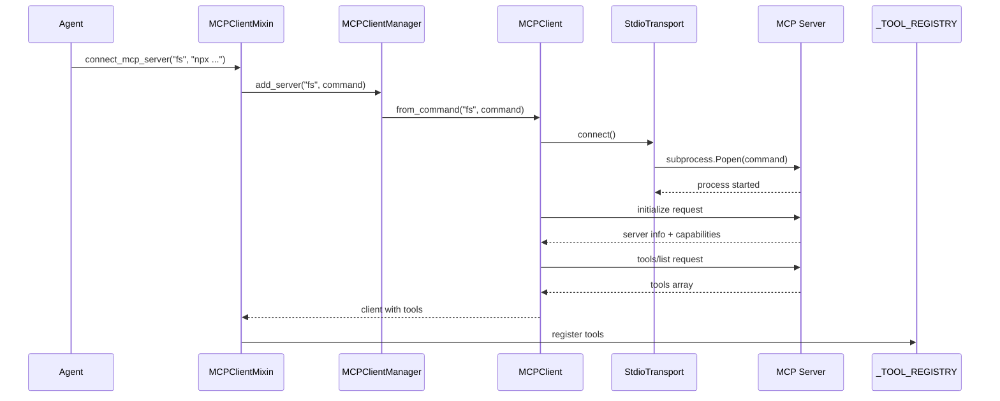

<Note>
⚡ **Complete SDK Reference** - Connect GAIA agents to any MCP server

**See also:** [User Guide](/guides/mcp-client)
</Note>

<Info>
  **Source Code:** [`src/gaia/mcp/mixin.py`](https://github.com/amd/gaia/blob/main/src/gaia/mcp/mixin.py) · [`src/gaia/mcp/client/`](https://github.com/amd/gaia/blob/main/src/gaia/mcp/client)
</Info>

<Note>
**Import:** `from gaia.mcp import MCPClientMixin, MCPClient, MCPClientManager`
</Note>

---

<Badge text="development" color="orange" />

**Purpose:** Enable GAIA agents to connect to external MCP (Model Context Protocol) servers and use their tools. Provides universal tool integration with automatic discovery and registration.

---

## Overview

The MCP Client enables GAIA agents to connect to and use tools from external MCP (Model Context Protocol) servers. This provides universal tool integration - any GAIA agent can use any MCP server's tools with zero code changes.

### Key Features

- **Universal Tool Access**: Connect to any (stdio) MCP server and use its tools
- **Automatic Tool Registration**: MCP tools automatically appear in agent's tool registry
- **Tool Namespacing**: Multiple servers with same tool names work without conflicts
- **Stdio Transport**: Support for subprocess-based MCP servers
- **Configuration Management**: Persistent server configurations
- **CLI Integration**: Simple command-line interface for managing connections

### Prerequisites

| Dependency | Required | Notes |
|------------|----------|-------|
| GAIA with MCP | Yes | `uv pip install -e ".[mcp]"` |
| Node.js 20.20.0 | Optional | Required for `npx`-based MCP servers (e.g., `npx -y @modelcontextprotocol/server-memory`). See [Setup Guide](/setup). |

---

## Quick Start (Agent with MCP)

```python
from gaia.agents.base.agent import Agent
from gaia.mcp import MCPClientMixin

class MyAgent(Agent, MCPClientMixin):
    def __init__(self, **kwargs):
        super().__init__(**kwargs)

        # Connect to filesystem MCP server
        # System prompt automatically updated with MCP tools
        self.connect_mcp_server(
            "filesystem",
            "npx @modelcontextprotocol/server-filesystem /tmp"
        )

# Create and use agent - MCP tools available immediately
agent = MyAgent()
result = agent.run("List all files in /tmp")
print(result)
# LLM can now use: mcp_filesystem_read_file, mcp_filesystem_write_file, etc.
```

---

## Connect Multiple Servers

```python
from gaia.agents.base.agent import Agent
from gaia.mcp import MCPClientMixin

class MultiToolAgent(Agent, MCPClientMixin):
    def __init__(self, **kwargs):
        super().__init__(**kwargs)

        # Connect to multiple MCP servers
        self.connect_mcp_server(
            "filesystem",
            "npx @modelcontextprotocol/server-filesystem /tmp"
        )

        self.connect_mcp_server(
            "github",
            "npx @modelcontextprotocol/server-github"
        )

        # All tools from both servers are available!

# Use agent with tools from multiple servers
agent = MultiToolAgent()
response = agent.run("List files in /tmp, then create a GitHub issue about them")
```

---

## Load Servers from Config

```python
from gaia.agents.base.agent import Agent
from gaia.mcp import MCPClientMixin

class ConfigAgent(Agent, MCPClientMixin):
    def __init__(self, **kwargs):
        super().__init__(**kwargs)

        # Load all servers from ~/.gaia/mcp_servers.json
        # System prompt automatically updated with all tools
        count = self.load_mcp_servers_from_config()
        print(f"Loaded {count} MCP servers")

# Agent automatically connects to all configured servers
agent = ConfigAgent()

# List connected servers
servers = agent.list_mcp_servers()
print(f"Connected to: {', '.join(servers)}")

# Get specific client for direct tool access
fs_client = agent.get_mcp_client("filesystem")
tools = fs_client.list_tools()
print(f"Filesystem tools: {len(tools)}")
```

---

## API Reference

### MCPClientMixin

The mixin class that adds MCP client capabilities to GAIA agents.

```python
class MCPClientMixin:
    """Mixin to add MCP client capabilities to agents.

    Usage:
        class MyAgent(Agent, MCPClientMixin):
            def __init__(self, ...):
                super().__init__(...)
                self.connect_mcp_server("filesystem", "npx @modelcontextprotocol/server-filesystem")
    """

    def connect_mcp_server(
        self,
        name: str,
        command: str = None,
        config: Dict = None
    ) -> bool:
        """Connect to an MCP server and register its tools.

        Args:
            name: Friendly name for the server
            command: Shell command to start server (for stdio)
            config: Optional server configuration dict

        Returns:
            bool: True if connection and tool registration successful
        """

    def disconnect_mcp_server(self, name: str) -> None:
        """Disconnect from an MCP server and unregister its tools."""

    def list_mcp_servers(self) -> List[str]:
        """List all connected MCP servers."""

    def get_mcp_client(self, name: str) -> MCPClient:
        """Get an MCP client by name."""

    def load_mcp_servers_from_config(self) -> int:
        """Load and register MCP servers from configuration file.

        System prompt is automatically rebuilt with all loaded tools.

        Returns:
            int: Number of servers successfully loaded
        """
```

**Quick Reference:**

| Method | Description | Returns |
|--------|-------------|---------|
| `connect_mcp_server(name, command)` | Connect to MCP server | `bool` |
| `disconnect_mcp_server(name)` | Disconnect from server | `None` |
| `list_mcp_servers()` | List connected servers | `List[str]` |
| `get_mcp_client(name)` | Get client by name | `MCPClient` |
| `load_mcp_servers_from_config()` | Load from config file | `int` |

---

### MCPClient

The client class for interacting with an MCP server.

```python
class MCPClient:
    """Client for interacting with an MCP server."""

    def __init__(self, name: str, transport: MCPTransport, debug: bool = False):
        """Create an MCP client with specified transport."""

    @classmethod
    def from_command(
        cls,
        name: str,
        command: str,
        timeout: int = 30,
        debug: bool = False
    ) -> "MCPClient":
        """Create an MCP client using stdio transport."""

    def connect(self) -> bool:
        """Connect to the MCP server and initialize."""

    def disconnect(self) -> None:
        """Disconnect from the MCP server."""

    def is_connected(self) -> bool:
        """Check if connected to server."""

    def list_tools(self, refresh: bool = False) -> List[MCPTool]:
        """List all available tools from the server."""

    def call_tool(self, tool_name: str, arguments: Dict[str, Any]) -> Dict[str, Any]:
        """Call a tool on the MCP server.

        Returns:
            Dict with {"content": [...]} on success or {"error": "msg"} on failure
        """

    def create_tool_wrapper(self, tool: MCPTool) -> Callable:
        """Create a callable wrapper for an MCP tool."""
```

**Quick Reference:**

| Method | Description | Returns |
|--------|-------------|---------|
| `from_command(name, command)` | Create client (factory) | `MCPClient` |
| `connect()` | Connect to server | `bool` |
| `disconnect()` | Disconnect | `None` |
| `list_tools(refresh=False)` | List available tools | `List[MCPTool]` |
| `call_tool(name, args)` | Execute tool | `Dict` |
| `is_connected()` | Check connection | `bool` |

---

### MCPClientManager

The manager class for handling multiple MCP client connections.

```python
class MCPClientManager:
    """Manages multiple MCP client connections."""

    def __init__(self, config: Optional[MCPConfig] = None, debug: bool = False):
        """Create manager with optional configuration."""

    def add_server(
        self,
        name: str,
        command: str = None,
        config: Dict = None
    ) -> MCPClient:
        """Add and connect to an MCP server."""

    def remove_server(self, name: str) -> None:
        """Remove and disconnect from an MCP server."""

    def get_client(self, name: str) -> Optional[MCPClient]:
        """Get a client by name."""

    def list_servers(self) -> List[str]:
        """List all registered server names."""

    def disconnect_all(self) -> None:
        """Disconnect from all MCP servers."""

    def load_from_config(self) -> None:
        """Load and connect to all servers from configuration."""
```

**Quick Reference:**

| Method | Description | Returns |
|--------|-------------|---------|
| `add_server(name, command)` | Add server | `MCPClient` |
| `remove_server(name)` | Remove server | `None` |
| `get_client(name)` | Get client | `MCPClient` |
| `list_servers()` | List servers | `List[str]` |
| `load_from_config()` | Load from config | `None` |
| `disconnect_all()` | Disconnect all | `None` |

---

### Supporting Classes

#### MCPTool

```python
@dataclass
class MCPTool:
    """Represents an MCP tool with its schema."""

    name: str
    description: str
    input_schema: Dict[str, Any]

    def to_gaia_format(self, server_name: str) -> Dict[str, Any]:
        """Convert MCP tool schema to GAIA _TOOL_REGISTRY format."""
```

#### MCPTransport

```python
class MCPTransport(ABC):
    """Abstract base class for MCP transport implementations."""

    @abstractmethod
    def connect(self) -> bool:
        """Establish connection to the MCP server."""

    @abstractmethod
    def disconnect(self) -> None:
        """Close the connection to the MCP server."""

    @abstractmethod
    def send_request(self, method: str, params: Dict = None) -> Dict:
        """Send a JSON-RPC request to the server."""

    @abstractmethod
    def is_connected(self) -> bool:
        """Check if transport is currently connected."""


class StdioTransport(MCPTransport):
    """Stdio-based transport using subprocess for MCP servers."""

    def __init__(self, command: str, timeout: int = 30, debug: bool = False):
        """Create stdio transport with command and timeout."""
```

#### MCPConfig

```python
class MCPConfig:
    """Configuration manager for MCP servers."""

    def __init__(self, config_file: str = None):
        """Create config manager (default: ~/.gaia/mcp_servers.json)."""

    def add_server(self, name: str, config: Dict[str, Any]) -> None:
        """Add or update a server configuration."""

    def remove_server(self, name: str) -> None:
        """Remove a server configuration."""

    def get_server(self, name: str) -> Dict[str, Any]:
        """Get a server configuration."""

    def get_servers(self) -> Dict[str, Dict[str, Any]]:
        """Get all server configurations."""

    def server_exists(self, name: str) -> bool:
        """Check if a server exists in configuration."""
```

---

## Implementation Details

### Connection Flow



### Tool Registration Pattern

MCP tools are converted from JSON Schema format to GAIA's tool registry format:

```python
# MCP tool format (from server)
{
    "name": "read_file",
    "description": "Read file contents",
    "inputSchema": {
        "type": "object",
        "properties": {
            "path": {"type": "string", "description": "File path"},
            "encoding": {"type": "string", "description": "Encoding"}
        },
        "required": ["path"]
    }
}

# GAIA tool format (in _TOOL_REGISTRY)
{
    "name": "mcp_filesystem_read_file",
    "description": "[MCP:filesystem] Read file contents",
    "parameters": {
        "path": {
            "type": "string",
            "required": True,
            "description": "File path"
        },
        "encoding": {
            "type": "string",
            "required": False,
            "description": "Encoding"
        }
    },
    "function": <wrapper_callable>,
    "atomic": True,
    "_mcp_server": "filesystem",
    "_mcp_tool_name": "read_file"
}
```

---

## CLI Commands

```bash
# Add server
gaia mcp add <name> <command>

# List servers
gaia mcp list

# List tools
gaia mcp tools <name>

# Test connection
gaia mcp test-client <name>

# Remove server
gaia mcp remove <name>
```

See [CLI Reference](/reference/cli#mcp-client) for complete documentation.

---

## Configuration

Servers are saved to `~/.gaia/mcp_servers.json`:

```json
{
  "servers": {
    "filesystem": {
      "command": "npx @modelcontextprotocol/server-filesystem /tmp"
    }
  }
}
```

---

## Tool Namespacing

MCP tools are automatically namespaced to prevent collisions:

- **MCP Tool:** `read_file`
- **GAIA Tool:** `mcp_filesystem_read_file`
- **Description:** `[MCP:filesystem] Read file contents from disk`

This ensures multiple servers with the same tool name work correctly:

```python
# Both work without conflicts:
# - mcp_fs1_read_file → reads from filesystem
# - mcp_github_read_file → reads from GitHub
```

---

## Usage Examples

### Direct Client Usage (Without Agent)

```python
from gaia.mcp.client import MCPClient

# Create client from command
client = MCPClient.from_command(
    name="filesystem",
    command="npx @modelcontextprotocol/server-filesystem /tmp",
    timeout=30,
    debug=False
)

# Connect to server
if client.connect():
    # List available tools
    tools = client.list_tools()
    for tool in tools:
        print(f"- {tool.name}: {tool.description}")

    # Call tool directly
    result = client.call_tool("read_file", {"path": "/tmp/example.txt"})
    if "content" in result:
        print(result["content"][0]["text"])
    elif "error" in result:
        print(f"Error: {result['error']}")

    # Disconnect when done
    client.disconnect()
```

---

### Error Handling

```python
from gaia.agents.base.agent import Agent
from gaia.mcp import MCPClientMixin

class SafeAgent(Agent, MCPClientMixin):
    def __init__(self, **kwargs):
        super().__init__(**kwargs)

        # Check connection success
        success = self.connect_mcp_server(
            "filesystem",
            "npx @modelcontextprotocol/server-filesystem /tmp"
        )

        if not success:
            print("Warning: Failed to connect to MCP server")
        else:
            print("Successfully connected to MCP server")

# Tool execution errors are returned in result
agent = SafeAgent()
client = agent.get_mcp_client("filesystem")
result = client.call_tool("read_file", {"path": "/nonexistent"})

if "error" in result:
    print(f"Tool failed: {result['error']}")
elif "content" in result:
    print(f"Success: {result['content']}")
```

---

### Using MCPClientManager

```python
from gaia.mcp.client import MCPClientManager
from gaia.mcp.client.config import MCPConfig

# Create manager with config file
config = MCPConfig("~/.gaia/mcp_servers.json")
manager = MCPClientManager(config=config)

# Add servers programmatically
client = manager.add_server(
    "filesystem",
    command="npx @modelcontextprotocol/server-filesystem /tmp"
)

# List all connected servers
servers = manager.list_servers()
print(f"Servers: {servers}")

# Get specific client
fs_client = manager.get_client("filesystem")
if fs_client and fs_client.is_connected():
    tools = fs_client.list_tools()
    print(f"Tools available: {len(tools)}")

# Load servers from config file
manager.load_from_config()

# Cleanup all connections
manager.disconnect_all()
```

---

### Debug Mode

Enable detailed logging:

```python
# Via MCPClient
client = MCPClient.from_command("server", "command", debug=True)

# Via MCPClientManager
manager = MCPClientManager(debug=True)

# Via MCPClientMixin (in agent)
class DebugAgent(Agent, MCPClientMixin):
    def __init__(self, **kwargs):
        kwargs["debug"] = True  # Enables MCP debug logging
        super().__init__(**kwargs)
        self.connect_mcp_server("server", "command")
```

---

## Requirements

### Functional Requirements

1. **Server Connection**
   - Connect to MCP servers via stdio (subprocess)
   - Initialize MCP protocol handshake
   - Handle connection failures gracefully
   - Note: HTTP transport exists but is not yet integrated

2. **Tool Discovery**
   - List all available tools from connected servers
   - Parse MCP tool schemas (JSON Schema format)
   - Convert MCP schemas to GAIA format

3. **Tool Execution**
   - Call MCP tools with proper arguments
   - Handle tool responses and errors
   - Support both synchronous and streaming responses

4. **Tool Registration**
   - Register MCP tools in agent's `_TOOL_REGISTRY`
   - Namespace tools by server name (prevent collisions)
   - Add server context to tool descriptions

5. **Configuration Management**
   - Save server configurations persistently
   - Load servers on startup
   - Support adding/removing servers

### Non-Functional Requirements

1. **Performance**
   - Minimal overhead for tool calls (`<50ms`)
   - Efficient subprocess management
   - Tool schema caching

2. **Reliability**
   - Automatic reconnection on failure
   - Process cleanup on disconnect
   - Error recovery and logging

3. **Usability**
   - Simple mixin interface for agents
   - Clear CLI commands
   - Helpful error messages

---

## Related Documentation

- [MCP Client Guide](/guides/mcp-client) - Complete usage guide
- [MCP Server SDK](/sdk/infrastructure/mcp) - Build MCP servers
- [Agent System](/sdk/core/agent-system) - Agent framework
- [CLI Reference](/reference/cli#mcp-client) - CLI commands

---

<small style="color: #666;">

Copyright(C) 2024-2025 Advanced Micro Devices, Inc. All rights reserved.

SPDX-License-Identifier: MIT

</small>
