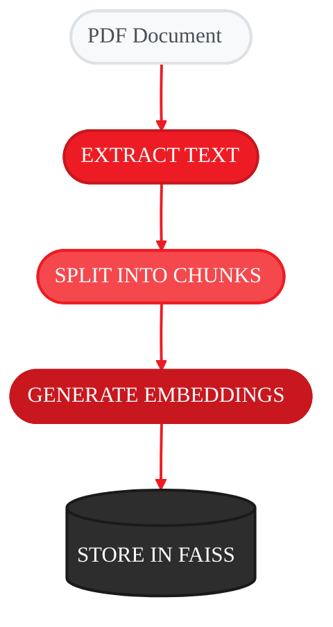
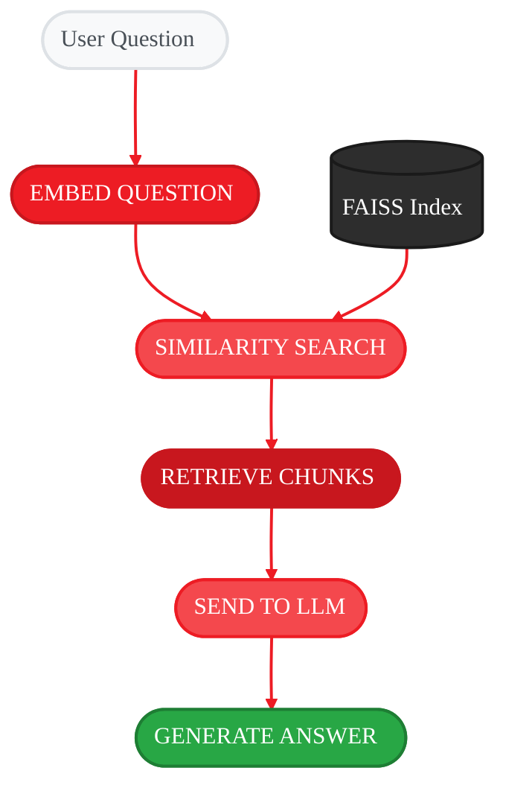
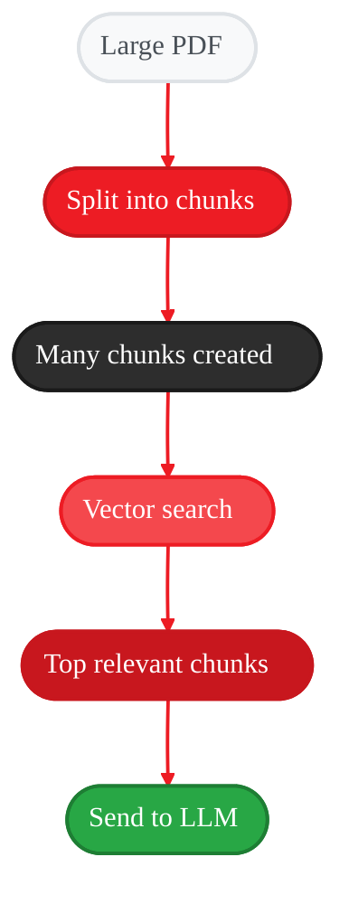
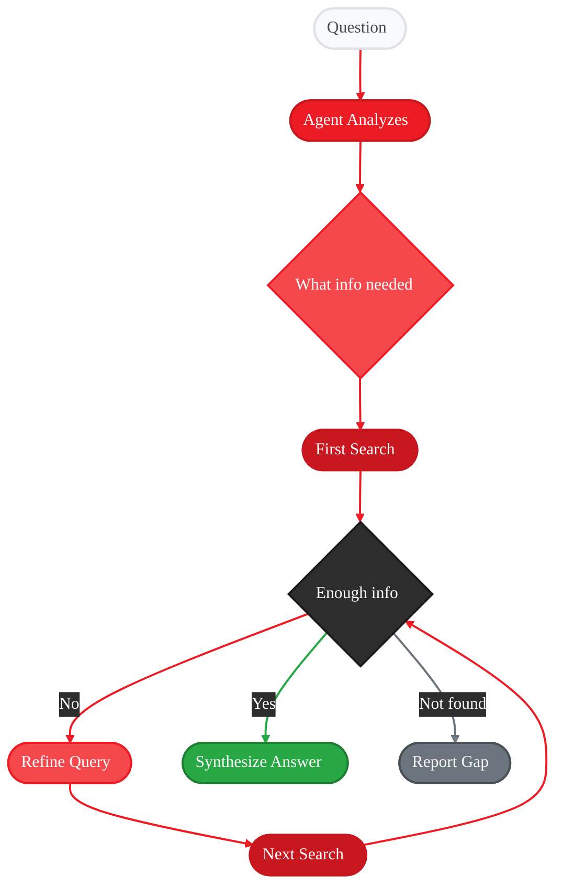
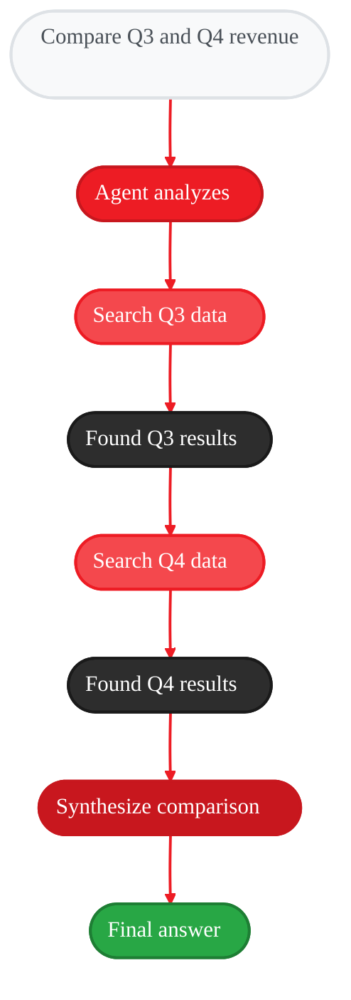

<Info>
  **Source Code:** [`src/gaia/rag/sdk.py`](https://github.com/amd/gaia/blob/main/src/gaia/rag/sdk.py)
</Info>

<Badge text="development" color="orange" />

**Detailed Spec:** [spec/rag-sdk](/spec/rag-sdk)

<Info>
**What You'll Learn:** What RAG is and why you need it, how documents become searchable through chunking and embeddings, how to configure RAG for different use cases, how to tune parameters for quality vs. speed, what Agentic RAG is and how it differs from traditional RAG, how to implement multi-step retrieval patterns, and common pitfalls and how to avoid them.
</Info>

## The Problem RAG Solves

LLMs have a knowledge cutoff—they don't know about your company's documents, your project's codebase, or yesterday's meeting notes.

<Tabs>
<Tab title="Without RAG">
```python
from gaia.llm import LLMClient

llm = LLMClient()
response = llm.generate("What's our company's refund policy?")
# "I don't have access to your company's specific policies..."
```
The LLM can only say it doesn't know.
</Tab>
<Tab title="With RAG">
```python
from gaia.rag.sdk import RAGSDK

rag = RAGSDK()
rag.index_document("policies/refund_policy.pdf")

response = rag.query("What's our company's refund policy?")
# "According to your refund policy, customers have 30 days
#  to return products for a full refund. The item must be
#  in original packaging..."
```
RAG searches your documents and answers using real information.
</Tab>
</Tabs>

**RAG** stands for **Retrieval-Augmented Generation**:
- **Retrieval** → Find relevant information from your documents
- **Augmented** → Add that information to the LLM's context
- **Generation** → LLM generates an answer using your documents

---

## How RAG Works: A Mental Model

Think of RAG as a smart research assistant:

### Phase 1: Preparation (Indexing)

This happens once when you index documents:

<Frame>

</Frame>

### Phase 2: Query (Retrieval)

This happens each time you ask a question:

<Frame>

</Frame>

<Note>
**Key Insight:** The magic is in the vectors. Text that has similar *meaning* ends up with similar vectors—even if the words are different. "System requirements" and "hardware needed" would have similar vectors because they mean similar things.
</Note>

---

## Getting Started with RAG

### Quick RAG: One-Line Document Q&A

For simple use cases, `quick_rag` handles everything in one call:

```python
from gaia.rag.sdk import quick_rag

# Index and query in one call
answer = quick_rag(
    query="What are the main features?",
    documents=["product_guide.pdf", "feature_list.pdf"]
)
print(answer)
```

**What happens behind the scenes:**
1. Extracts text from both PDFs
2. Splits into chunks (default: 500 tokens each)
3. Generates embeddings for all chunks
4. Creates temporary FAISS index
5. Searches for relevant chunks
6. Sends chunks + question to LLM
7. Returns the generated answer

**Best for:** Quick exploration, one-off questions, prototyping

### RAG SDK: Persistent Index

For applications where you'll ask multiple questions, create a persistent RAG instance:

```python
from gaia.rag.sdk import RAGSDK, RAGConfig

# Create RAG with custom config
rag = RAGSDK()

# Index documents (only needed once per document)
rag.index_document("docs/manual.pdf")
rag.index_document("docs/faq.pdf")

# Or index multiple at once
rag.index_documents(["guide1.pdf", "guide2.pdf", "guide3.pdf"])

# Now you can ask unlimited questions
response = rag.query("How do I install the software?")
print(response.text)

response = rag.query("What are the system requirements?")
print(response.text)

response = rag.query("How do I contact support?")
print(response.text)
```

**Key advantage:** Documents are indexed once, then you can query as many times as you want without re-processing.

---

## Understanding Chunks

Chunking is the most important concept in RAG. Let's understand it deeply.

### Why Do We Need Chunks?

LLMs have limited context windows. You can't send a 500-page PDF directly. Instead:

<Frame>

</Frame>

### What is `chunk_size`?

`chunk_size` controls how many tokens (roughly 3/4 of a word) go into each chunk:

```python
config = RAGConfig(chunk_size=500)  # 500 tokens ≈ 375 words ≈ 2-3 paragraphs
```

| chunk_size | Roughly equals | Best for |
|------------|----------------|----------|
| `256` | ~1 paragraph | FAQs, short Q&A pairs, definitions |
| `512` | ~2-3 paragraphs | General documents, manuals (default) |
| `1024` | ~4-6 paragraphs | Technical papers, code with context |
| `2048` | ~1-2 pages | Long-form analysis, narratives |

**Trade-offs:**

<CardGroup cols={2}>
<Card title="Small Chunks (256)" icon="crosshairs">
**Pros:** Precise matching, less noise in results, faster embedding.

**Cons:** May miss surrounding context, more chunks to search, fragmented information.
</Card>
<Card title="Large Chunks (1024+)" icon="expand">
**Pros:** More context preserved, fewer chunks overall, complete ideas captured.

**Cons:** Less precise matching, more irrelevant text included, slower embedding.
</Card>
</CardGroup>

### What is `chunk_overlap`?

Overlap ensures information isn't lost at chunk boundaries:

```
WITHOUT OVERLAP:
┌────────────────────────┐ ┌────────────────────────┐
│ "...with benefits like │ │ and 401k matching up   │
│  health insurance"     │ │ to 6% of salary..."    │
└────────────────────────┘ └────────────────────────┘
                        ↑ Information split!

WITH OVERLAP (100 tokens):
┌─────────────────────────────────┐
│ "...with benefits like health   │
│  insurance and 401k matching..."│
└─────────────────────────────────┘
┌─────────────────────────────────┐
│ "...health insurance and 401k   │
│  matching up to 6% of salary..."│
└─────────────────────────────────┘
                        ↑ Context preserved!
```

**Rule of thumb:** Set `chunk_overlap` to 10-20% of `chunk_size`:
- `chunk_size=500` → `chunk_overlap=50-100`
- `chunk_size=1000` → `chunk_overlap=100-200`

---

## Configuration Deep Dive

Here's the full `RAGConfig` with explanations:

```python
from gaia.rag.sdk import RAGConfig, RAGSDK

config = RAGConfig(
    # === Chunking ===
    chunk_size=500,            # Tokens per chunk
    chunk_overlap=100,         # Overlap between chunks

    # === Retrieval ===
    max_chunks=5,              # How many chunks to retrieve per query

    # === Models ===
    model="Qwen3-Coder-30B-A3B-Instruct-GGUF",  # LLM for generation
    embedding_model="nomic-embed-text-v2-moe-GGUF",  # Embedding model

    # === Storage ===
    cache_dir=".gaia",         # Where to store the index

    # === Limits ===
    max_indexed_files=100,     # Maximum documents to index
    max_file_size_mb=100,      # Maximum file size in MB
)

rag = RAGSDK(config)
```

### Tuning `max_chunks`

`max_chunks` controls how many chunks are sent to the LLM:

| max_chunks | Effect | Best for |
|------------|--------|----------|
| `2-3` | Focused, specific answers | Factual Q&A, definitions |
| `5` | Balanced (default) | General purpose |
| `8-10` | Comprehensive answers | Research, complex topics |

**Visualization:**

```
Query: "What are all the security features?"

max_chunks=2:  [Security overview] [Authentication]
               → "Two main security features: overview and auth..."

max_chunks=5:  [Security overview] [Authentication] [Encryption]
               [Access control] [Audit logging]
               → "There are several security features including..."

max_chunks=10: [All security-related chunks]
               → Comprehensive answer but slower, more tokens used
```

---

## RAG Response Object

When you query, you get back a rich response object:

```python
response = rag.query("What is GAIA?")

# The generated answer
print(response.text)
# "GAIA is AMD's framework for running generative AI locally..."

# The chunks that were retrieved
for i, chunk in enumerate(response.chunks):
    print(f"Chunk {i+1}: {chunk[:100]}...")

# Relevance scores (0.0 to 1.0)
print(response.chunk_scores)
# [0.94, 0.87, 0.82, 0.75, 0.71]

# Source files
print(response.source_files)
# ["docs/intro.pdf", "docs/overview.pdf"]

# Per-chunk metadata
for meta in response.chunk_metadata:
    print(f"File: {meta['source']}, Page: {meta.get('page', 'N/A')}")

# Stats (if available)
if response.stats:
    print(f"Tokens used: {response.stats['total_tokens']}")
    print(f"Latency: {response.stats['latency_ms']}ms")
```

### Interpreting Relevance Scores

| Score Range | Meaning | What to Do |
|-------------|---------|------------|
| `0.90+` | Excellent match | High confidence answer |
| `0.75-0.90` | Good match | Answer is likely accurate |
| `0.50-0.75` | Moderate match | Review answer carefully |
| `< 0.50` | Weak match | Consider rephrasing question |

```python
# Check if results are reliable
response = rag.query(user_question)

if response.chunk_scores and response.chunk_scores[0] < 0.5:
    print("Warning: Low confidence in answer. The documents may not contain this information.")
else:
    print(response.text)
```

---

## Beyond Basic RAG: Agentic RAG

Traditional RAG follows a simple pattern: **one question → one search → one answer**. But real-world information needs are rarely that simple.

**Agentic RAG** adds intelligent reasoning to the retrieval process, allowing the agent to:
- Make multiple retrieval calls when needed
- Refine queries based on initial results
- Combine information from multiple documents
- Know when it has enough information to answer
- Recognize when documents don't contain the answer

### Traditional RAG vs. Agentic RAG

<Tabs>
<Tab title="Traditional RAG">
<Frame>

</Frame>

**How it works:** User asks a question, system searches once for relevant chunks, top chunks are sent to LLM, LLM generates answer from those chunks.

**Limitations:** If initial search misses relevant info it's gone, can't handle multi-part questions, no ability to refine or dig deeper, doesn't know when it lacks information.
</Tab>
<Tab title="Agentic RAG">
<Frame>

</Frame>

**How it works:** Agent analyzes question to understand intent, decides what information is needed, searches and evaluates results, refines query and searches again if insufficient, synthesizes answer from all gathered information, and indicates confidence or admits when info isn't available.
</Tab>
</Tabs>

### When Agentic RAG Shines

| Scenario | Traditional RAG | Agentic RAG |
|----------|----------------|-------------|
| "What's the refund policy?" | ✅ Single search works | ✅ Works |
| "Compare the 2023 and 2024 budgets" | ❌ Searches once, misses comparison | ✅ Searches both years, compares |
| "What's our cloud strategy and how does it affect security?" | ❌ Gets cloud OR security, not both | ✅ Searches both topics, synthesizes |
| "Is there anything about GDPR compliance?" | ❌ Returns low-relevance chunks anyway | ✅ Reports "no GDPR info found" |
| "Summarize all action items from Q3 meetings" | ❌ Gets random meeting chunks | ✅ Iteratively finds all Q3 meetings |

### The Agentic RAG Mental Model

Think of the difference like this:

**Traditional RAG** = A librarian who:
- Takes your question
- Goes to one shelf
- Grabs the first 5 books that seem related
- Hands them to you

**Agentic RAG** = A research assistant who:
- Discusses your question to understand what you really need
- Searches multiple sections of the library
- Evaluates if the books actually answer your question
- Goes back for more if needed
- Tells you honestly if the library doesn't have what you need
- Synthesizes findings into a coherent answer

### How GAIA Implements Agentic RAG

GAIA's agents use RAG as a **tool**, not just a pipeline. This is the key architectural difference:

```python
from gaia.agents.chat.agent import ChatAgent, ChatAgentConfig

# Create an agent with RAG capability
config = ChatAgentConfig(
    rag_documents=["quarterly_reports/", "policies/", "meeting_notes/"]
)

agent = ChatAgent(config)

# The agent can now reason about retrieval
result = agent.process_query(
    "Compare our Q3 and Q4 revenue and explain any differences"
)
```

**What happens under the hood:**

<Frame>

</Frame>

### The RAG Tool Interface

When RAG is used as an agent tool, the LLM can make intelligent decisions:

```python
from gaia.agents.base.agent import Agent
from gaia.agents.base.tools import tool
from gaia.rag.sdk import RAGSDK

class ResearchAgent(Agent):
    """Agent that uses RAG intelligently."""

    def __init__(self, documents_path: str, **kwargs):
        self.rag = RAGSDK()
        self.rag.index_documents(documents_path)
        super().__init__(**kwargs)

    def _register_tools(self):
        @tool
        def search_documents(
            query: str,
            search_type: str = "semantic"
        ) -> dict:
            """Search indexed documents for information.

            Args:
                query: What to search for - be specific
                search_type: "semantic" for meaning-based, "keyword" for exact match

            Use this tool when you need information from the documents.
            You can call this multiple times with different queries to
            gather comprehensive information.

            Returns:
                Dictionary with chunks, scores, and source files
            """
            response = self.rag.query(query)

            return {
                "status": "success" if response.chunk_scores[0] > 0.5 else "low_confidence",
                "chunks": response.chunks,
                "scores": response.chunk_scores,
                "sources": response.source_files,
                "suggestion": (
                    "Try a more specific query"
                    if response.chunk_scores[0] < 0.5
                    else None
                )
            }

        @tool
        def check_document_coverage(topic: str) -> dict:
            """Check if documents contain information about a topic.

            Use this BEFORE making claims to verify the documents
            actually cover this topic.
            """
            response = self.rag.query(topic)
            coverage = response.chunk_scores[0] if response.chunk_scores else 0

            if coverage > 0.7:
                return {"covered": True, "confidence": coverage}
            elif coverage > 0.4:
                return {"covered": "partial", "confidence": coverage}
            else:
                return {
                    "covered": False,
                    "confidence": coverage,
                    "note": "Documents may not contain information about this topic"
                }
```

### Multi-Step Retrieval Example

Here's how an agent handles a complex question:

**Question:** "What were our top 3 product launches this year and how did each perform?"

**Traditional RAG would:**
1. Search "top product launches performance"
2. Return 5 random chunks about products
3. Generate a potentially incomplete answer

**Agentic RAG does:**

```
Step 1: Agent thinks: "I need to find product launches, then performance data for each"

Step 2: Agent calls search_documents("2024 product launches new releases")
        → Finds: ProductA (March), ProductB (June), ProductC (September)

Step 3: Agent calls search_documents("ProductA launch performance sales metrics")
        → Finds: ProductA achieved 150% of target, $2.3M revenue

Step 4: Agent calls search_documents("ProductB launch performance sales metrics")
        → Finds: ProductB had slower adoption, 80% of target

Step 5: Agent calls search_documents("ProductC launch performance sales metrics")
        → Finds: ProductC exceeded expectations, best Q3 launch ever

Step 6: Agent synthesizes:
        "Our top 3 product launches in 2024 were:
         1. ProductC (September) - Best Q3 launch ever, exceeded all targets
         2. ProductA (March) - Strong performance at 150% of target, $2.3M revenue
         3. ProductB (June) - Slower adoption at 80% of target

         ProductC's success was attributed to..."
```

### Implementing Agentic RAG Patterns

<AccordionGroup>
<Accordion title="Pattern 1: Iterative Refinement">

When initial results are insufficient, refine and search again:

```python
def _register_tools(self):
    @tool
    def deep_search(question: str, max_iterations: int = 3) -> dict:
        """Search with automatic refinement if results are poor.

        Will refine query and search again if confidence is low.
        """
        all_chunks = []
        queries_tried = []

        current_query = question
        for i in range(max_iterations):
            response = self.rag.query(current_query)
            queries_tried.append(current_query)

            if response.chunk_scores and response.chunk_scores[0] > 0.7:
                # Good results found
                all_chunks.extend(response.chunks[:3])
                return {
                    "status": "success",
                    "chunks": all_chunks,
                    "iterations": i + 1,
                    "queries_used": queries_tried
                }

            # Results not great - try to refine
            all_chunks.extend(response.chunks[:1])  # Keep best chunk anyway

            # Generate refined query (in real implementation, use LLM)
            current_query = f"{question} details specifics"

        return {
            "status": "partial",
            "chunks": all_chunks,
            "iterations": max_iterations,
            "note": "Could not find high-confidence results"
        }
```

</Accordion>

<Accordion title="Pattern 2: Multi-Aspect Search">

For questions with multiple parts, search each aspect:

```python
@tool
def multi_aspect_search(aspects: list[str]) -> dict:
    """Search for multiple related topics and combine results.

    Args:
        aspects: List of topics to search for separately

    Use when a question has multiple parts that need
    different searches (e.g., "compare X and Y").
    """
    results = {}

    for aspect in aspects:
        response = self.rag.query(aspect)
        results[aspect] = {
            "chunks": response.chunks[:3],
            "confidence": response.chunk_scores[0] if response.chunk_scores else 0,
            "sources": response.source_files
        }

    # Identify which aspects have good coverage
    covered = [a for a, r in results.items() if r["confidence"] > 0.6]
    missing = [a for a, r in results.items() if r["confidence"] < 0.4]

    return {
        "results": results,
        "well_covered": covered,
        "potentially_missing": missing,
        "note": f"Strong info on {len(covered)}/{len(aspects)} aspects"
    }
```

**Usage by agent:**
```
User: "Compare our pricing strategy with competitor analysis"

Agent thinks: "This needs two aspects - pricing and competitors"
Agent calls: multi_aspect_search(["pricing strategy", "competitor analysis"])

Results: {
  "pricing strategy": {"confidence": 0.89, ...},
  "competitor analysis": {"confidence": 0.34, ...},
  "well_covered": ["pricing strategy"],
  "potentially_missing": ["competitor analysis"]
}

Agent responds: "I found detailed information about our pricing strategy...
However, I couldn't find substantial competitor analysis in the documents.
You may need to provide competitor analysis documents for a full comparison."
```

</Accordion>

<Accordion title="Pattern 3: Confidence-Aware Responses">

Always check confidence before making claims:

```python
@tool
def verified_search(query: str, min_confidence: float = 0.6) -> dict:
    """Search with explicit confidence verification.

    Only returns results above the confidence threshold.
    Clearly indicates when information is not available.
    """
    response = self.rag.query(query)

    if not response.chunk_scores:
        return {
            "found": False,
            "reason": "No matching documents in index"
        }

    top_confidence = response.chunk_scores[0]

    if top_confidence >= min_confidence:
        return {
            "found": True,
            "confidence": top_confidence,
            "answer_basis": response.chunks[:3],
            "sources": response.source_files
        }
    else:
        return {
            "found": False,
            "confidence": top_confidence,
            "reason": f"Best match only {top_confidence:.0%} confident",
            "suggestion": "The documents may not contain this information",
            "closest_match": response.chunks[0] if response.chunks else None
        }
```

</Accordion>

<Accordion title="Pattern 4: Source Triangulation">

Verify information appears in multiple sources:

```python
@tool
def triangulated_search(query: str, min_sources: int = 2) -> dict:
    """Search and verify information across multiple sources.

    More reliable for important facts - ensures the information
    isn't just from one potentially outdated document.
    """
    response = self.rag.query(query)

    # Group chunks by source
    sources = {}
    for chunk, score, meta in zip(
        response.chunks,
        response.chunk_scores,
        response.chunk_metadata
    ):
        source = meta.get("source", "unknown")
        if source not in sources:
            sources[source] = []
        sources[source].append({"chunk": chunk, "score": score})

    unique_sources = len(sources)

    if unique_sources >= min_sources:
        return {
            "verified": True,
            "source_count": unique_sources,
            "sources": list(sources.keys()),
            "evidence": {s: chunks[0] for s, chunks in sources.items()},
            "note": f"Information confirmed across {unique_sources} documents"
        }
    else:
        return {
            "verified": False,
            "source_count": unique_sources,
            "sources": list(sources.keys()),
            "warning": f"Only found in {unique_sources} source(s) - verify independently"
        }
```

</Accordion>
</AccordionGroup>

### When to Use Each Approach

| Use Case | Approach | Why |
|----------|----------|-----|
| Simple FAQ lookups | Traditional RAG | Fast, single search is sufficient |
| Document search UI | Traditional RAG | User expects immediate results |
| Complex analysis questions | Agentic RAG | Needs multiple searches and synthesis |
| Multi-document comparison | Agentic RAG | Must search each document specifically |
| Research assistant | Agentic RAG | Needs to iterate and refine |
| Chatbot with memory | Agentic RAG | Context-aware follow-up questions |
| Compliance checking | Agentic RAG | Must verify coverage, report gaps |

### Key Takeaways: Agentic RAG

<CardGroup cols={2}>
<Card title="RAG as a Tool, Not Pipeline" icon="wrench">
In Agentic RAG, retrieval is a tool the agent chooses to use—not a fixed pipeline.
</Card>
<Card title="Multiple Searches Are Normal" icon="rotate">
Complex questions often need 3-5 searches to gather complete information.
</Card>
<Card title="Confidence Matters" icon="gauge">
Agents should check relevance scores and admit when documents don't have the answer.
</Card>
<Card title="Synthesis Over Retrieval" icon="brain">
The agent's job is to synthesize information, not just return search results.
</Card>
</CardGroup>

---

## Tuning RAG for Your Use Case

<AccordionGroup>
<Accordion title="Use Case: Customer Support FAQ Bot">

FAQs are short, focused questions with direct answers:

```python
config = RAGConfig(
    chunk_size=256,        # Short chunks for precise matching
    chunk_overlap=50,      # Some overlap for context
    max_chunks=3,          # Few chunks, focused answers
    max_indexed_files=200  # Support many FAQ documents
)

rag = RAGSDK(config)
rag.index_documents(["faq.pdf", "troubleshooting.pdf", "quick_start.pdf"])

response = rag.query("How do I reset my password?")
```

**Why these settings:**
- Small chunks match FAQ Q&A pairs precisely
- Low max_chunks prevents mixing unrelated FAQs
- Focused answers are better for support
</Accordion>

<Accordion title="Use Case: Research Paper Analysis">

Academic papers need more context to understand concepts:

```python
config = RAGConfig(
    chunk_size=1024,       # Large chunks preserve argument flow
    chunk_overlap=200,     # High overlap keeps ideas connected
    max_chunks=4,          # Fewer, richer chunks
    max_file_size_mb=200   # Academic papers can be large
)

rag = RAGSDK(config)
rag.index_documents(["paper1.pdf", "paper2.pdf", "literature_review.pdf"])

response = rag.query("What methodology was used in the study?")
```

**Why these settings:**
- Large chunks capture complete methodologies
- High overlap preserves logical flow
- Fewer chunks focus on key passages
</Accordion>

<Accordion title="Use Case: Codebase Documentation">

Code docs mix short references with detailed explanations:

```python
config = RAGConfig(
    chunk_size=512,        # Medium chunks for mixed content
    chunk_overlap=100,     # Preserve code block context
    max_chunks=6,          # More chunks to show examples + explanations
)

rag = RAGSDK(config)
rag.index_documents(["api_reference.pdf", "tutorial.pdf", "examples.pdf"])

response = rag.query("How do I authenticate API requests?")
```

**Why these settings:**
- Medium chunks handle both code and prose
- More chunks show multiple code examples
- Balanced for API reference + tutorials
</Accordion>

<Accordion title="Use Case: Legal Document Review">

Legal documents need precise, complete clause retrieval:

```python
config = RAGConfig(
    chunk_size=768,        # Clauses can be long
    chunk_overlap=150,     # Don't break clause boundaries
    max_chunks=5,          # Show relevant clauses
    max_file_size_mb=500   # Contracts can be huge
)

rag = RAGSDK(config)
rag.index_document("contract.pdf")

response = rag.query("What are the termination conditions?")
```

**Why these settings:**
- Larger chunks capture complete clauses
- High overlap prevents splitting conditions
- Legal answers need complete context
</Accordion>
</AccordionGroup>

---

## Security: Restricting Document Access

RAG can be restricted to specific directories for security:

```python
from gaia.rag.sdk import RAGConfig, RAGSDK

# Restrict indexing to specific paths
config = RAGConfig(
    allowed_paths=[
        "/home/user/documents",
        "/home/user/work/public"
    ]
)

rag = RAGSDK(config)

# This works - within allowed paths
rag.index_document("/home/user/documents/report.pdf")

# This is BLOCKED - outside allowed paths
try:
    rag.index_document("/etc/passwd")  # Raises SecurityError
except SecurityError as e:
    print(f"Blocked: {e}")
```

<Warning>
**Security Consideration:** Without `allowed_paths`, RAG can index any file the process can read. In production, always set explicit allowed paths.
</Warning>

---

## Common Pitfalls and Solutions

<AccordionGroup>
<Accordion title="Pitfall 1: RAG returns irrelevant information">

**Symptom:** Asking about weather, but RAG returns technical documentation.

**Cause:** RAG always retrieves the "most similar" chunks, even if similarity is low.

**Solutions:**

```python
# 1. Check relevance scores before trusting the answer
response = rag.query(question)

if not response.chunk_scores or response.chunk_scores[0] < 0.6:
    # Low relevance - documents probably don't cover this
    print("I don't have information about that topic.")
else:
    print(response.text)

# 2. Use a more specific question
# ❌ "Tell me about the system"
# ✅ "What are the system requirements for installation?"

# 3. Index more relevant documents
rag.index_document("system_requirements.pdf")
```
</Accordion>

<Accordion title="Pitfall 2: Answers are missing context">

**Symptom:** Answer is technically correct but missing important details.

**Cause:** Chunks are too small, cutting off important context.

**Solutions:**

```python
# 1. Increase chunk size
config = RAGConfig(
    chunk_size=768,        # Was 256
    chunk_overlap=150,     # Proportionally larger
)

# 2. Retrieve more chunks
config = RAGConfig(
    max_chunks=8,          # Was 3
)

# 3. Both together for comprehensive answers
config = RAGConfig(
    chunk_size=768,
    chunk_overlap=150,
    max_chunks=6,
)
```
</Accordion>

<Accordion title="Pitfall 3: Indexing is slow">

**Symptom:** Indexing 100 documents takes 30+ minutes.

**Cause:** Embedding generation is CPU/GPU intensive.

**Solutions:**

```python
# 1. Use AMD NPU acceleration (if available)
# Lemonade Server (https://lemonade-server.ai) automatically uses NPU for embeddings

# 2. Index documents in batch
# ✅ Efficient - one batch operation
rag.index_documents(["doc1.pdf", "doc2.pdf", "doc3.pdf", ...])

# ❌ Slow - separate operations
for doc in documents:
    rag.index_document(doc)

# 3. Use smaller embedding model
config = RAGConfig(
    embedding_model="all-MiniLM-L6-v2"  # Smaller, faster
)

# 4. Persist index to avoid re-indexing
config = RAGConfig(
    cache_dir="./my_rag_cache"  # Index persisted here
)
# Next run will load existing index instead of re-creating
```
</Accordion>

<Accordion title="Pitfall 4: Out of memory with large documents">

**Symptom:** Python crashes or hangs when indexing large PDFs.

**Cause:** Large documents create many chunks that consume memory.

**Solutions:**

```python
# 1. Limit indexed files
config = RAGConfig(
    max_indexed_files=50,     # Limit total files
    max_file_size_mb=50,      # Limit individual file size
)

# 2. Use larger chunks (fewer total chunks)
config = RAGConfig(
    chunk_size=1024,          # Fewer chunks per document
)

# 3. Clear index when switching projects
rag.clear_index()

# 4. Remove documents you no longer need
rag.remove_document("old_document.pdf")
```
</Accordion>
</AccordionGroup>

---

## Practice Challenge

<Card title="Build a Document Q&A System" icon="book">
Create a RAG system that: (1) Indexes multiple PDF documents, (2) Answers questions with source citations, (3) Indicates confidence based on relevance scores, (4) Handles missing information gracefully.

**Requirements:** Configure appropriate chunk size for your documents, include relevance score checking, show which documents the answer came from.

<Accordion title="Hints">
Use `response.source_files` for citations. Check `response.chunk_scores[0]` for confidence. Use a threshold (e.g., 0.6) to detect unreliable answers.
</Accordion>

<Accordion title="Solution">
```python
from gaia.rag.sdk import RAGSDK, RAGConfig

class DocumentQA:
    """Document Q&A system with confidence scoring and citations."""

    def __init__(self, documents: list[str]):
        # Configure for general document Q&A
        config = RAGConfig(
            chunk_size=512,
            chunk_overlap=100,
            max_chunks=5,
        )

        self.rag = RAGSDK(config)

        # Index all provided documents
        print(f"Indexing {len(documents)} documents...")
        self.rag.index_documents(documents)
        print("Indexing complete!")

    def ask(self, question: str) -> str:
        """Ask a question with confidence scoring and citations."""
        response = self.rag.query(question)

        # Check confidence
        if not response.chunk_scores:
            return "I couldn't find any relevant information."

        top_score = response.chunk_scores[0]

        # Build response with confidence indicator
        if top_score >= 0.85:
            confidence = "High confidence"
        elif top_score >= 0.65:
            confidence = "Medium confidence"
        else:
            return (
                f"Low confidence ({top_score:.0%}): "
                "The documents may not contain this information. "
                f"Best guess: {response.text}"
            )

        # Add citations
        sources = list(set(response.source_files))
        source_text = ", ".join(sources)

        return f"""**{confidence}** ({top_score:.0%})

{response.text}

📚 **Sources:** {source_text}
"""

    def get_stats(self) -> dict:
        """Get index statistics."""
        return self.rag.get_stats()

# Usage
qa = DocumentQA([
    "company_handbook.pdf",
    "product_manual.pdf",
    "faq.pdf"
])

# High confidence question (in documents)
print(qa.ask("What is the vacation policy?"))

# Low confidence question (not in documents)
print(qa.ask("What's the weather like today?"))

# Check stats
stats = qa.get_stats()
print(f"Indexed {stats['num_files']} files with {stats['total_chunks']} chunks")
```

**Why this solution works:**
1. **Confidence scoring:** Users know when to trust the answer
2. **Citations:** Users can verify information
3. **Graceful handling:** Low confidence triggers a warning instead of wrong answer
4. **Configurable:** Chunk settings can be adjusted for document types
5. **Statistics:** Helps monitor and debug the system
</Accordion>
</Card>

---

## Deep Dive: How Vector Similarity Works

<Accordion title="Understanding Embeddings and Cosine Similarity">

**What are embeddings?**

Embeddings convert text into vectors (lists of numbers) where similar meanings are close together:

```python
# Simplified example (real embeddings have 384-768 dimensions)
"system requirements"  → [0.8, 0.3, -0.5, 0.2]
"hardware needed"      → [0.7, 0.4, -0.4, 0.3]  # Similar meaning = similar vector
"vacation policy"      → [-0.2, 0.9, 0.1, -0.6]  # Different meaning = different vector
```

**How similarity is calculated:**

FAISS uses **cosine similarity**—measuring the angle between vectors:

```
Vectors pointing same direction    = Similar meaning (score ~1.0)
Vectors pointing different ways    = Different meaning (score ~0.0)
Vectors pointing opposite          = Opposite meaning (score ~-1.0)

"system requirements" ←→ "hardware needed"
     Cosine similarity: 0.92 (very similar!)

"system requirements" ←→ "vacation policy"
     Cosine similarity: 0.15 (very different)
```

**Why this works for search:**

When you ask "What are the hardware specs?", it becomes a vector that's mathematically close to chunks about "system requirements", "hardware needed", "computer specifications", etc.—even if none of those exact words appear in your question!

</Accordion>

---

## Key Takeaways

<CardGroup cols={2}>
<Card title="RAG = Search + Generate" icon="magnifying-glass">
Find relevant chunks from your documents, then use LLM to synthesize an answer.
</Card>
<Card title="Chunks are Everything" icon="puzzle-piece">
How you split documents determines what RAG can find. Tune `chunk_size` for your use case.
</Card>
<Card title="Check Confidence" icon="chart-line">
Use `chunk_scores` to know when answers are reliable vs. when documents don't have the info.
</Card>
<Card title="Index Once, Query Many" icon="database">
Use `RAGSDK` for applications—documents are indexed once, then queried unlimited times.
</Card>
</CardGroup>

---

## Next Steps

<CardGroup cols={3}>
<Card title="Chat SDK" icon="comments" href="./chat">
Combine RAG with conversational memory
</Card>
<Card title="Security" icon="shield" href="../security">
Path validation and security best practices
</Card>
<Card title="Examples" icon="code" href="../examples">
Complete document Q&A examples
</Card>
</CardGroup>

---

<small style={{color: "#666"}}>
Copyright(C) 2025-2026 Advanced Micro Devices, Inc. All rights reserved.
SPDX-License-Identifier: MIT
</small>
